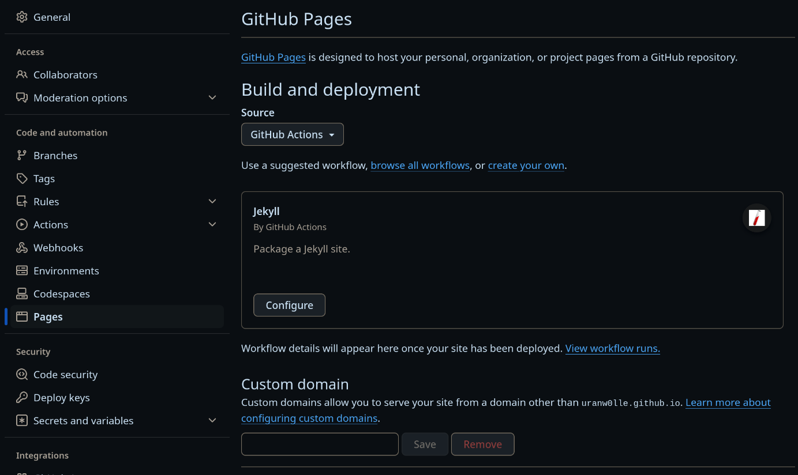
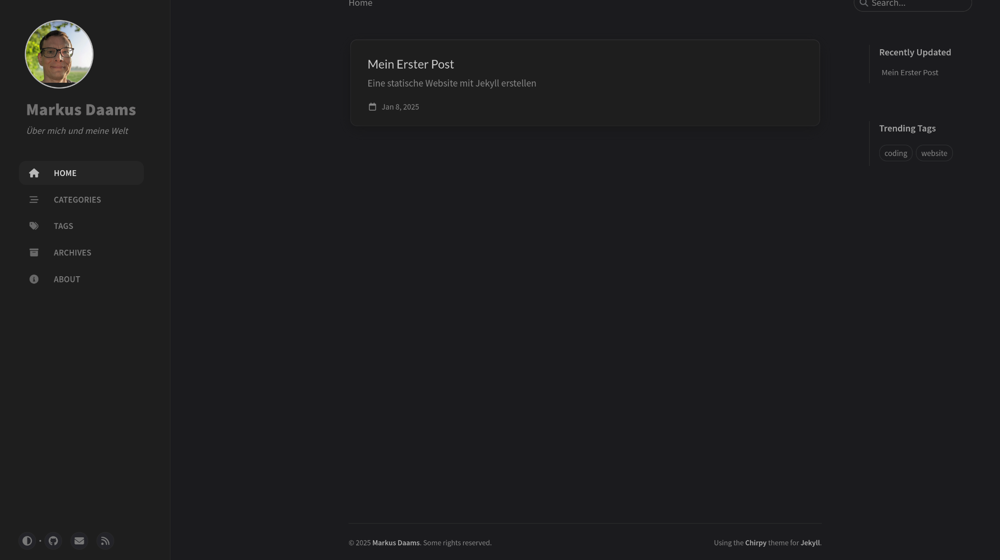
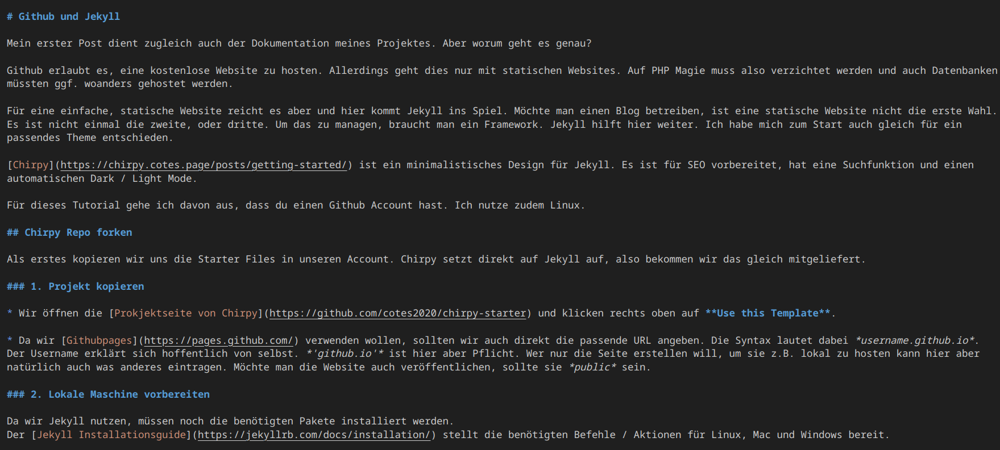

# Github und Jekyll 

Mein erster Post dient zugleich auch der Dokumentation meines Projektes. Aber worum geht es genau?

Github erlaubt es, eine kostenlose Website zu hosten. Allerdings geht dies nur mit statischen Websites. Auf PHP Magie muss also verzichtet werden und auch Datenbanken müssten ggf. woanders gehostet werden. 

Für eine einfache, statische Website reicht es aber und hier kommt Jekyll ins Spiel. Möchte man einen Blog betreiben, ist eine statische Website nicht die erste Wahl. Es ist nicht einmal die zweite, oder dritte. Um das zu managen, braucht man ein Framework. Jekyll hilft hier weiter. Ich habe mich zum Start auch gleich für ein passendes Theme entschieden. 

[Chirpy](https://chirpy.cotes.page/posts/getting-started/) ist ein minimalistisches Design für Jekyll. Es ist für SEO vorbereitet, hat eine Suchfunktion und einen automatischen Dark / Light Mode. 

Für dieses Tutorial gehe ich davon aus, dass du einen Github Account hast. Ich nutze zudem Linux.

## Chirpy Repo forken

Als erstes kopieren wir uns die Starter Files in unseren Account. Chirpy setzt direkt auf Jekyll auf, also bekommen wir das gleich mitgeliefert. 

### 1. Projekt kopieren

* Wir öffnen die [Prokjektseite von Chirpy](https://github.com/cotes2020/chirpy-starter) und klicken rechts oben auf **Use this Template**. 

* Da wir [Github Pages](https://pages.github.com/) verwenden wollen, sollten wir auch direkt die passende URL angeben. Die Syntax lautet dabei *username.github.io*. Der Username erklärt sich hoffentlich von selbst. *'github.io'* ist hier aber Pflicht. Wer nur die Seite erstellen will, um sie z.B. lokal zu hosten kann hier aber natürlich auch was anderes eintragen. Möchte man die Website auch veröffentlichen, sollte sie *public* sein.

Im Repo selbst klicken wir noch einmal auf **Settings** -> im linken Menü auf **Pages** und unter **Build and deployment** muss nun **Github Actions** ausgewählt werden. Das ist wichtig, da mit diesem Schritt der Build- und Deployment Prozess automatisiert wird. So wie eine Änderung gepusht wird, wird diese Build and Deploy Action automatisch getriggert.



### 2. Lokale Maschine vorbereiten

Da wir Jekyll nutzen, müssen noch die benötigten Pakete installiert werden. 
Der [Jekyll Installationsguide](https://jekyllrb.com/docs/installation/) stellt die benötigten Befehle / Aktionen für Linux, Mac und Windows bereit.

1. Ich arbeite mit Fedora. Daher starte ich mit diesem Befehl:
```console
sudo dnf install ruby ruby-devel openssl-devel redhat-rpm-config gcc-c++ @development-tools
```
2. Die Anleitung empfiehlt, Paketabhängikeiten für Jekyl nicht als **root** user zu installieren. Das ist aufjeden Fall sinnvoll. Daher führen wir diese Kommandos aus:

```console
echo '# Install Ruby Gems to ~/gems' >> ~/.bashrc
echo 'export GEM_HOME="$HOME/gems"' >> ~/.bashrc
echo 'export PATH="$HOME/gems/bin:$PATH"' >> ~/.bashrc
source ~/.bashrc
```

3. Nun wird es Zeit Jekyll und Bundler zu laden:

```console
gem install jekyll bundler
```

### 3. Repo Klonen und VS Code vorbereiten

Am besten erstellt man sich einen Arbeitsordner. Ich habe meinen *Coding* getauft, da ich einfach keine Phantasie bestitze. 

1. Repo klonen:

```console
git clone https://github.com/MeinGithubUsername/projektName-Aus-Schritt-1.github.io.git
```

2. Repo in VS Code öffnen und es kann los gehen.

In der Datei **_config.yaml** werden generelle Einstellungen der Website vorgenommen. Der Code dort ist gut dokumentiert und selbst erklären. Diese Datei sollte man am Anfang einmal von oben bis unten durchgehen und ggf. ändern. 

Fertig?

Dann werfen wir mal einen Blick auf die neue Seite:

```console
bundle exec jekyll s
```

Die Website wird nun lokal gehostet.



### 4. Den ersten Post anlegen

Die Posts werden mit Markdown geschrieben. Das vereinfacht die Sache doch schon einmal erheblich. Die Posts werden im Ordner **_posts** platziert. Hierbei sollte man folgende Namenskonvention beachten:

**YYYY-MM-DD-TITLE.md**

oder

YYYY-MM-DD-TITLE.markdown

Ein korrekter Beispiel-Dateiname wäre also

**2025-01-08-mein-erster-post.md**

In der Datei selbst geht es dann so weiter:

```yaml
---
title: TITLE
date: YYYY-MM-DD HH:MM:SS +/-TTTT
categories: [TOP_CATEGORIE, SUB_CATEGORIE]
tags: [TAG] # Alle Tags klein schreiben
---
```
Im Header geben wir Basis-Informationen für den Post an. *Tag* und *Categpory* sind Arrays.

Beispiel für einen Tag-Header:

```yaml
---
layout: 
title: "Mein Erster Post"
date: 2025-01-08 10:07:59 +0100
category: 
author: 
tags: [coding, website]
description: "Eine statische Website mit Jekyll erstellen"
---
```



> VS Code bietet bereits native Markdown unterstützung.
{: .prompt-tip }

Und wer, wie ich, die Syntax von Markdown immer wieder vergisst, hier gibt es eine Übersicht:

* [Markdown Basic Syntax](https://www.markdownguide.org/basic-syntax/)

### 5. VS Code Addon

Für so einen Post wäre doch ein Template nützlich, oder? Das erstellt man sich entweder selbst, oder man installiert in VS Code das Add-On **Jekyll Helper**. Nun kann man mit einem Rechtklick auf den Ordner *_posts* einen neuen Post oder Draft erstellen. 

Das Addon erstellt automatisch ein File mit dem Datum und dem eingegebenen Blog-Titel. Außerdem beinhaltet das File bereits ein vorkonfiguriertes Template, welches nur noch ausgefüllt werden muss. 

Es lassen sich zudem automatisch Drafts erstellen und frei geben. Das macht die Arbeit mit Jekyll noch mal einfacher.

## Website konfiguriert und Post erstellt?

Dann ab auf Git damit. 

Wir schauen uns alle Änderungen noch einmal an:

```console
git status
```
Alle Änderungen stagen, also für den Uload einreihen:

```console
git add .
```
Die Änderungen sollten nun Grün angezeigt werden.

```console
git status
```
Nun *committen* wir die Files:

```console
git commit -m "Konfiguration der Website und erster Post."
```

Und dann laden wir das auf Github hoch.

```console
git push
```

### 6. Fertig

Neue Post erstellen wir ab sofort wie in Schritt 4 beschrieben. Nachdem wir die Änderungen hoch geladen haben, werden diese automatisch deployed. Bitte beachte aber, dass es etwas dauern kann, bis diese Änderungen auch sichtbar sind.

Viel Spaß mit deiner Website! 

### 7. Ressourcen

* [Chirpy getting started](https://chirpy.cotes.page/posts/getting-started/)
* [Jekyll Git Hub Actions Anleitung](https://jekyllrb.com/docs/continuous-integration/github-actions/)
* [Youtube: Meet Jekyll - The Static Site Generator](https://www.youtube.com/watch?v=F8iOU1ci19Q&t=203s) [17:22 min , Englisch]
* [Markdown: Syntax Overview](https://www.markdownguide.org/basic-syntax/)
* [Styling Optionen für Chirpy](https://chirpy.cotes.page/posts/write-a-new-post/)


