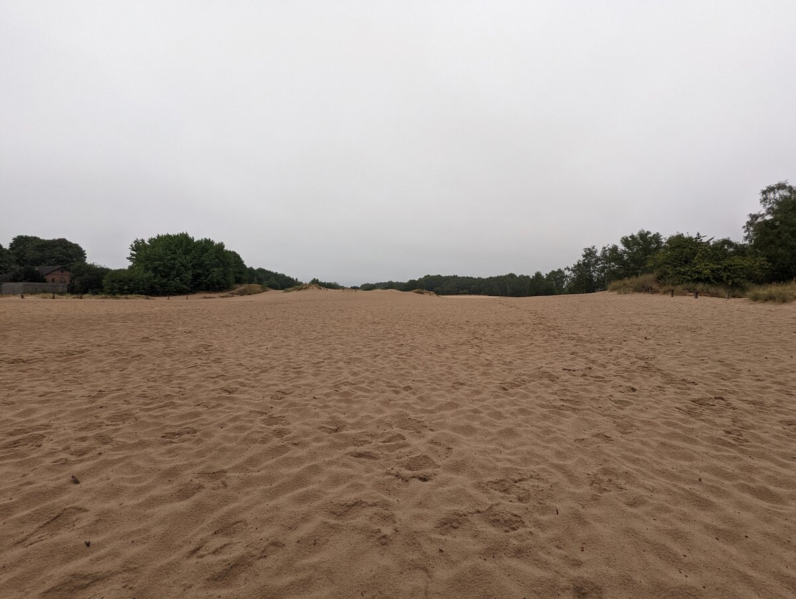
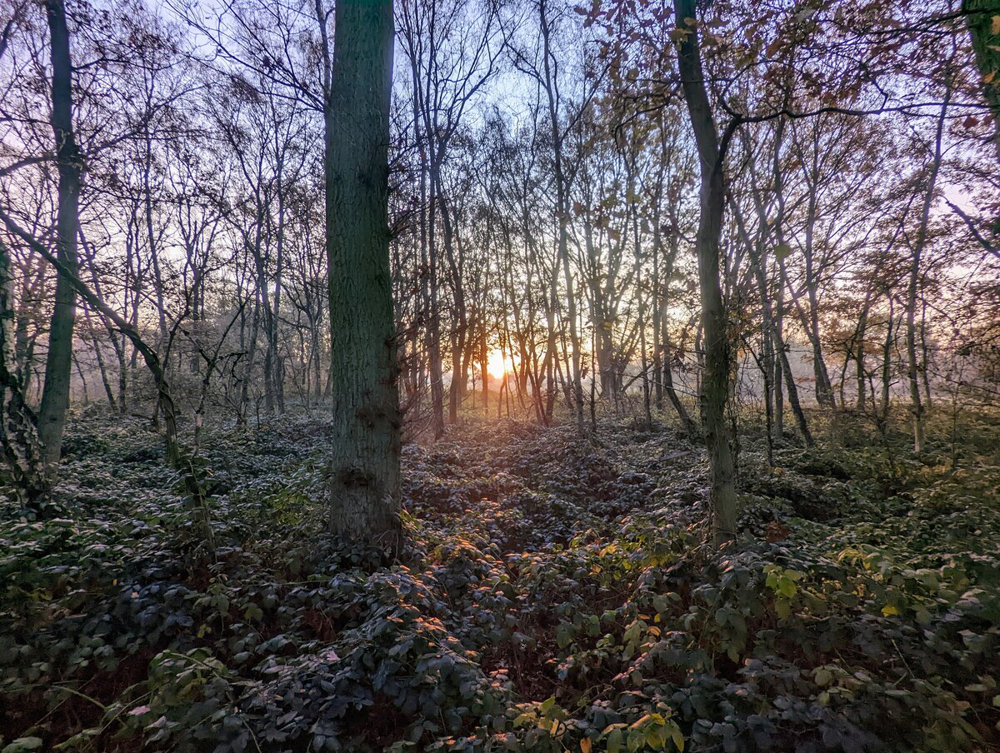
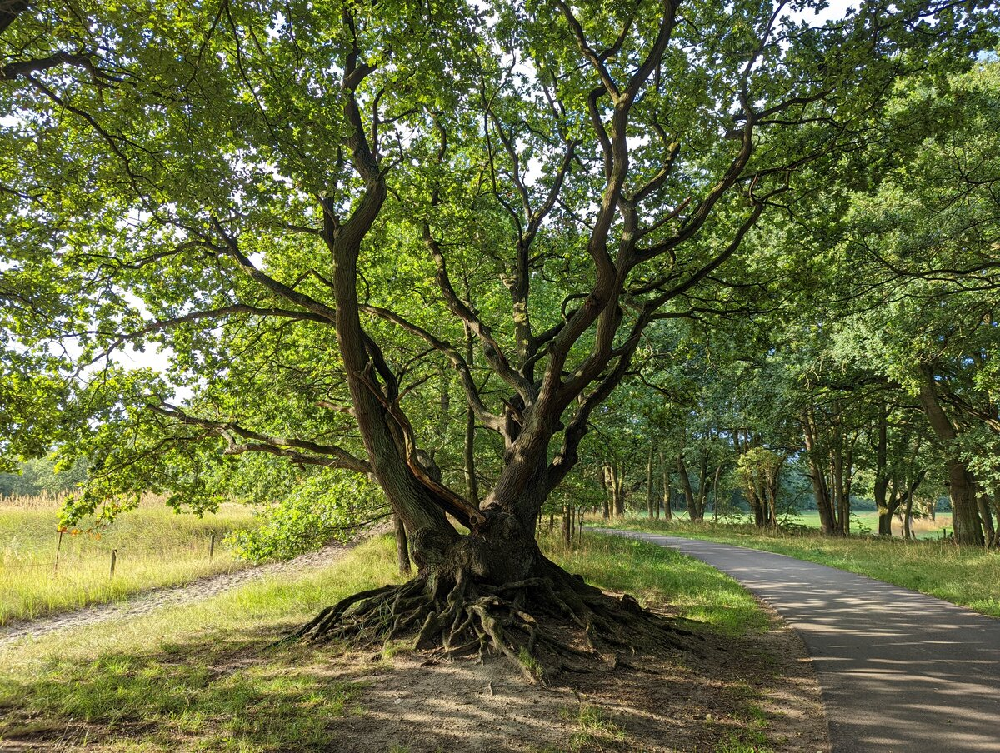
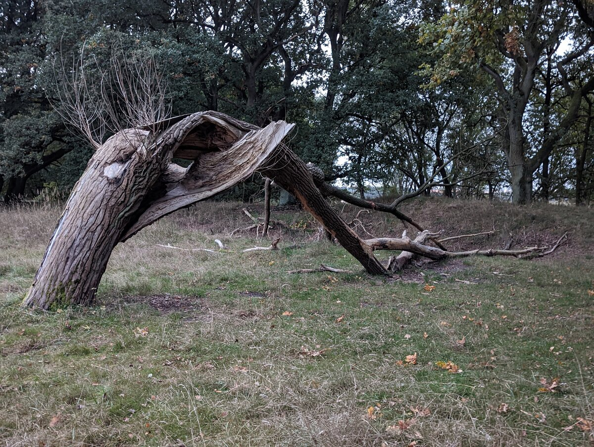
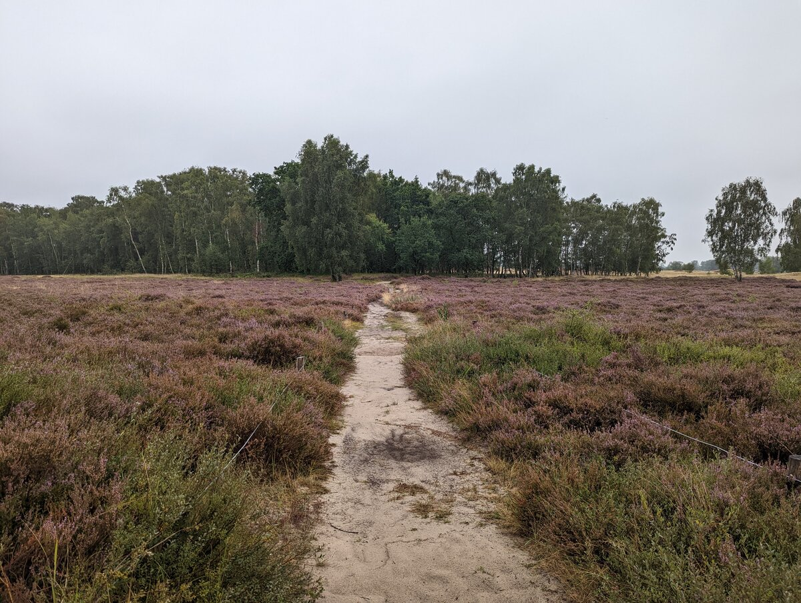
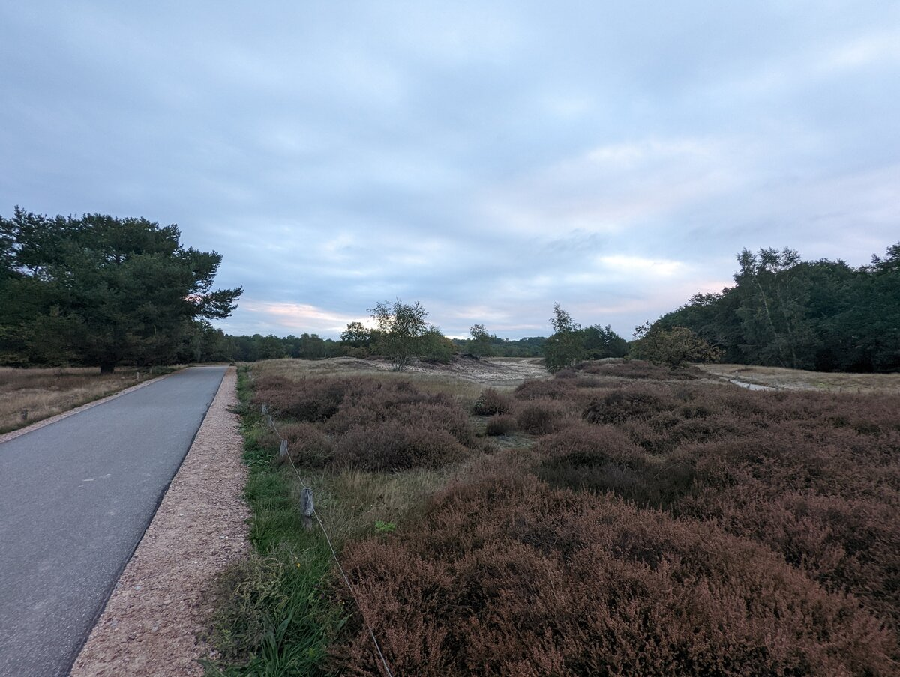
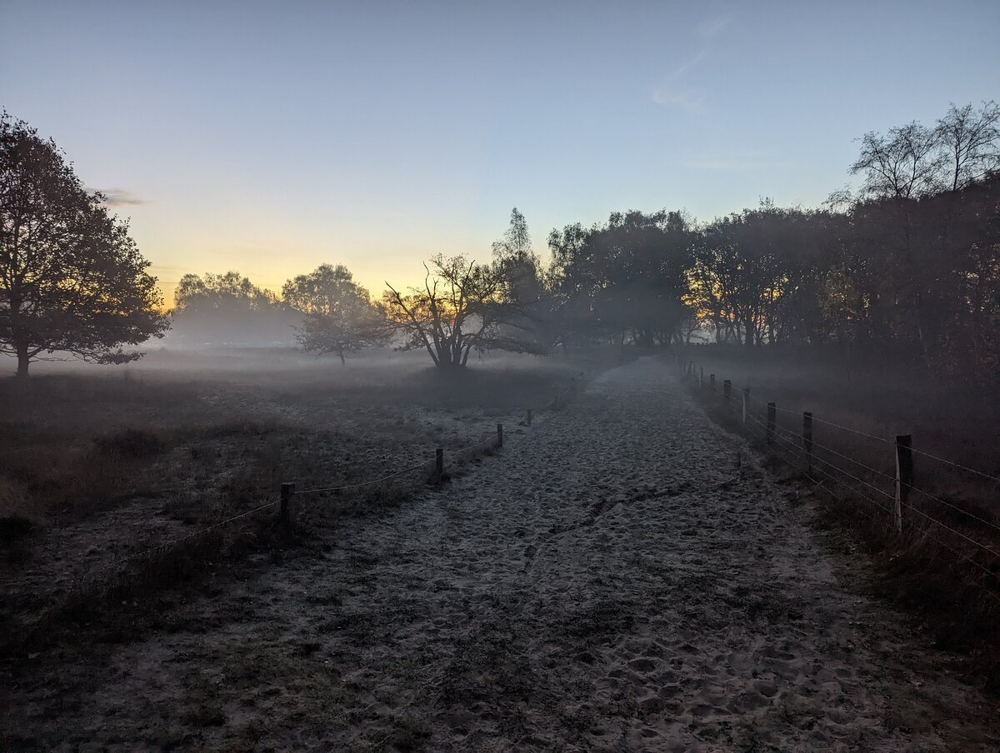
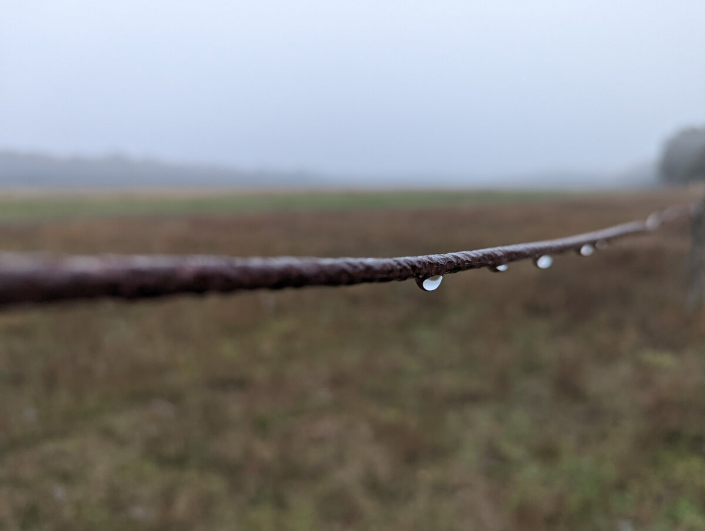
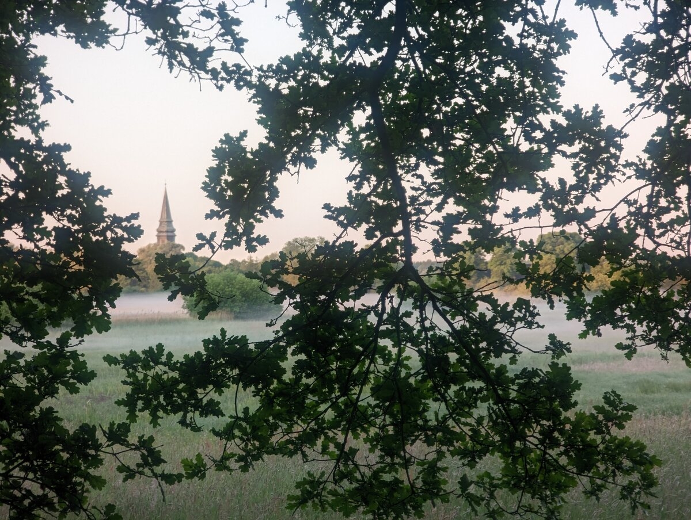

# Die Boberger Niederungen

Hamburg ist eine Großstadt. Hier reihen sich also Häuser an Häuser und wo sie es nicht tun, da breitet sich die Industrie aus. Ich mag das, denn wo viele Menschen sind, da ist auch viel Leben, also immer was los. Dennoch sehnt man sich immer mal wieder nach dem einen ruhigen Moment. Den Moment, wo man keine Autos, LKW oder S-Bahnen hört. Dann darf auch der Hafen weit weg sein. Für solche Momente braucht es besondere Orte. Diese Orte gibt es auch in Hamburg. 

Ein solcher Ort sind die Boberger Niederungen. Auf gut 350 Hektar verteilt sich eine abwechslungsreiche Natur und eine einmalige Artenvielfalt. 

Schauen wir uns doch einmal um ...

## Von Sand und Giftmüll

Die Boberger Niederungen wurden 1991 unter Schutz gestellt. Ein Glück, denn bis dahin wurde viel Schindluder getrieben. Im 19. Jahrhundert dienten die Dünen als Sandquelle für die Industrie in Hamburg. In den 1960ern wurde hier illegal Giftmüll entsorgt. 

_Viele kennen die Boberger Niederungen auch unter dem Namen "Boberger Dünen". Ja, hier gibt es Sanddünen_

Die Sanddünen sind ein Überbleibsel der Eiszeit. Heute darf der Sand auch einfach Sand sein, denn es wird davon nichts mehr für die Industrie oder für Deiche entnommen. Heute gibt es hier am Rand der Niederungen lediglich ein Segelflugplatz, der – ein Glück – völlig ohne Fluglärm auskommt.

## Landschaften über Landschaften

Die Boberger Niederungen sind mein Lieblingsnaturschutzgebiet in Hamburg. Das liegt auch daran, dass sich hier so viele verschiedene Landschaften auf so kleinem Raum verteilen. Heide, Dünen, Moor, hier findet sich alles.

_Die Sonne geht über den Niederungen auf. Genau das sind die Momente, die ich meine_

Fangen wir mit dem klassischen Wald an. Fairerweise muss ich sagen, dass es nicht der Wald ist, den man in Deutschland so kennt. In dem sandigen Boden wachsen keine massiven Bäume, denn sie finden hier keinen Halt. Dennoch wagen ein paar Bäume das Abenteuer und wachsen drauflos. Das Resultat ist ein sehr interessanter Baumbestand, der typisch norddeutsch ist. 

_Der Sand kommt und geht. Und so werden dann auch die Wurzeln freigelegt_

Die Bäume haben es aufgrund des lockeren Untergrundes nicht leicht. Daher findet man hier und da auch ganz interessante Gewächse – Bäume, wie aus einem Roman.

Allerdings verändert sich die Landschaft aktuell auch sehr stark. 

_Es wird nur noch sehr selten in die Natur eingegriffen. Man sieht also umgeknickte Bäume überall_

Die Stürme in Hamburg haben durch den Klimawandel zugenommen. Dadurch wird auch der Baumbestand in den Niederungen angegriffen. Wie ich ja bereits geschrieben habe, haben es die Bäume in dem Boden hier nicht gerade leicht, Halt zu finden. Das Ergebnis kann man dann – leider – nach jedem Orkan auf’s Neue begutachten.

#### Auf der Heide blüht ein kleines Blümelein ...

... und das heißt ... Erica ampullacea. Das typische Heidekraut.

_Und dann, so mitten drin, noch etwas Heidelandschaft_

Wie bereits beschrieben, bin ich davon fasziniert, wie viele Landschaften sich in den Niederungen vereinen. Hat man den Boberger See hinter sich gelassen, steht man plötzlich mitten in der Heide. Im Mittelalter haben Menschen versucht, sich hier niederzulassen und den Boden landwirtschaftlich zu nutzen. Das war nicht von Erfolg gekrönt, aber hinterließ uns eine interessante und biodiverse Heidelandschaft.

Der Weg ist hier dann aber nicht mehr befestigt. 

## Und hier soll man sich entspannen können?

Ja, aber man muss sich vielleicht etwas vorbereiten.

Es gibt einen befestigen Weg, der quer durch die Niederungen führt. Dieser ist geteert und eignet sich für entspanntes Fahrradfahren, joggen – oder wie ich es am liebsten mag – wandern. Es gibt daneben noch viele weitere, markierte Wege und Pfade. Möchte man auch diese begehen, empfehle ich gute Schuhe. Gerade nach einem Regenschauer sind einige der Wege kaum oder nur noch schwer begehbar. 

_Nur ein kleiner Teil der Wege ist geteert_

## Und dann findet man sie, diese Momente

Ich bin besonders häufig sehr früh Morgens in den Boberger Niederungen unterwegs. Ich kenne die Wege dort inzwischen sehr gut, sodass ich mich dort auch dann bewegen kann, wenn es noch stockdunkel ist. Denn genau zwischen Nacht und Sonnenaufgang, entfaltet sich eine eigenartige Magie, die man nur dann und nur dort finden kann.

_Wenn der Sonnenaufgang auf Nebel trifft, wird’s richtig magisch._

Menschen, die gerne Fotografieren, bekommen hier abseits von Hafen und Binnenalster tolle Motive vor die Linsen. 

_Der Zaun beim Segelflugplatz_

Es lohnt sich also, ab und zu innezuhalten und sich umzuschauen. 

_St. Nikolai in Billwerder._

## Anreise

Meine Empfehlung ist, mit der S-Bahn anzureisen. Hierzu nimmt man die S2 und steigt am Bahnhof “Mittlerer Landweg“ aus. Beim einzigen Ausgang nach links wenden und dann einfach 500 Meter geradeaus. 

Die Boberger Niederungen erstrecken sich über mehrere Stadtteile. Wer will, kann bis nach Nettelnburg oder Bergedorf wandern und dort dann wieder in die Öffis steigen. Es gibt mehrere Wege in die Niederungen und wieder hinaus. 

> Es gibt – hier und da – Richtungsweiser. Diese sind aber eher Richtungsempfehlungen. Ich empfehle, eine App zu installieren, die auch Kartenmaterial mit Wanderwegen vorhält. (Beispiel: OpenStreetMaps)
{: .prompt-tip}

<iframe width="425" height="350" src="https://www.openstreetmap.org/export/embed.html?bbox=10.125532150268556%2C53.50192111540838%2C10.164113044738771%2C53.51378898243286&amp;layer=mapnik" style="border: 1px solid black"></iframe> <small><a href="https://www.openstreetmap.org/#map=16/53.50786/10.14482">Größere Karte anzeigen</a></small>

## Noch ein kleiner Nachtrag

Bitte lasst keinen Müll liegen und bitte leint eure Hunde an, denn es gibt viel wildes Leben in den Boberger Niederungen – sogar Rehe. So ein Naturschutzgebiet muss von uns allen geschützt werden. Zum Dank können wir hier immerhin tolle und schöne Momente verleben.  

## Ressourcen

* [Alle Infos über dieses tolle Naturschutzgebiet](https://www.boberger-duenen.de/)

* [Boberger Dünen auf hamburg.de](https://www.hamburg.de/politik-und-verwaltung/behoerden/bukea/themen/boden-und-geologie/geologie/geologie-in-hamburg/geotourismus/geotope-im-hamburger-raum/boberger-duenen-bergedorf-168438)

* [Boberger Moor auf hamburg.dec](https://www.hamburg.de/politik-und-verwaltung/behoerden/bukea/themen/boden-und-geologie/geologie/geologie-in-hamburg/geotourismus/geotope-im-hamburger-raum/boberger-moor-168448)

