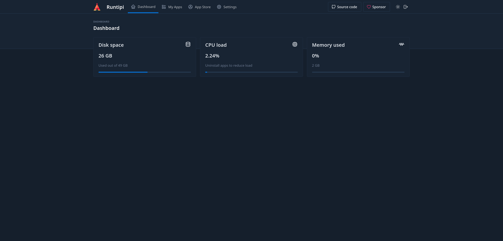
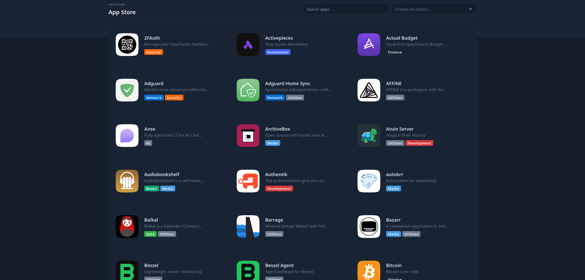
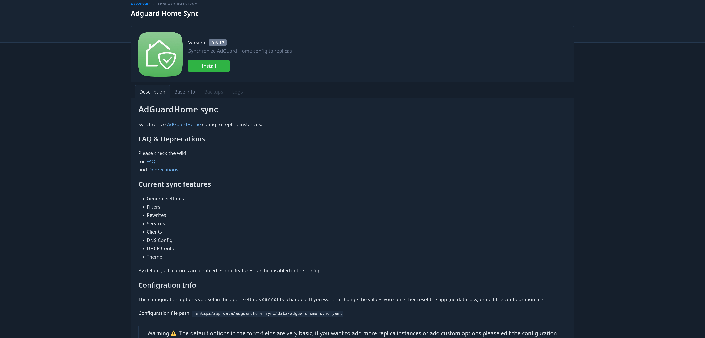
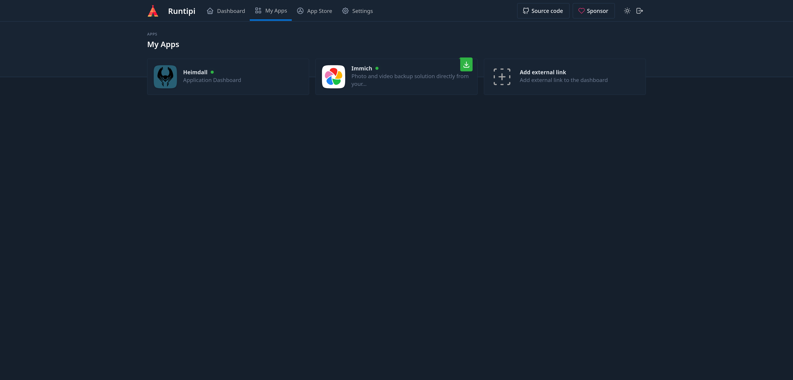
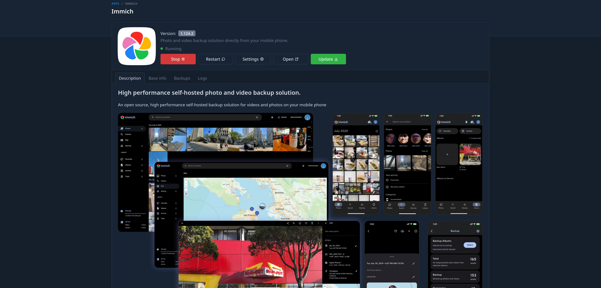
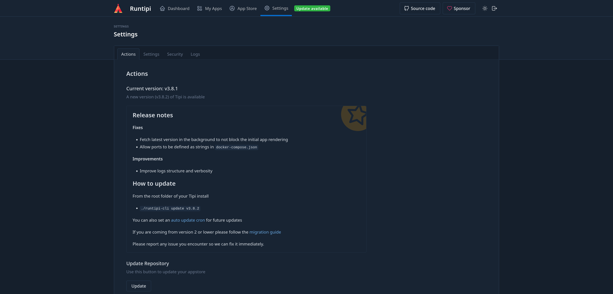

# Runtipi - Ein Zelt für Docker

Self-Hosting macht Spaß und liegt auch mehr und mehr im Trend. Inzwischen lässt sich alles selbst hosten, von der eigenen Cloud (z.B. [Nextcloud](https://nextcloud.com/)), über den leistungsstarken Medienserver (z.B. [Jellyfin](https://jellyfin.org/)), bis hin zur Heimautomatisierungslösung (z.B. [Home Assistant](https://www.home-assistant.io/)). Apps wie [Immich](https://immich.app/) laufen Google Fotos sogar regelrecht den Rang ab.

Allerdings ist all das auch immer mit einigem Aufwand verbunden. Alle diese Lösungen wollen erst einmal installiert und konfiguriert werden. Daneben ist auch immer die Aktualiserung der jeweiligen Anwendung wichtig und die ganz Schlauen denken auch immer mit an das Backup. Das klingt nach viel Arbeit, oder?

Runtipi ist angetreten, um einige dieser Schritte einfacher zu machen. Vieles lässt sich dank diesem Projekt dann mit einem Klick erledigen. Ich möchte in diesem Artikel eine kurze Übersicht darüber geben, um was es sich hier handelt und was das Projekt zu bieten hat. 

## Das Projekt

Runtipi ist ein open source App Store zum selbst hosten. Kurz gesagt: Hat man es einmal installiert, lassen sich ca. 200 beliebte Apps (Stand 22.01.2025) mit nur einem Klick installieren, updaten und durch Backups sichern. Die Apps lassen sich zudem per SSL-Zertifikat von Let’s Encrypt absichern, wenn man diese auch über das Internet verfügbar machen möchte. 

### Hardware Voraussetzungen und Installation

Die Systemanforderungen von Runtipi lauten wie folgt:

#### Minimale Anforderungen

* Ein 64 Bit Prozessor
* 4 GB Ram
* 10  GB Festplattenspeicher

#### Empfohlene Systemanforderungen

* Ein moderner Mehrkernprozessor
* 8 GB Ram (je mehr, desto besser)
* 20 GB Ram (je mehr … genau ;))

> Nicht alle Apps stehen auch für ARM zur Verfügung. Diese sollen dann aber ausgeblendet werden, wenn man diese Architektur nutzt.
{: .prompt-info}

Als Betriebssystem wird **Ubuntu 18.04 LTS** empfohlen. Generell kann Runtipi aber auf jeder Distribution genutzt werden, auf der auch Docker läuft. 

Ich nutze Runtipi in einem LXC-Container auf meinem Proxmox-Server. Klingt jetzt erst einmal doppelgemoppelt, läuft aber prima. 

## Installation

Die Installation von Runtipi ist sehr einfach und kann mit folgendem Befehl ausgeführt werden:

```bash
curl -L https://setup.runtipi.io | bash
```

Das Script wird herunter geladen und ausgeführt. Es werden alle benötigten Pakete automatisch installiert und der Server auch direkt gestartet.

Das war es schon? Ja, das war es schon.

Der Server lässt sich dann mit den folgenden Befehlen verwalten. Diese erklären sich hoffentlich von selbst:

```bash
sudo ./runtipi-cli start
```

```bash
sudo ./runtipi-cli stop
```

```bash
sudo ./runtipi-cli restart
```

## Nach der Installation

Nach der Installation rufen wir die IP des Servers auf, auf dem Runtipi installiert wurde. Im Falle von Proxmox habe ich diese schon bei der Erstellung des Containers vergeben. Im Zweifel schaut man noch einmal kurz im Router nach. 

Runtipi verlangt zunächst, einen neuen User anzulegen. Ein Unsername und ein Passwort sind schnell vergeben, und nach dem Login finden wir uns auf unserem neuen Dashboard wieder. 

{: .shadow }
_Das Dashboard bietet einen Überblick über den Speicherverbrauch und die Systemauslastung aller installierten Apps._

## Apps, gebt mir Apps!

Das Menü von Runtipi ist auf das Wesentliche reduziert. Dort finden wir das Dashboard, unsere installierten Apps, den App Store und die Einstellungen.

Schauen wir doch einmal in die App Store.

{: .shadow }
_Im Store finden sich zahlreiche Apps zum selbsthosten_

Eine Suchfunktion für Freitext, aber auch eine Sortierung nach Kategorien ist möglich. Klicke ich eine App an, gelange ich in die Übersicht der App.

{: .shadow }
_In dieser Übersicht finde ich eine Beschreibung, wichtige Informationen, aber auch Systemanforderungen und die unterstütze Architektur (unter **Base Info**)._ 

> Die Beschreibung sollte man auf jeden Fall lesen. Hier werden zum Beispiel auch wichtige Information wie Pfadangaben hinterlegt.
{: .prompt-warning}

 Mit einem Klick auf **Install** wird diese dann mit einer vordefinierten Konfiguration geladen, installiert und direkt gestartet. 

## Nach der Installation

Nachdem die App installiert wurde, finde ich diese im Menüpunkt **My Apps**. Hier sehe ich dann direkt, welche Apps ich installiert habe und für welche eine Aktualierung vorliegt. 

{: .shadow }
_Wie ich sehe, steht für Immich ein Update zur Verfügung._

Und ab hier wird es für gestresste Selbsthoster echt toll.

{: .shadow }
_Die wichtigsten Operationen lassen sich nun mit einem Klick erledigen._

In der Detailansicht meiner installierten App, stehen mir nun unter anderem folgende Optionen zur Verfügung:

* Ich kann die App anhalten, starten, oder direkt neustarten. 
* Ich kann die App mit einem Klick aktualiseren. Ein Backup wird auf Wunsch ‚on the fly‘ mit angelegt.
* Ich kann ein manuelles Backup anlegen und auch einspielen.
* Ich habe Zugriff auf die Logs. Das ist wichtig, wenn man denn doch einmal auf einen Fehler trifft.
* Die App öffnen. Entweder über die IP, oder die Domain, wenn diese konfiguriert wurde.

## Runtipi selbst aktualisieren 

Runtipi kann aktuell noch nicht über die WebUI aktualisiert werden. Aber auch dies ist nicht weiter schwer. Wichtig ist, dass wir Zugriff auf den Server haben, auf dem Runtipi gehostet wird. Das kann also zum Beispiel über **SSH** erfolgen, oder, wie in meinem Fall, direkt über die Oberfläche von Proxmox.

{: .shadow }
_Steht ein Update zur Verfügun, wird dies in der WebUI angezeigt._ 

Alle wichtigen Informationen zum Updaten findet man in der WebUI unter *Settings* -> *Actions*. Die Informationen auf dieser Seite sollte man **immer aufmerksam lesen**. So gab es zum Beispiel breaking changes beim Update von der Version 2.x auf 3.x. Da ich diese ignoriert habe, hat es mir auch direkt die Installation zerlegt. Ich hätte die Anweisungen zur Migration auf genau dieser Seite gefunden.

### Runtipi Update

Für das Update stehen zwei verschiedene Befehle zur Verfügung. Mit:

```bash
sudo ./runtipi-cli update latest
```
wird die jeweils neueste Version gezogen und installiert. 

Mit dem Befehl:

```bash
sudo ./runtipi-cli update v3.8.1
```
kann auf eine bestimme Versionsnummer aktualisiert werden. 

> Die Apps werden beim Update (logischerweise) beendet und der Server herunter gefahren. Nach der Installtion wird aber alles wieder automatisch gestartet. Dies ist wichtig zu wissen, wenn man z.B. Pihole nutzt.
{: .prompt-info}

## Da geht aber noch mehr

Ich wollte diese Übersicht bewusst kurz halten. Ich nutze Runtipi lokal und greife auf die Apps per VPN-Verbindung zu, wenn ich unterwegs bin. Aber mit Runtipi lassen sich die Apps auch direkt in das Internet veröffentlichen. Allerdings sprengt das den Rahmen dieser Übersicht. Meine Empfehlung in diesem Fall ist aber die offizielle Dokumentation, die entzückend schnell auf den Punkt kommt:

* [runtipi.io - Expose your Apps](https://runtipi.io/docs/guides/expose-your-apps)

## Fazit

Ich schätze Docker sehr. Gerade für Menschen, die gerne vieles selbst hosten, bringt es enorme Vorteile mit sich. Runtipi vereinfacht jedoch viele Routinen wie die Installation, die Aktualisierung und die Sicherung der Apps noch einmal zusätzlich. Zudem wurden die Apps, die ich bisher genutzt habe, sinnvoll vorkonfiguriert. Immich konnte ich so zum Beispiel ‚out of the box‘ nutzen. Gerade diese App wird aktuell sehr oft und auch mit breaking changes aktualisiert. Runtipi nimmt mir diese Sorgen ab. 

Beim selbst hosten kommt man irgendwann an einen Punkt, wo man sich wünscht, dass alles friedlich vor sich hin funktioniert. Der Verwaltungsaufwand aller Installationen sollte sich dann auf ein Minimum reduzieren. Dank Projekten wie Runtipi hat sich mein Admin-Stress schon deutlich reduziert. 

Runtipi ist nicht das einzige Projekt dieser Art. Aber es sticht für mich persönlich schon hervor und es ist eines, welches von einer tollen Community immer weiter vorangetrieben. Und ausprobieren kostet nichts. 

Viel Spaß!

## Ressourcen

* [Runtipi - Website](https://runtipi.io/)

* [Runtipi - Documentation](https://runtipi.io/docs/introduction)

* [Runtipi - Github Repo](https://github.com/runtipi/runtipi)

* [Runtippi auf Discord](https://discord.gg/Bu9qEPnHsc) - Bei Problemen wird einem hier freundlich und schnell geholfen. 

* [Eigene App zum Store hinzufügen (für Profis)](https://runtipi.io/docs/contributing/adding-a-new-app)

