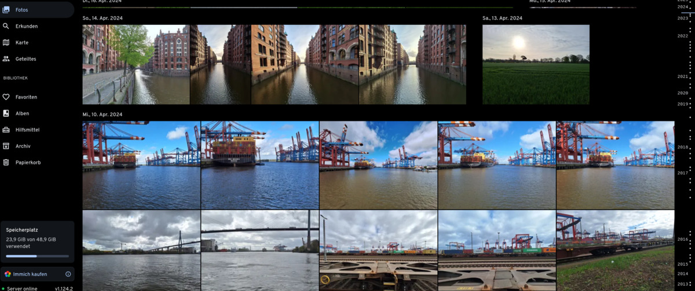

# Warum immich?

Vor einigen Jahren fasste ich den Entschluss, meine Daten aus der Cloud zurück in meinen „Herrschaftsbereich“ zu holen. Hauptsächlich lagen diese bei den Diensten von Microsoft und Google. Mich haben hier allerdings weniger datenschutzrechtliche Motive angetrieben. Vielmehr bereitete es mir Sorge, dass die Dienste immer restriktiver und zunehmend übergriffiger hinsichtlich der Monetarisierung wurden. 

Klar, ein Unternehmen muss Geld verdienen dürfen. Jedoch war für mich nicht abzusehen, wie weit das Gewinnstreben der Unternehmen wohl reichen mag. 

So begann ich mit der Umstellung auf die selbst gehostete Cloud. Mit **Nextcloud** konnte ich schon einmal alle meine Daten (Dokumente, Savegames, Projektdateien, ihr kennt es) heimholen.

Bei den Fotos wurde es aber etwas schwieriger.

## Warum denn selbst hosten, wenn Google Fotos alles bietet, was man braucht?

Google Fotos war einfach da. Es war auf jedem meiner Handys vorinstalliert und vorkonfiguriert. Die Fotos flogen direkt in die Cloud, wo ein schicker, schlanker Foto-Stream auf mich wartete, der das Betrachten und Teilen von Fotos super einfach machte. Dazu kam die gewohnt mächtige Suchfunktion von Google.

Es war so einfach, dass ich Google Fotos von Anfang an nutzte und nicht daran dachte, dass ich jemals was Anderes brauchen würde.

Aber auch die tollsten Storys sind einmal zu Ende. Google strich hier und da Features (Google Pixel unlimited Speicher ade) und begann die Monetarisierung zu pushen. Die Android-App schlug mir tolle Filter vor, die am Ende aber hinter einer Paywall lauerten. Und es schwebte immer auch die Angst mit, dass alle Fotos weg sind, wenn ich meinen Google Account verlieren würde.

Das alles bewog mich, nach einer Alternative zu suchen. Dabei stieß ich sehr schnell auf **immich**.

## Ich googelte und fand … immich

Es gibt tatsächlich viele Lösungen, um Fotos und Videos selbst zu hosten. Meine Wunschliste für eine selbst gehostete Lösung sah wie folgt aus:

* Ein schneller und responsiver Fotostream im Stile von Google Fotos
* Die Möglichkeit Fotos zu liken
* Die Möglichkeit Alben anzulegen
* Fotos lassen sich herunterladen
* Eine Backup-Möglichkeit

"Nice to have" waren:

* Eine Karten-Funktion
* Eine Suchfunktion
* Eine App für Android

**immich** sprang mir bei meiner Suche direkt ins Auge, denn bewusst, oder unbewusst, imitierte es Google Fotos. Cool, ich muss mich also nicht groß umstellen. 

Zudem hat **immich** die gesamte Wunschliste abgeräumt. Also machte ich mich ans Werk und installierte es.

## Vor immich kommt das Basteln

Wie bei allen selbst gehosteten Lösungen, benötigt man einen bereits konfigurierten und laufenden Server. Ich selbst nutze **Proxmox**. Jedoch lässt sich **immich** auch auf **Unraid**, **TrueNAS**, **Kubernetes**, **Docker** usw. usf. installieren. 

Ich habe mich für **Runtipi** entschieden. Ich **immich** hier mit einem Klick installieren und es lässt sich genau so einfach aktualisieren. In diesem [Artikel](https://markus-daams.com/posts/runtipi-selfhosting-einfach-gemacht/) findet ihr einen Überblick.

> Laut den Entwicklern befindet sich **immich** nach wie vor in stetiger Entwicklung. Breaking Changes kommen daher oft vor!
{: .prompt-warning}

Allerdings nutze ich es nun seit über 18 Monaten unfallfrei. Außerdem lassen sich Dienste wie Google Fotos ja weiterhin nutzen und so als Backup verwenden.

## immich läuft, und nun?

Einmal installiert, vergibt man beim ersten Aufrufen der lokal gehosteten Website einen Benutzernamen und ein Passwort. 

> Es können in immich mehrere User angelegt und Fotos, Alben usw. können untereinander geteilt werden. 
{: .prompt-info}

Danach findet man sich auf dem leeren Dashboard wieder. Nun kann man die Fotos hinzufügen. Diese habe ich zuvor mit [Google Takeout](https://takeout.google.com/) heruntergeladen. Der Bilderimport ist auf verschiedenen Wegen möglich. 

Ich habe mich für die denkbar einfachste Methode entschieden und die 23 GB an Fotos und Videos einfach per *Drag & Drop* in das Browserfenster gezogen. Und der Upload startete sofort und ohne Umwege. Dank Heimnetzwerk ging dieser auch recht zügig von statten. Nach ein paar Tassen Tee und etwas Musik erwartete mich mein Foto Stream. 

_Der Fotostream von immich. Sogar die Zeitleiste ist da, wo ich sie erwartete._

Was mir dann direkt auffiel war, wie schnell sich die Oberfläche aufbaute. Die Vorschaubilder wurden sehr zügig generiert und es gibt beim Scrollen keine Wartezeit mehr. Die Fotos lassen sich anklicken und werden in einer Lightbox geöffnet. 

_Die Detailsansicht zeigt mir optional weitere Informationen zum Foto an. Zudem wird eine Karte eingeblendet, wenn das Foto die entsprechenden Daten liefert._

## immich – Noch besser mit App

Darauf hin habe ich mir auch die App aus dem Playstore gefischt. Diese ist ebenfalls modern, schnell und unterstützt alle Funktionen, die ich auch in der Weboberfläche finde. Der automatische Upload lässt sich schnell einrichten. Die Fotos werden automatisch synchronisiert. 

## Was bietet immich noch?

Eine Menge! 

Zuerst ist mir aufgefallen, das mein kleiner Home Server mächtig unter Dampf stand. Nicht nur ein paar Minuten, oder Stunden, sondern die ganze Nacht. Was war passiert?

Die Gesichtserkennung und das Machine Learning machten sich ans Werk.

Am nächsten Morgen konnte ich nicht nur den gefundenen Personen einen Namen zuordnen, sondern die neue Suchfunktion ausprobieren. Denn **immich** durchsucht, genau wie Google Fotos und Co. Die Fotos nach verschiedenen Entitäten wie Personen und Dinge und Szenen. Diese lassen sich dann per einfachem Schlagwort durchsuchen:

_In der Searchbar lässt es sich nach Personen, Dingen, Tageszeiten uvm. suchen._

Alternativ steht eine erweiterte Suche zur Verfügung. Hier lässt sich das eigene Fotoarchiv noch viel granularer durchsuchen, z.B. nach den in allen Fotos gefunden Orten (Bundesländer, Staaten, Provinzen usw. werden erkannt):

_Mit der erweiterten Suche kann ich viele verschiedene Parameter angeben. Sehr praktisch._

Allerdings liegt die Suche öfters daneben. Dann finden sich Fotos im Suchergebnis wieder, die nichts mit dem eigentlichen Begriff zu tun haben.

_Die Hamburger Außenalster befindet sich tatsächlich nicht in Kanada._

Das stört mich persönlich nicht. Denn wie bereits erwähnt, befindet sich **immich** nach wie vor in der Entwicklung und ich habe bisher die Fotos immer gefunden, die ich gesucht habe.

## Werde ich immich weiter nutzen?

Ein klares Ja. Ich habe bisher keine Schwierigkeiten mit immich gehabt. Ich sichere mich mit regelmäßigen Backups ab. **Immich** hat alles das, was ich gesucht habe, um Google Fotos zu ersetzen.

### Meine Highlights kurz vorgesetllt

Die Karte mit der Übersicht aller Fotos ist ein tolles und sinnvolles Feature, dass ich gerne nutze. 

_Je näher man rein scrollt, desto detailierter die Auflösung. Fotos, die am selben Ort aufgenommen wurden, werden bei hoher Zoomstufe gruppiert._

Fotos lassen sich in Alben zusammen fassen.

_Die angelegten Alben lassen zuden sich in immich mit einem Beschreibungstext versehen._

Mit der Like-Funktion finde ich meine Lieblingsbilder schnell wieder:

_Fotos lassen sich, wie bei bekannten Apps, per Herz liken und landen so in einer gesonderten Übersicht._

Übrigens steht auch eine sehr durchdachte Teilen-Funktion zur Verfügung.

_Für die Teilen-Funktion muss der externe Zugriff konfiguriert sein._

## Was ich nicht erwähnt habe

**immich** ist inzwischen eine sehr mächtige Lösung zur Fotoverwaltung geworden. Ich wollte diesen Artikel bewusst etwas kürzer halten, habe daher ein paar Dinge ausgelassen, die **immich** aber dennoch mitbringt. Darunter:

* immich bietet eine API-Funktion an
* Es gibt eine Geräteverwaltung in den Einstellungen
* Es gibt eine Zugriffsstatistik
* immich unterstützt das Partner-Sharing
* und noch mehr, immer mehr. 

## Ist immich kostenlos?

**Immich** ist kostenlos und soll es auch bleiben. Allerdings bittet das Entwicklerteam um spenden. Hierzu wird in der Weboberfläche ein dezenter Hinweis eingeblendet. Hat man jedoch etwas gespendet, bekommt man einen Key und der Hinweis wird ausgeblendet. 

## Mein Fazit

**Immich** hat bei mir Google Fotos ersetzt und das sehr schnell. Der Grund hierfür ist, dass ich alle Features wieder gefunden habe, die ich bei Google geschätzt habe. Ich musste mich also nicht umstellen. Die Installation ist einfach, wenn man im Thema *Self Hosting* einigermaßen bewandert ist. 

Zudem will ich auch einmal die überragende Performance von **immich** hervor heben. Egal ob Scrollen, Suchen oder Uploaden, die Geschwindkeit ist hoch. Die "Schwubtizität" von **immich** ist wirklich bemerkenswert.

Die Suchfunktion ist nicht treffsicher. Das aber stört mich nicht, denn ich habe bisher immer gefunden, was ich gesucht habe. 

Da sich auch externe Bibliotheken einbinden lassen, habe ich in Zukunft die Möglichkeit, meine umfangreiche Sammlung an RAW Fotografien zu importieren (mehrere 100GB). Und dann habe ich alle meine Fotos, zentral an einem Platz. 

Wer also die Installation nicht scheut, sollte sich **immich** unbedingt einmal anschauen.

## Ressourcen

* [Die offizielle Website des Projekts](https://immich.app/)

* [Die Dokumentation (Englisch)](https://immich.app/docs/overview/introduction)

* [Die Roadmap des Projekts](https://immich.app/roadmap)

* [Das sehr aktive Github - Repo](https://github.com/immich-app/immich)

### Wo bekommt man Hilfe?

Hilfe kann man unter anderem hier bekommen:

* [Es gibt eine sehr aktive Community auf Reddit](https://www.reddit.com/r/immich/)

* [Der offizielle Discord-Kanal.](https://github.com/immich-app/immich)

* [Die Discussion Sektion auf Github](https://github.com/immich-app/immich/discussions)

Natürlich findet man auch auf Youtube eine Fülle an Videos, auch in deutscher Sprache. 