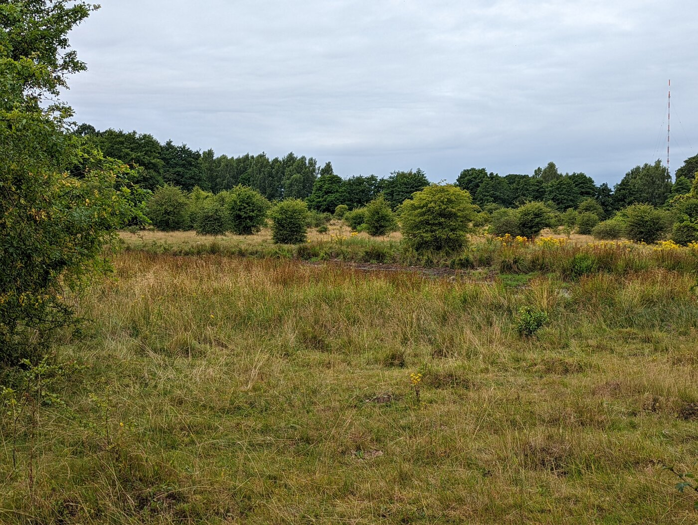
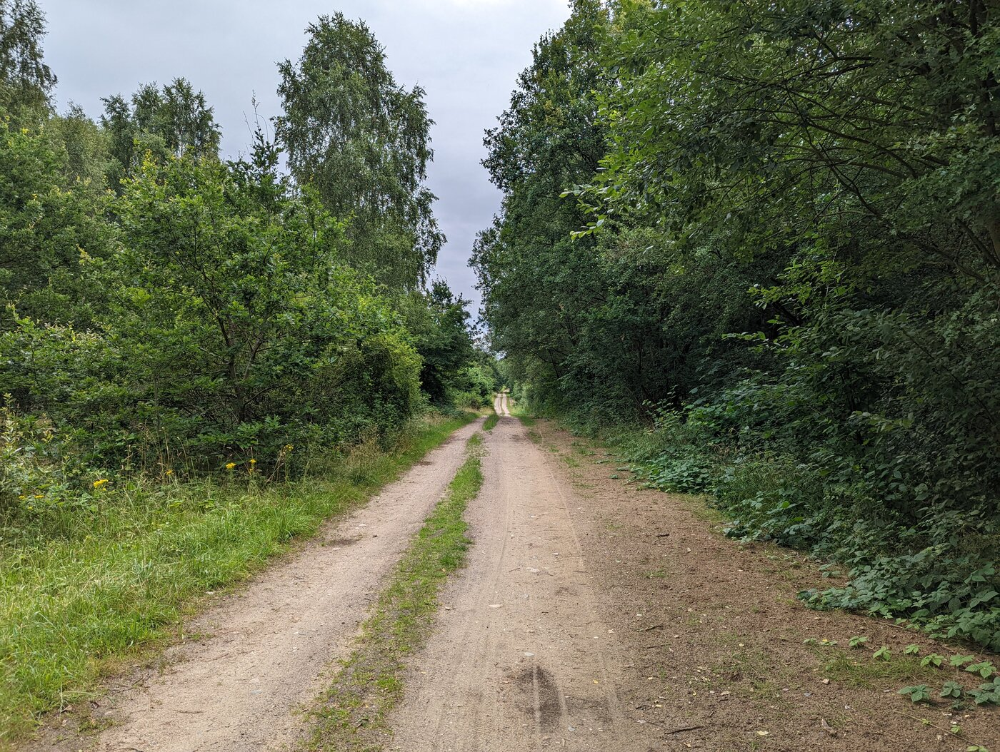
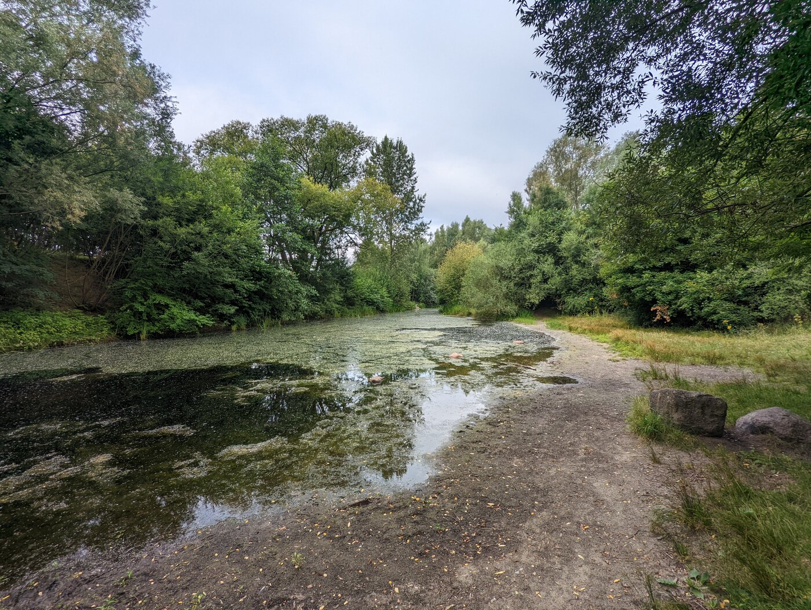
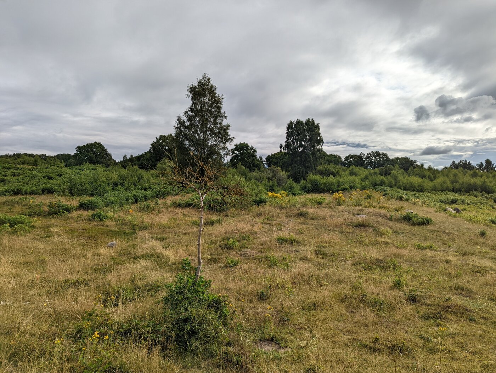
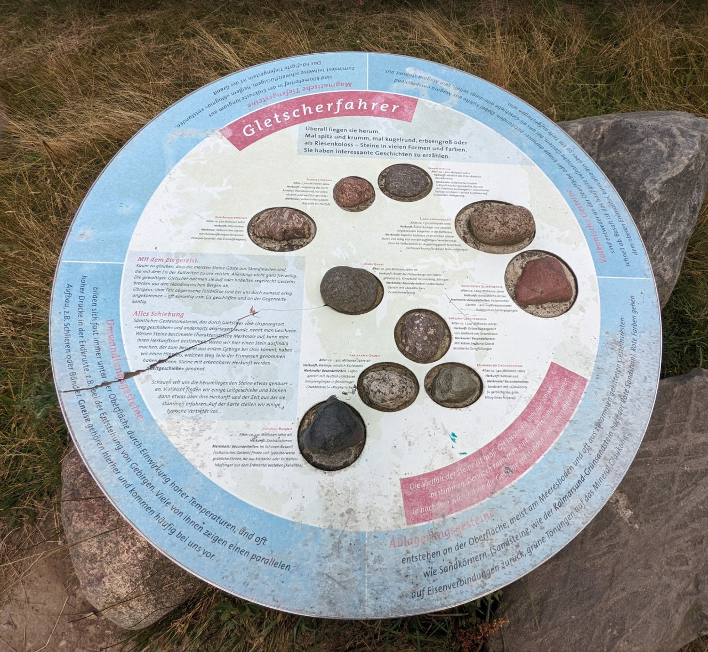
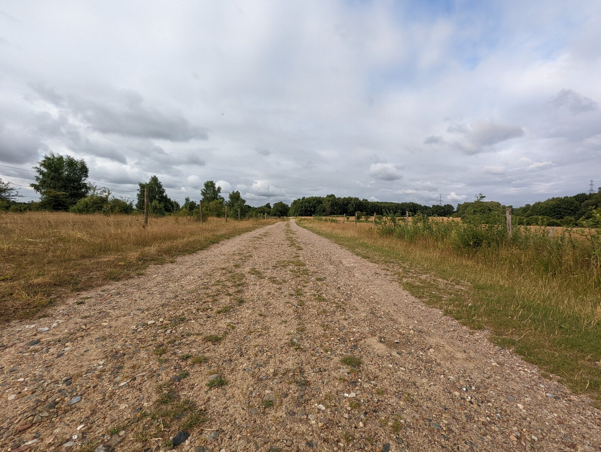

# Der Höltigbaum, ein Naturschutzgebiet mit Geschichte

Zwei Naturschutzgebiete in Hamburg habe ich mit den [Boberger Niederungen](https://markus-daams.com/posts/entspannen-in-hamburg/) und dem [Hamburger Wattenmeer](https://markus-daams.com/posts/hamburger-wattenmeer/) bereits vorgestellt. Aber was soll ich sagen, ich entspanne sehr gerne und wenn ich die Natur schon um mich herum habe, dann nutze ich das aus.

Heute geht es in das Naturschutzgebiet Höltigbaum. Hier gibt es wieder viel Natur zu entdecken. Da der Höltigbaum nicht so bekannt ist, nehme ich diesen Artikel einmal zum Anlass, dieses Fleckchen einmal vorzustellen.

## Hamburg und seine Bäume

Wer in Hamburg unterwegs ist, wird immer wieder auf den "Baum" im Namen stoßen. Dieser Namensbestandteil weist sehr häufig darauf hin, dass sich hier eine Zollgrenze befunden hat. Der Baum war in diesem Fall dann der Schlagbaum, also eine Schranke, die sich erst dann geöffnet hat, wenn man eine entsprechende Zollgebühr entrichtet hat. Die Stadt Hamburg hatte solch eine Zollgrenze an allen Handelswegen, die aus oder in die Stadt führten.

Der Höltigbaum liegt mitten im Grenzgebiet zwischen Hamburg-Wandsbek und Schleswig-Holstein. Beide Bundesländer fühlen sich auch für dieses Naturschutzgebiet verantwortlich. 

_Die Landschaft wird auch hier größtenteils sich selbst überlassen._

Wer also neugierig ist, wie sich die Natur einen einst militärisch genutztes Gebiet zurückerobert, ist hier genau richtig.

## Die Geschichte des Höltigbaums

Die Geschichte des Höltigbaums beginnt mit viel Unrecht. Der Gutsbesitzer des "Guts Höltigbaum" wurde von der Wehrmacht in den 1930ger Jahren enteignet. Die Wehrmacht nutze das Areal als Übungsplatz. Gegen Ende des Zweiten Weltkrieges kam es hier auch zu Exekutionen von Kriegsgefangenen, Kriegsdienstverweigerern und angeblichen Fahnenflüchtigen. Eine leider etwas versteckte Gedenktafel erinnert noch heute an diese Verbrechen.

Nach dem Zweiten Weltkrieg haben kurzzeitig britische Soldaten den Höltigbaum als Schießübungsplatz verwendet.

## Die Bundeswehr rückt ein

Ab 1958 übernahm die Bundeswehr den Höltigbaum. Es wurde die Standortschießanlage vor allem für die [Panzerbrigade 17](https://de.wikipedia.org/wiki/Panzergrenadierbrigade_17), eine Panzergrenadierbrigade der **6. Panzergrenadierdivision**. Diese waren in Hamburg-Rahlstedt (Boehn-Kaserne) stationiert und hatten es daher nicht weit in den Höltigbaum.

_Gut zu erkennen sind noch die Spuren der Schützenpanzer, die hier eins fuhren._

Die Panzergrenadiere aus Hamburg waren hier auch in Schützenpanzern unterwegs. Deren Spuren sind noch heute im Höltigbaum deutlich zu sehen. Heute sind diese aber begehbar. Spuren der militärischen Nutzung sind noch heute zu erkennen. Aber nur, wenn man weiß, wonach man gucken muss.

## Nach dem kalten Krieg übernahm die Natur das Kommando

Die **Panzerbrigade 17** wurde 1993 aufgelöst und ab dem Jahr 1995 hat die Bundeswehr den Höltigbaum geräumt. Ein paar Jahre später haben Hamburg und Schleswig-Holstein ihre jeweiligen Teile unter Naturschutz gestellt. 

Die militärischen Installationen wurden zurückgebaut und die Natur konnte sich wieder ausbreiten.

_Auch Gewässer gibt es im Höltigbaum._

## Anreise

Für die Anreise empfehle ich, wie immer, die Öffis. Ab dem Bahnhof Rahlstedt nimmt man den **Metrobus 29** in Richtung Bergedorf. Die Haltestelle heißt dann auch **"Naturschutzgebiet Höltigbaum (NSG Höltigbaum)"**. Man kann den Bus also auch von Bergedorf in Richtung Rahlstedt nehmen. 

Ab der Bushaltestelle kann man dann einfach in Richtung Natur gehen, diese ist nicht von dort nicht zu übersehen. Eine genaue Wegbeschreibung findet sich [hier](https://www.hoeltigbaum.de/footer/anfahrt).

## Die Landschaft

Durch die militärische Nutzung entstand hier eine Art Heidelandschaft, wie sie typisch für Manöver Gebiete ist. Größeres Gehölz ist hier also nicht so oft zu finden und wo keine Panzer mehr fahren, da wachsen Heidekraut, Gräser und andere Pflanzen, die robust sind.

Aber so langsam wagt sich auch größeres Gehölz wieder ans Licht. Es ist herrlich beim Wandern zu sehen, wie sich die Natur hier wieder zurückentwickelt.

_Keine Panzer mehr da, der Baum traut sich nun raus._

Alle Wege sind miteinander verbunden. Es gibt zudem zahlreiche Hinweis- und Infotafeln. Besonders gelungen fand ich die Erklärtafeln zu den Gesteinen, die sich hier finden lassen. Die Gletscher der letzten Eiszeit haben in ganz Norddeutschland ihre Spuren hinterlassen.

_Infotafeln sind im gesamten Naturschutzgebiet zu finden und sehr nützlich._

Die Wege sind alle befestigt. Einige der Sandwege können bei Regen aber schlammig werden. Ich empfehle daher festes Schuhwerk.

_Ein Wanderweg im Naturschutzgebiet Höltigbaum_

Auch zahlreiche Wildtiere und sogar Galloway Rinder lassen sich hier entdecken.

## Mein persönliches Fazit

Meine Verbindung zu diesem Naturschutzgebiet ist besonders. Das liegt vor allem daran, dass ich einige ehemalige Bundeswehrsoldaten kennengelernt habe, die in der **17. Panzergrenadierbrigade** gedient haben und den Höltigbaum daher sehr gut kannten. Sie verbanden schon damals gute Erinnerungen mit dem Ort. Ich bin mit jungen Jahren nach Hamburg-Jenfeld gezogen und habe miterlebt, wie die Kasernen in moderne Wohnungen umgewandelt wurden. Rahlstedt wuchs damals sehr schnell, daher bin ich sehr froh, dass der Höltigbaum kein Gewerbe- oder Neubaugebiet wurde. 

Ich bin sehr gerne im Höltigbaum unterwegs. Mein Favorit bleiben aber Boberger Niederungen, da diese landschaftlich abwechslungsreicher sind. Wer aber der Hektik des Hamburger Trubels entkommen möchte und im Osten der Stadt wohnt, sollte hier unbedingt einmal vorbeischauen. 

# Ressourcen

* [Die Website des NSG Höltigbaum](https://www.hoeltigbaum.de/)

* ["Wandern im Höltigbaum" - Auf hamburg.de](https://www.hamburg.de/freizeit/ausfluege/wandern/wandern-hoeltigbaum-306636)

* [Der Höltigbaum auf Openstreetmap.org](https://www.openstreetmap.org/#map=16/53.61953/10.19102)

* [Eine Website über die Geschichte Panzergrenadierbrigade 17 Hamburg](https://pzgrendiv6.de/brigaden/panzergrenadierbrigade-17.html)