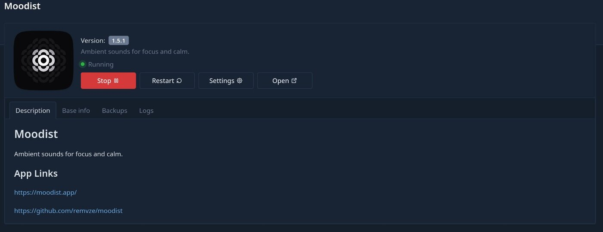
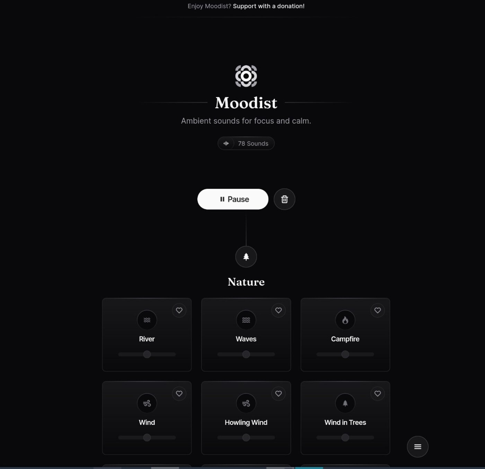

# Ozeanwellen direkt vom eigenen Server

Ich sitze viel vor dem Computer. Vielleicht sogar viel öfter, als gut für mich ist. Und wenn so vor mich dahin arbeite, tue ich das am liebsten mit voller Konzentration. Was mir schon immer dabei geholfen hat, waren Musik oder Geräusche. Für die Musik habe ich einen Jellyfin Server laufen. Für die Geräusche habe ich bisher immer eine App genutzt. Bis ich beim Scrollen durch den App-Store von [Runtipi](https://runtipi.io/) auf [Moodist](https://moodist.mvze.net/) gestoßen bin. Die perfekte App, um Geräusche zu erzeugen.

## Warum Moodist selbst hosten?

Die Apps, die ich auf meinem Smartphone nutze, bringen den Nachteil mit sich, dass sie auch nur auf diesem laufen. Ich habe öfters einmal Phasen, in denen ich mein Handy nicht bei mir haben kann (es lädt), oder bei mir haben will (digital detox). Klar, es gibt auch entsprechende Apps für Linux und Windows. Zudem kann man Moodist auch auf der Projekt-Website direkt im Browser nutzen. 

Warum also selbst hosten?

Da kommen meine üblichen "deswegen hoste ich selbst" Argumente zum Tragen:

- Selbst gehostete Apps sind plattformunabhängig. Ich kann sie parallel auf verschiedenen Endgeräten nutzen
- Projekte können jederzeit eingestellt werden. Ich kann sie dann zumindest noch eine Weile selbst hosten
- Es ist ein Edgecase, aber kommt vor: Sie funktionieren auch dann, wenn die Internetverbindung einmal wegknickt

## Moodist installieren

Ich habe die Installation direkt über [Runtipi](https://runtipi.io/) angestoßen. Was **Runtipi** ist, bietet und wie man es installiert, erkläre ich in [diesem Artikel](https://markus-daams.com/posts/runtipi-selfhosting-einfach-gemacht/).

Einfach **Moodist** im Store suchen und auf *Install* klicken. Die Installation und das Deployment laufen dann vollständig automatisch ab.

_Die Installation geht schnell und Moodist wird automatisch gestartet_

## Und dann ... Geräusche

Öffnet man nun die IP-Adresse, erscheint eine sehr schlichte, aber funktionale Website. 

_Die Website der lokal gehosteten Moodist Instanz_

Nun wird es Zeit, den inneren DJ zu channeln. Es stehen verschiedene Geräusche zur Verfügung. In der Variante zum selbst hosten sind dies aktuell **78** an der Zahl. Da finden sich zum Beispiel:

- Natur (Fluss, Ozean, Wind, 'gehen auf Schnee', Wasserfall ...)
- Regen (Leichter Regen, schwerer Regen, Regen auf ein Zelt ...)
- Tiere (Seemöven, Eulen, Frösche, Wölfe ...)
- Urban (Straße, Autobahn, Menschenmassen ...)
- Orte (Flughafen, U-Bahn-Station, volle Bar, Baustelle ...)
- Transport (Flugzeug, U-Boot (*ja, wirklich*), Zug, 'in einem Zug' ...)
- Dinge (Uhr, Wäschetrockner, Papier, Schreibmaschine, Morse Code ...)
- Geräusche: (Pink Noise, White Noise, Brown Noise)
- Binaurale Geräusche (Theta-, Gamma-, Delta-Wellen ...)

Die Mischung stimmt also.

Jedes einzelne Geräusch kann man nun anklicken und direkt abspielen. Die Lautstärke lässt sich für jedes Geräusch separat einstellen. Das ist besonders dann nützlich, wenn man mehrere Geräusche parallel abspielen will. Ich kann mir dann per Mausklick ein paar Möwen zu meinem Ozean hinzufügen. Und ist mir die Kulisse noch zu ruhig, spiele ich mir dazu noch einen Sturm und ein Flugzeug ab. Es lässt sich alles mit allem mischen. So kann jede noch so ausgefallene Klangkulisse erzeugt werden. Wie hört sich wohl ein Wäschetrockner im Dschungel an, während der Wolf dazu heult? Mit **Moodist** lässt sich diese Frage nun endlich klären.

_Klänge lassen sich einfach mischen. Aktive Klänge werden visuell hervorgehoben_

Dazu kommen noch Komfortfunktionen, die ich gerne nutze. So ist es möglich, seine Lieblingsgeräusche zu liken. Diese erscheinen dann ganz oben, in einer eigenen Kategorie.

Es kommen aber noch weitere Funktionen dazu. Darunter natürlich ein *Sleeptimer* und die Möglichkeit, die eigene Kombo als *Preset* zu speichern. Das Preset kann dann auf allen Geräten genutzt werden, denn wir hosten ja selbst :)

_Moodist bietet einige Komfortfunktionen - Und wer es braucht, sogar ein Notizfeld_

## Mein Fazit

Ich höre mir gerne Hintergrundgeräusche an. Sie helfen mir entweder mit der Konzentration, oder ganz klassisch, beim Einschlafen. **Moodist** bietet hierbei nichts, was nicht auch andere Apps bieten. Ich schätze aber die Möglichkeit sehr, es selbst zu hosten. So kann ich meine Favoriten und Presets lokal auf mehreren Geräten nutzen. 

Die Geräusche selbst sind absolut in Ordnung, wobei ich noch nicht alle ausprobieren konnte. Besonders angetan bin ich vom Regen, welcher auf ein Zelt prasselt und zu dem ich mir dann noch einen strammen Wind abspiele. **Man, das chillt mich!**

Kurz um: Mit **Moodist** kann man sich seine eigene Klangkulisse selbst hosten. Zudem ist es open source.

## Ressourcen

- [Moodist Website - Hier kann man es auch ausprobieren!](https://moodist.mvze.net/)
- [Die Github-Page von Moodist](https://github.com/remvze/moodist)

