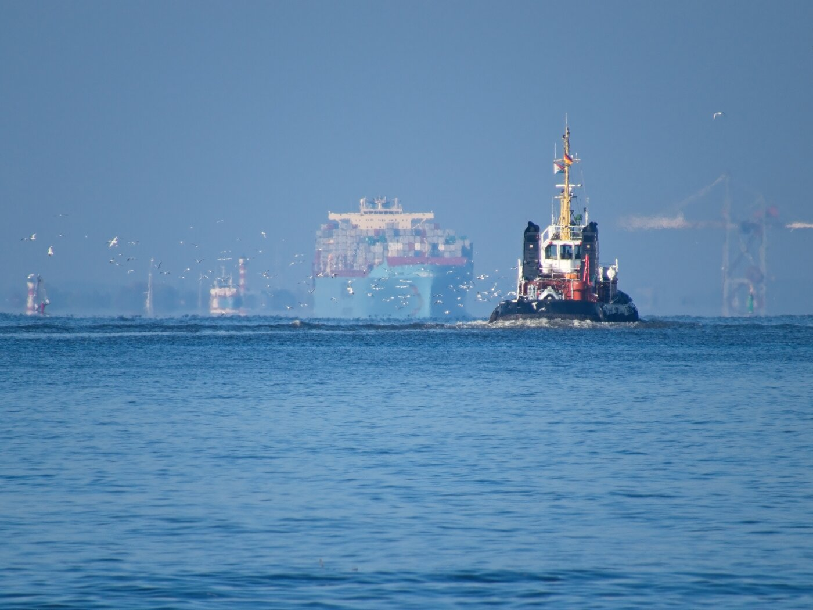
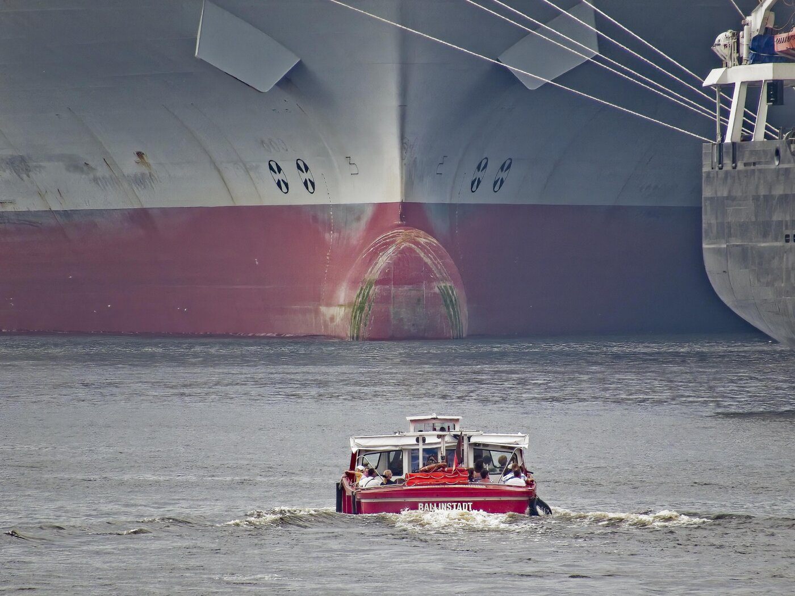
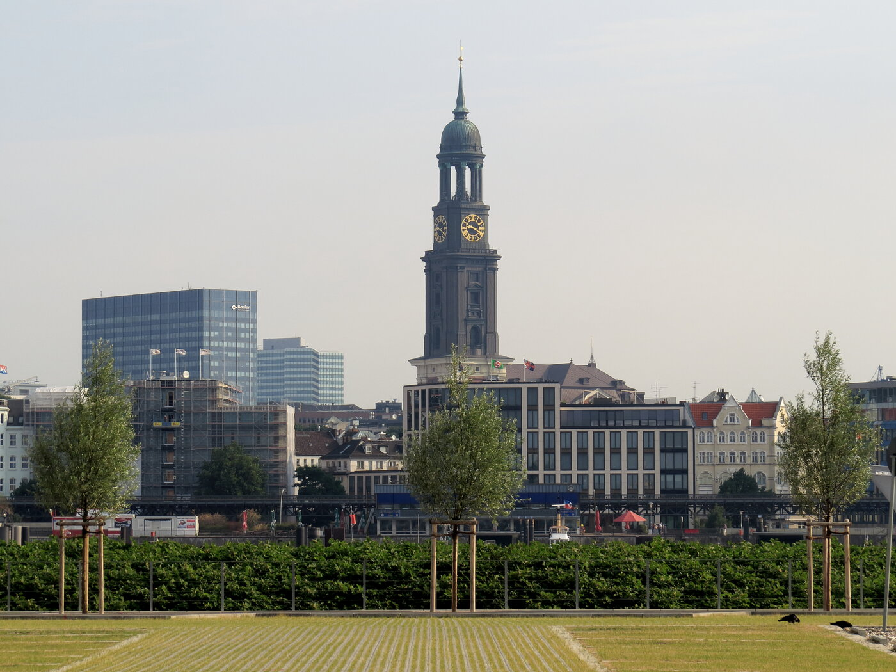
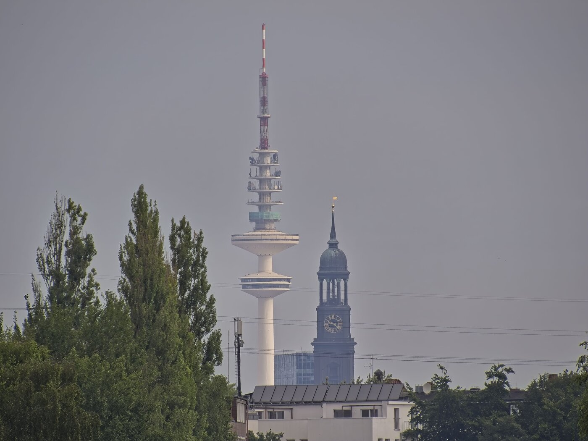
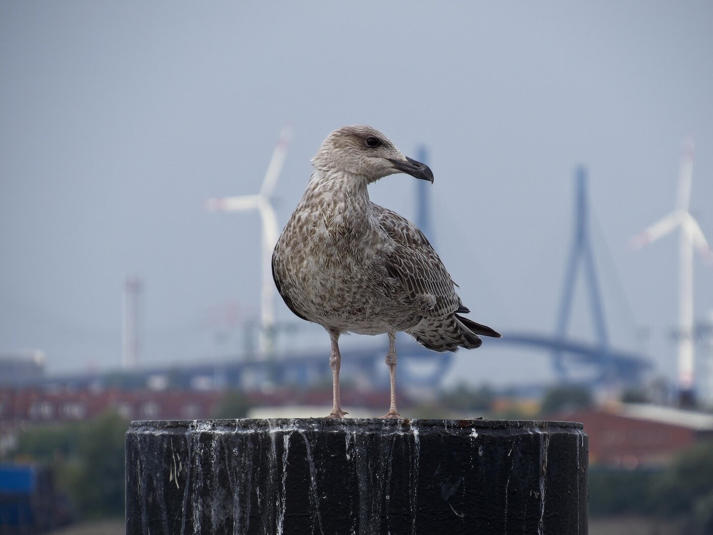
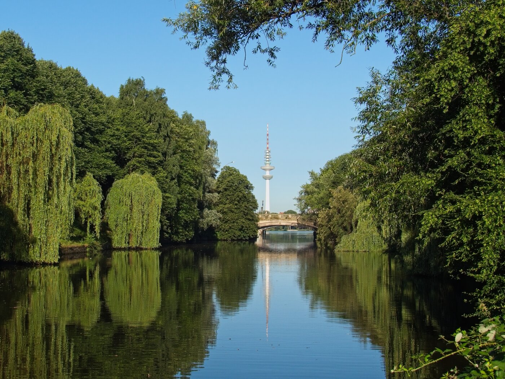

# Meine Lieblingsfotos - Erster Teil

Fotografieren ist ein tolles Hobby. Die Begeisterung hierfür teile ich mit vielen Menschen. Dabei kommt es der Foto-Community hier sehr gelegen, dass Hamburg eine sehr fotogene Stadt ist. Dabei sei einmal vorweggeschickt, dass ich kein Profi bin und auch nie die Ambitionen hatte, einer zu werden. Ich habe dieses Hobby nur mit einem anderen Hobby verbinden können, welches ich ebenfalls mit viel Begeisterung betreibe.

## So ging es bei mir los.

Alles startet bei mir mit einem sehr ausgeprägten Bewegungsdrang. Ich habe mir Musik auf die Ohren gelegt und bin einfach losgegangen. War ich anfangs noch in den umliegenden Stadtteilen unterwegs, hat sich mein Bewegungsradius schnell auf die ganze Stadt Hamburg und die sie umgebenden Ortschaften und Landstriche erweitert. Hamburg ist nicht nur an der Alster und am Hafen schön. Es gibt hier – bei gutem Wetter und richtigem Licht – viele, schöne, schnuckelige oder atemberaubende Flecken. Diese Momente sollte ich doch irgendwie mit anderen teilen können ...

In den 2000er – 2010er Jahren begann die Fotografie als Hobby zu sprießen. Das hing auch mit dem Aufkommen von sozialen Netzwerken wie Facebook zusammen. Die Leute teilten ihre Fotos und als jemand, der Hamburg liebt, likte und teilte ich diese. Allerdings konnte man mit den Fotos wenig anfangen, denn alle waren sehr darauf bedacht, ihr Wasserzeichen zu hinterlegen und restriktive Lizenzen zu verwenden. Auch wenn ich die Intention dahinter verstehen konnte, machte es mich traurig, dass es kaum schöne Fotos zur freien Verwendung gab. Hamburg war so schön für mich, dass man es den Menschen ermöglichen musste, damit anzugeben. Gedacht, getan. Ich hab all diese tollen Orte entdeckt, nun musste ich diese nur noch ablichten und mit allen teilen.

Ich hatte bis dahin nur mit einem Handy fotografiert, einem Samsung Galaxy S2. Die Kamera reichte leider nicht aus, wirklich schöne Fotos zu machen. Also kaufte ich mir meine erste Kamera.

Die Wahl viel bei mir auf eine **Canon Powershot SX 50HS**, eine Superzoom Kamera. Sie erfüllte wichtige Punkte für mich:

- Sie war klein und leicht genug, um sie beim Wandern dabei zu haben
- Der Brennweitenbereich war weit genug, um verschiedene Motive abbilden zu können
- Der Zoom war mit dem Faktor 50 ausreichend, um auch schwierige Motive einfangen zu können
- Sie war für Anfänger geeignet, denn Canons Automatikprogramme sind trotz der Kritik der Profis wirklich gut
- Ich konnte sie mir damals leisten (Yay!)

Diese Kamera hatte ich ab dann bei mir, wenn ich wieder einmal auf Wandertour war. 

Und man, was habe ich abgedrückt. Ich war ja mindestens jedes Wochenende unterwegs. Die Ordner füllten sich schnell mit vielen Bildern, die nicht so gelungen sind, einigen Bildern, die schon was haben und einigen wenigen Perlen. Meine Lieblingsfotos. Die will ich in diesem Blog mit allen teilen. 

Los geht es.

## Ein Schlepper auf der Elbe

_Ein Schlepper fährt die Elbe runter um ein ankommendes Containerschiff beim Einlauf zu unterstützen (2013)_

Dieses Foto entstand im Spätsommer 2013. Meine Wandertour führte mich an diesem Tag an der Elbe entlang, in Richtung Wedel. Diese Strecke war damals noch nicht so besucht wie sie es heute ist, daher war ich dort öfters unterwegs. Dabei kommt man irgendwann am Fähranleger „Teufelsbrück“ vorbei – ein Schwimmponton auf der Elbe. Hier fahren die Fähren nach Finkenwerder und dem Airbus Werksgelände. 

Da der Ponton an dieser Stelle recht weit in die Elbe ragt, hat man hier die Möglichkeit, tolle Fotos zu schießen. 

### Auftritt Superzoom

Wie eingangs beschrieben, hatte ich mir bewusst eine Superzoom-Kamera gekauft. Die Abstriche in der Bildqualität bei hohen Brennweiten hatte ich bewusst in Kauf genommen, da ich es mehr auf tolle Motive und Bildgestaltung abgesehen hatte. 

Die Blickrichtung bei diesem Foto geht von Teufelsbrück in Richtung Wedel. Man erkennt einen Schlepper, der sich auf den Weg macht, um ein einlaufendes Containerschiff zu unterstützen. Dies ist bei großen Schiffen notwendig, da das Manövrieren auf der Elbe sehr herausfordernd ist. 

Der Zoom dieses Fotos vermittelt den Eindruck, das Foto wäre auf hoher See entstanden. Das ist es natürlich nicht. Durch die hohe Zoomstufe wurden der Schlepper und die Schiffe näher herangezogen und die beiden Ufer der Elbe sind aus dem Bildrand verschwunden. Dazu kommt das Hitzeflimmern des Spätsommers. Durch dieses Foto ist damals meine Begeisterung für hohe Zoomstufen entstanden. 

## Die Hafenrundfahrt vor dem Containerschiff

_Die Hafenrundfahrt einer Barkasse luschert mal im Containerterminal Tollerort vorbei (2013)_

Der 50x Zoom meiner Kamera hatte es mir angetan. Ich war ab sofort auf der Suche nach Motiven, die ich mit eben dieser Fähigkeit besonders zur Geltung bringen konnte. Dabei ist mir ein besonderer Spot eingefallen, der sich für tolle Fotos besonders eignet.

Am [„Altonaer Holzhafen“ (Link zu OpenStreetMaps)](https://www.openstreetmap.org/?#map=19/53.544066/9.945505), noch vor der „Großen Bergstraße“ hat man eine direkte Sichtachse über die Elbe auf das Containerterminal „Tollerort“. Bewaffnet mit meiner Superzoom ging es also auch dort hin und es entstand dieses Foto. Wieder einmal erzeugte die hohe Brennweite ein beeindruckendes Motiv. Die Größenverhältnisse stimmen hier nämlich nicht. Durch die hohe Zoomstufe erscheint der Bug des Containerschiffs deutlich größer, als dieser tatsächlich war. 

Daher ist es auch eines meiner Lieblingsfotos geworden. Es steht sinnbildlich für die typische Hafenrundfahrt in Hamburg. Die kleinen Barkassen sind seit über 100 Jahren nicht gewachsen, während die Containerschiffe immer größer wurden und werden.

## Der Michel

_Die Sichtachse ist am Sonntagmorgen frei, daher konnte ich von hier tolle Fotos machen (2013)_

Nun durfte natürlich auch der Michel nicht fehlen. Er ist und bleibt unser Wahrzeichen, egal wieviele Millionengräber in die Stadt gestellt werden. 

Für den Michel ist mir ein Spot eingefallen, den ich bei einer meiner Wandertouren durch den Hamburger Hafen entdeckt hatte. Die Rede ist vom Parkplatz des Musicals „König der Löwen“, welches gefühlt 2 Stunden nach Stadtgründung einzog und nun einfach hier wohnt. Man hat auch von dort eine großartige Aussicht. 

Der Parkplatz war (ist?) an den Wochenenden leer. Man hat also eine freie Sichtachse in Richtung Michel. Durch die hohe Zoomstufe war es mir dann möglich, den Michel näher ran zu holen, damit er größer wirkt. Hierdurch fällt die Elbe zwischen Parkplatz und Landungsbrücken praktisch gar nicht mehr auf. 

## Der Michel und der Fernsehturm

_Zwei Hamburger Originale, der Michel und der Fernsehturm auf einem Bild (2013)_

Mit so viel Zoom, warum nicht mal zwei echte Hamburger Originale ablichten? Ich war auf Wandertour in Wilhelmsburg. Im Zuge der Internationalen Gartenbauaustellung 2013 wurde dort viel umgebaut. Es wurden aber auch markierte Wanderwege (Loop) angelegt. Diese musste ich natürlich auch mal abgehen und immer dabei, meine Kamera. 

Und dann findet man auch einmal solche Motive wie auf diesem Foto. Ich stand auf einer kleinen Holzbrücke über einen Kanal und es bot sich mir eine freie Sichtachse in Richtung Sankt Pauli. Der Michel und der Fernsehturm standen brav nebeneinander. Dank des 50x Zooms konnte ich die beiden Hübschen wieder etwas näher heranziehen. Dieses Motiv habe ich so nicht wieder hinbekommen können. Daher ist es auch eines meiner Lieblingsfotos.

## Die Möve und die Köhlbrandbrücke

_Eine Möve auf einem Dalben, dahinter die Köhlbrandbrücke_

*So mein Schieter, jetzt aber nicht bewegen* - Das war mein Gedanke, als ich an dieser Szene vorbei kam. Ich wanderte gerade über die [„Müggenfelder Hafenbahnbrücke“ (Link zu OpenStreetMaps)](https://www.openstreetmap.org/?#map=19/53.522067/10.009620), als sich mir ein einmaliges Motiv bot. Die Biester fliegen halt sehr gerne weg, wenn ihnen was nicht passt. Also kramte ich die Kamera aus dem Rucksack so ruhig ich auch nur irgendwie konnte. Möwen gehören zu Hamburg wie Michel, Franzbrötchen und Staus auf der A7. Möwe vor Köhlbrandbrücke, na also das ist doch mal ein Motiv wie es Hamburger kaum geht. 

Das ist auch der Grund, warum sich dieses Foto zu einem meiner Lieblinge gemausert hat. Die hanseatische Gelassenheit der Möwe hatte mir ein tolles Foto beschert. 

## Mundsburger Kanal

_Der Mundsburger Kanal mit Blickrichtung Alster. Dazu unverkennbar, der Fernsehturm (2013)_

Joggen, wo andere Urlaub machen. So beschreibe ich die Szene auf diesem Foto für mich selbst. Der Eilbek Kanal, welcher irgendwann zum [„Mundsburger Kanal“ (Link zu OpenStreetMaps)](https://www.openstreetmap.org/?#map=18/53.565573/10.023109) wird, war schon immer meine Jogging Strecke. Besonders im Frühling und Sommer ist es besonders bei Sonnenaufgang einfach wunderschön hier. 

Da war es klar, dass ich meine Kamera mit genommen hatte, um ein paar dieser Momente einzufangen. Hamburg ist – zum Glück – eine sehr grüne Stadt. Einige Kanäle sind an beiden Ufern bewachsen, wie auch hier beim Mundsburger Kanal. Es gibt eine Unterführung unterhalb der „Kuhmühlenbrücke“. Von hier hat man dann freie Sicht in Richtung Außenalster. Der Fernsehturm steht hier ebenfalls in der Sichtachse, wodurch sich zur richtigen Jahres- und Tageszeit und bei gutem Wetter, ein einmalig schönes Motiv ergibt.

## Zum Schluss

Dies waren die ersten Lieblingsfotos, die ich vorstellten wollte. Diese Artikelreihe werde ich bald fortsetzen. Es macht mir Spaß, hier noch einmal in Erinnerungen zu schwelgen und mich daran zu erinner, wie diese Fotos eigentlich entstanden sind. Da kann ich meinen Blog dafür nutzen, dies auch gleich zu dokumentieren. Bis dahin, vielen Dank für's Lesen und Tschüss.

Noch ein Hinweis: Viele Meiner Lieblingsfotos finden sich auch auf meinem Profil auf **Flickr** und auf **Pixabay**. Einige davon werde ich in diesem Blog zukünftig vorstellen.

* [Mein Profil auf Flickr](https://www.flickr.com/photos/uranwolle/)

* [Mein Profil auf Pixabay](https://pixabay.com/de/users/markusdhamburg-6311779/)