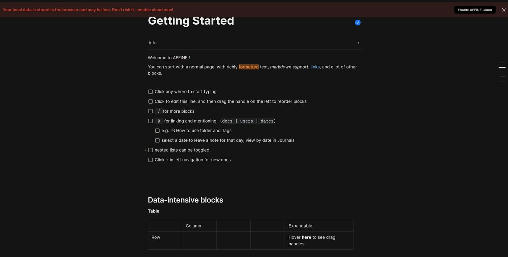

# Mit AFFiNE Ordnung ins Chaos bringen

Ich gebe zu, dass auch ich zu der Kategorie Mensch gehöre, die gerne viele Projekte gleichzeitig beginnt und sich dann später sehr schwer damit tut, wieder den Anschluss zu finden. Sich selbst zu organisieren ist da das erste Gebot. Dabei habe ich schon vieles ausprobiert. Von einfachen Notizen, wie man sie auch in **Nextcloud** anlegen kann, bis zu [Joplin](https://joplinapp.org/). Ich war mir nicht einmal zu schade, [JIRA](https://www.atlassian.com/de/software/jira) für einige Projekte zu nutzen. Wirklich durchgesetzt hat sich bei mir kein Tool. Dennoch suche ich weiterhin nach einer geeigneten Lösung. Wichtig ist mir dabei nur, dass ich sie selbst hosten kann.

Heute schaue ich mir [**AFFiNE**](https://affine.pro/) an. Der Claim *"This is your second brain"* ist zugegebenermaßen ganz schön steil. Nicht nur setzt dieser bei mir ein *"first brain"* voraus, was ich sehr schmeichelnd finde. Es werden auch große Erwartungen geweckt.

**AFFiNE** wirbt mir allem, was die Marketing-Artillerie abfeuern kann. Wir haben "*atrue canvas for your ideas*", über *"Real-time collaborative"* und natürlich "*Multimodal AI partner*". Wobei die selbst gehostete Version einige Features wohl nicht unterstützt. Das schreckt mich aber nicht weiter ab, es wenigstens einmal getestet zu haben. Also mache ich mich einmal mutig ans Werk.

## Installation und erste Schritte

Die [Installation](https://docs.affine.pro/docs/self-host-affine) von **AFFiNE** ist mittels Docker möglich. Ich entscheide mich aber für die Installation via **Runtipi**. In [diesem Artikel](https://markus-daams.com/posts/runtipi-selfhosting-einfach-gemacht/) stelle ich **Runtipi** vor. Mit einem Klick landet **AFFiNE** auf der SSD und wird automatisch gestartet. 

_Nach der Installation erwartet uns der Welcome Screen von AFFiNE im Webbrowser_

Im Webbrowser geht es dann weiter. Nach der Anmeldung öffnet sich dann das Admin-Panel. 

_Im Admin-Panel werden User und Server Settings verwaltet_ 

Im Admin-Panel verwalte ich die User und die Server Settings. 

Um nun auf den normalen User Workspace zuzugreifen, rufe ich die IP-Adresse oder Subdomain + Port 3010 auf. Daraufhin begrüßt mich erst einmal eine Warnmeldung.

_Um die Warnmeldung muss ich mich als Erstes kümmern_

In der aktuellen Konfiguration werden alle Änderungen lokal im Browser gespeichert. Diese Daten gehen also in dem Moment verloren, indem ich den Browser Cache lösche. Gemäß der [Anleitung](https://docs.affine.pro/docs/self-host-affine) muss ich dies auf *Cloud* ändern. 

Hiermit werden meine Daten dann serverseitig gespeichert. Es reicht dazu aus, auf das Wort **Local** zu klicken und dann **Cloud** auszuwählen. Nachdem ich das getan habe, verschwindet die Warnmeldung von alleine. 

> Der für verschiedenen Betriebssysteme bereit stehende Client für AFFiNE unterstützt laut Dokumentation aktuell noch keine Verbindung zu einer lokal gehosteten Instanz.
{: .prompt-info}

## AFFiNE läuft. Und nun?

Mich begrüßt eine vorab konfigurierte Beispiel-Seite, auf dem gezeigt wird, was **AFFiNE** so alles bietet. Ich kann mir ein Kanban-Board anlegen, wissenschaftliche Notationen werden unterstützt, es stehen zahlreiche Formatierungsoptionen für Text zur Verfügung und noch vieles mehr. 

_Die Beispiele zeigen, was sich alles nutzen lässt_

Ich habe die Sprache erst einmal auf Deutsch geändert. Der Dark Mode wurde anhand meiner System-Settings vorausgewählt. 

Ich lege meine erste Seite an, um mich einmal vertraut mit der Bedienung zu machen. Diese ist wirklich intuitiv gestaltet. 

_Die Seiten lassen sich umfangreich ändern_

Mittels '/' lässt sich auf eine Seite das Menü öffnen. Hier stehen die Blocks zur Verfügung, die ich einfügen kann. Und das sind wirklich viele Optionen, zum Beispiel:

* Styles wie Textformatierungen wie fett, unterstrichen, italic, strikethrough ...
* Basics wie verschiedene Überschriften, Textblöcke, Zitate ...
* Content wie Einbettungen von Youtube-Videos, PDF, Google Drive Docs, Github-Repos, [Figma](https://www.figma.com/), [Loom](https://www.loom.com/) ...
* Frames, Mindmaps
* Kanban-Boards und Tabellen

Es gibt also sehr viele Möglichkeiten, eine Seite genau auf ein Projekt anzupassen. Toll ist auch, dass sich die Seiten dann untereinander verlinken lassen. Wer sich also sein eigenes Confluence auf Steroiden erschaffen will, kann das hiermit vermutlich schaffen. 

Die erste eigene Seite lässt sich schnell anlegen und mit Leben füllen. Die Bedienung ist intuitiv und lehnt sich sehr an die Konzepte von bereits existierenden Lösungen an. Wer also irgend eine Projektverwaltung kennt, wird sich vermutlich schnell zurecht finden.

_Die erste eigene Seite lässt sich schnell anlegen und gestalten_

Übrigens: Alle Änderungen werden praktisch sofort und automatisch gespeichert. Dank der serverseitigen Speicherung geht auch dann nichts verloren, wenn mal schnell der Laptop zugeklappt werden muss. 

## Was sonst noch wichtig ist

Die Entwicklung von **AFFiNE** ist aktuell noch in vollem Gange. Jedoch ist es bereits sehr gut nutzbar. Es lassen sich verschiedene Seiten in verschiedenen Ordern anlegen. Alle registrierten User können miteinander interagieren. Je nach verwendeter Hardware, auf der selbst gehostet wird, lassen sich hier also einige Leute und Teams zusammen führen.

Features wie zum Beispiel die AI-Integration, aber auch die Nutzung der Client-Software stehen aktuell nicht für die Selbst-Hoster zur Verfügung. Wer das braucht, muss auf das [kommerzielle Angebot](https://affine.pro/pricing) zurückgreifen, wobei es auch einen Free Tier gibt. Allerdings habe ich nicht herausfinden können, wo das Angebot gehostet wird. Daher sollte man auch den Datenschutz mitdenken, wenn man dieses Angebot nutzen möchte.

## Mein Fazit

**AFFiNE** ist schon echt spannend. Für die Projektorganisation eignet es sich meiner Meinung nach auf jeden Fall. Es versprüht echte Conflunce-Vipes, wobei ich hier ausdrücklich die (wenigen) positiven Eigenschaften von Conflunce meine.

Aber ... 

Mir persönlich ist es für das, was ich so treibe, dann doch etwas zu mächtig. Ich denke, dass für einen einzelnen Nutze wie mich eine einfachere Lösung die bessere Wahl ist. Dennoch werde ich **AFFiNE** im Hinterkopf behalten, für den Fall, dass ich doch noch das weltverändernde Unternehmen gründen werde. 

## Das gefällt an AFFiNE

* Es ist open source (MIT Lizenz)
* Das kommerzielle, Cloud gehostete Angebot bietet einen Free Tier
* Die Bedienung ist einfach und lehnt sich an gleichartige Lösungen an
* Selbst hosten wird angeboten und auch aktiv mit entwickelt

## Ressourcen

* [Die offizielle Projektseite](https://affine.pro/)

* [AFFiNE auf Reddit](https://www.reddit.com/r/Affine/)

* [Das Github-Repo](https://github.com/toeverything/AFFiNE)
