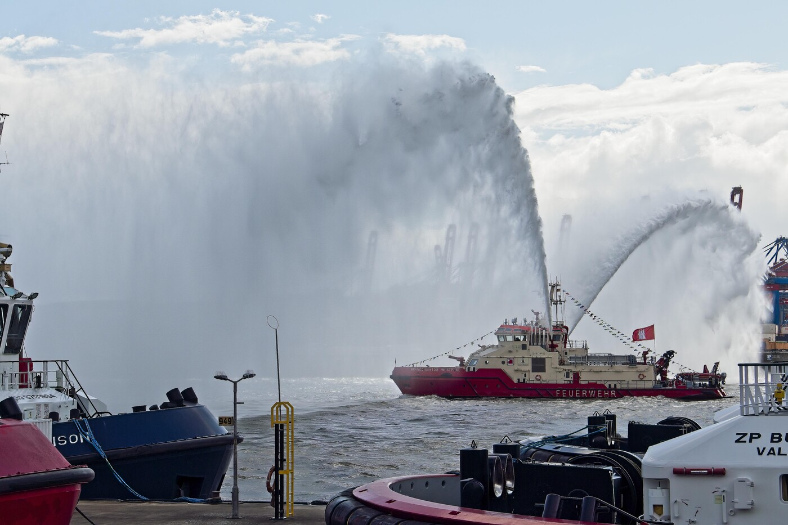
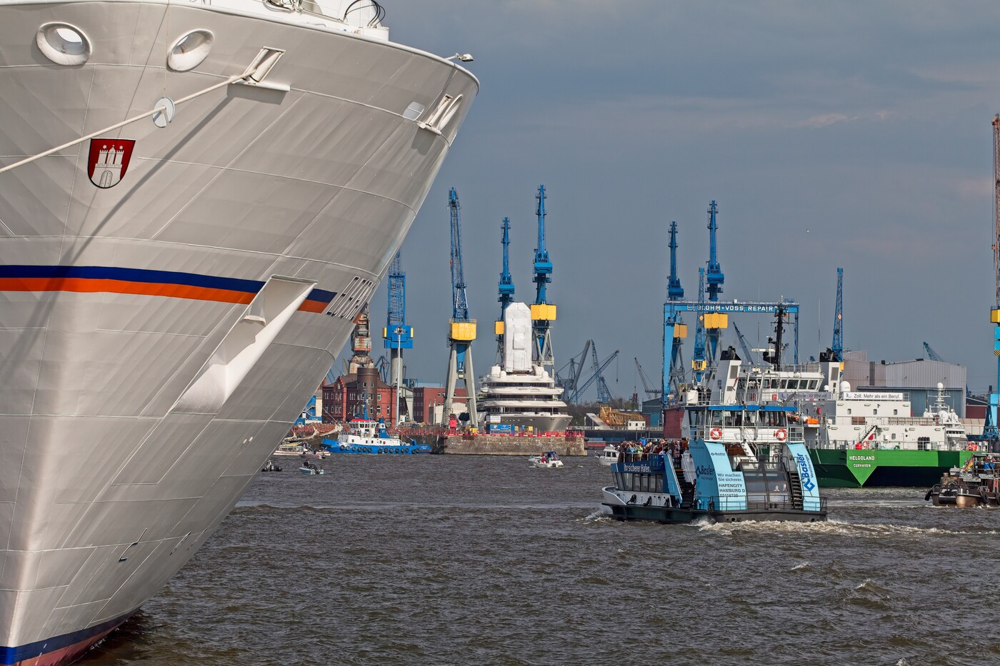
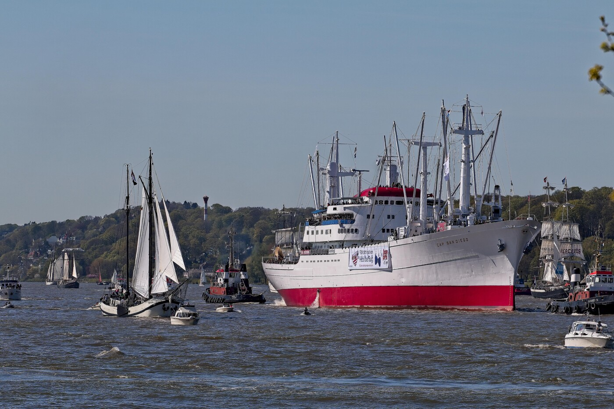
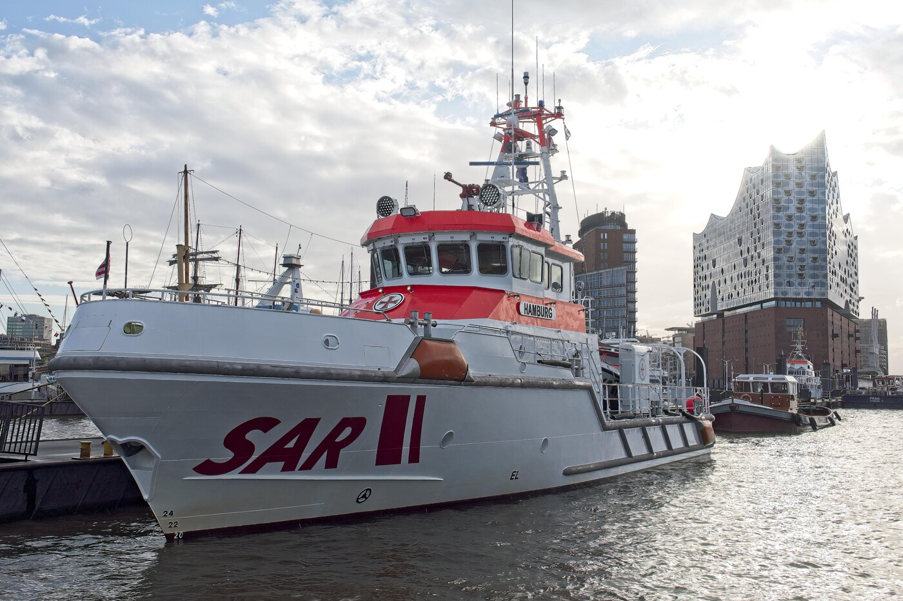
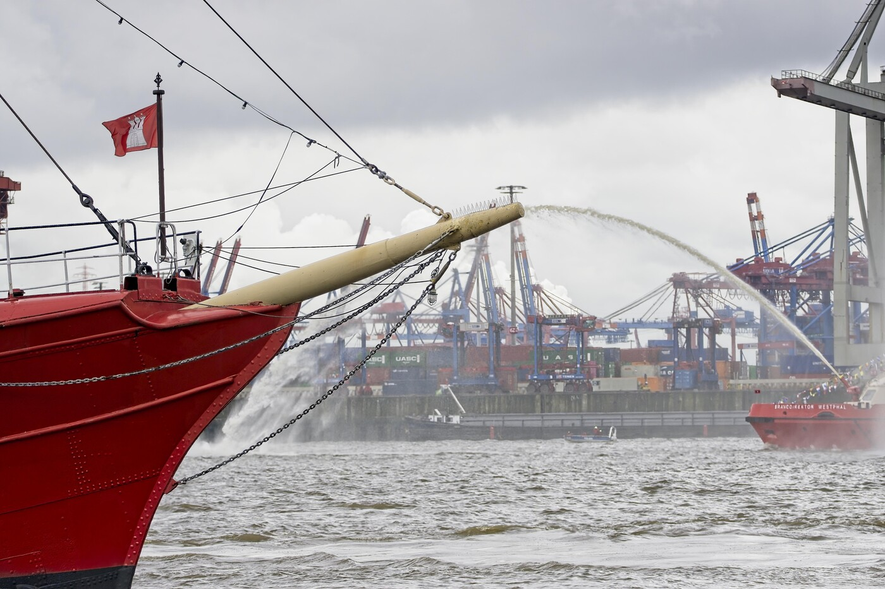

# Meine Lieblingsfotos - Zweiter Teil

Nachdem der Titel [dieses Artikels](https://markus-daams.com/posts/lieblingsfotos-part-1/) es bereits angedeutet hatte, möchte ich hier und heute den zweiten Teil meiner Lieblingsfotos vorstellen. 

Es gibt da auch einen Anlass für, denn in Hamburg findet am Wochenende der alljährliche Hafengeburtstag statt. Den Trubel dort meide ich inzwischen und die Gründe dafür sind vielfältig, aber darum soll es heute nicht gehen. Es soll vor allem um meine Lieblingsfotos gehen, die Rund um den Hafengeburtstag entstanden sind. Da musste ich eine Auswahl treffen, denn naturgemäß entstehen bei einem solchen Event viele Fotos. 

Sollte es jemanden geben, der den Hafengeburtstag nicht kennt, dem will ich kurz erzählen, worum es geht. Offiziell feiert die Stadt Hamburg nicht nur ihren Wirtschaftsfaktor Nummer 1, den Hafen, sondern auch den Freibrief - auch Barbarossa-Brief genannt, in welchem der Stadt viele Privilegien zugestanden wurden, unter anderem die Zollfreiheit bis an die Elbmündung. Diese Handelsfreiheiten galten als Geburtshelfer des Hamburger Hafens. 
Allerdings dient dieser Hintergrund nur als "Aufmacher". Letztendlich ist der Hafengeburtstag ein Volksfest mit Schiffsparade und - naja - jeder Menge Schiffen. 

Jedenfalls ist dann viel los in der Stadt und es bieten sich zahllose Möglichkeiten, Fotos zu schießen. Das habe ich in der Vergangenheit immer gerne gemacht. Also legen wir los mit dem zweiten Teil meine Lieblingsfotos.

## Zuerst kommt das Feuerlöschboot

_Das Feuerlöschboot Schmidt führt die Auslaufparade an (2015 / Markus Daams / CC0)_

Traditionell führt ein Feuerlöschboot die Schiffsparade beim Ein-, als auch beim Auslauf an. Feuerlöschboote sind in Hamburg unerlässlich und sehr nützlich. Besonders Boote wie auf diesem Bild, die "Oberbaurat Schmidt". Sie sind flach genug, um auch durch die meisten Schleusen im Hafen zu kommen. Ihre mächtigen Monitore - so nennt man die Wasserspritzen mit den beeindruckenden Fontänen - fördern genug Wasser, um fast jedem Feuer Herr zu werden. 

**Warum ist das eines meiner Lieblingsfotos?** Es war mir immer schwergefallen, das Feuerlöschboot und die ganze Wasserpracht auf einem Bild unterzukriegen. Das lag an mir, weil ich oft einfach nicht das richtige Objektiv montiert hatte. Es lag aber auch daran, dass die Monitore eine wirklich beeindruckende Reichweite haben. Sie sollten ja nicht nur in der Lage sein, bei der Brandbekämpfung auf Schiffen zu unterstützen, sondern auch an Land. Und zu einem Anlass wie dem Hafengeburtstag wollte man als auch zeigen was man kann.

An diesem Tag hatte ich Glück. Ich stand gut um das Feuerlöschboot in seiner ganzen Pracht ablichten zu können. Dazu gab es dann noch, rechts davon, das Lotsenhaus auf dem Seemannshöft. Ein durchaus ikonisches Gebäude in Hamburg, denn von hier fahren die Lotsen aus, die die Schiffe beim Ein- und Auslauf unterstützen. 

## Und dann kommt das Feuerlöschsuperboot

_Das Feuerlöschboot Branddirektor Westphal führt die Einlaufparade an (2022 / Markus Daams / CC0)_

Immer mal wieder kommt es - leider - zu Bränden auf Containerschiffen im Hamburger Hafen. Die [CCNI Arauco brannte 4 Tage lang](https://www.schiffsjournal.de/grosseinsatz-am-hamburger-hafen-containerschiff-ccni-arauco-brennt-unter-deck/) und die Feuerwehr hatte große Mühe, den Brand unter Kontrolle zu bekommen. Es zeigte sich, dass es die alten Feuerlöschboote nicht mehr mit den Containerriesen unserer Zeit aufnehmen konnten. Natürlich gab es anschließend sowohl in der Hafenwirtschaft, als auch im Senat eine Diskussion über die sichtbar gewordenen Unzulänglichkeiten der Ausrüstung der Feuerwehr auf dem Wasser. 

Hamburg handelte und schaffte ein neues Feuerlöschboot an, die "Branddirektor Westphal". Dieses Löschboot hatte es dann in sich. Die drei Monitore können 120.000 Liter Wasser fördern, pro Minute! Das Wasser kann dann 110 Meter hoch und 180 Meter weit gepustet werden. Mehr als genug "Löschpower" für die großen Containerschiffe. Natürlich war die Branddirektor Westphal auch der Star bei der ersten Einlaufparade, nach ihrer Indienststellung. Die Monitore erreichten spielend beide Elbufer. Ich habe mich also sehr bemühen müssen, sie halbwegs gut auf ein Foto bekommen zu können. Es gelang mir dann 2022, als ich sie von der Seite erwischte, auf Höhe vom Museumshafen in Övelgönne / Neumühlen. 

**Warum ist das eines meiner Lieblingsfotos?** Ich habe das Boot selbst, aber auch den Wasserschleier recht gut auf ein Bild bekommen. Dazu weht dann auch noch die Fahne von Hamburg im Wind. Das ganze spielte sich zwischen den Schleppern und dem Containerterminal Burchardkai ab. Das Bild ist so Hamburgisch wie Franzbrötchen und Stau auf der A7. 

## Schön Hamburgisch

_Die Europa 2 während der Einlaufparade am Hafengeburtstag (2015 / Markus Daams / CC0)_

Die HADAG ist eine Betreiberin von Fähren in Hamburg. Sie ist ein Tochterunternehmen der Hamburger Hochbahn und betreibt den Liniendienst auf dem Wasser. Die Fähren fahren also ganz normal im HVV Tarifverbund und lassen sich mit derselben Fahrkarte nutzen, mit der man auch Bus und Bahn fährt. 
Wenn der Hafengeburtstag stattfindet, dann gibt die HADAG eine Information aus, die ungefähr so lautet: *Es kann während der Einlaufparade zu Unterbrechungen im Fährbetrieb kommen.* Davon ist dann besonders die Linie 62 betroffen, die verschiedene Stationen auf beiden Seiten der Elbe anläuft. Allerdings versucht die HADAG ihr Bestes, die Fähre dennoch fahren zu lassen, denn es gibt Berufsstätige, die auf diese Linie angewiesen sind. Und ich bewundere immer wieder, wie sich die Fähren ihren Weg durch das Gewusel bahnen. Die HADAG will liefern, egal, was das gerade auf dem Wasser los ist.

**Warum ist das eines meiner Lieblingsfotos?**  Ich kann mich noch gut an das Foto erinnern, denn ich bin der Einlaufparade ab Övelgönne zu Fuß in Richtung Landungsbrücken gefolgt. Beim alten Fischereihafen (Docklands) wollte ich eine kurze Pause machen, weil es ein echt strammer Marsch war. Ich stellte mich auf den Niedergang zum Fähranleger "Docklands" und fand dieses tolle Motiv vor mir. Auf dem Bug der "Europa 2" prankt hell und stolz das Wappen Hamburgs und im Hintergrund kämpft sich die Fähre "Hafencity" durch die Einlaufparade. Den Hintergrund bildet das Werftgelände von Blohm und Voss. Das Bild hatte es mir einfach angetan.

## Es gibt viele Schiffe, aber keines ist so wie Du

_Die Cap San Diego während der Einlaufparade (2016 / Markus Daams / CC0)_

Es kommen jedes Jahr viele Schiffe und Boote in Hamburg zu Besuch, wenn der Hafengeburtstag stattfindet. Aber natürlich hat eine Hafenstadt wie Hamburg auch ein paar eigene kleine Schmuckstücke, die es anlässlich eines solchen Ereignisses aus der Schatulle, oder besser gesagt, vom Liegeplatz holt.

Die Rede ist von der "Cap San Diego". Sie soll bis heute das größte, noch betriebsfähige Museumsschiff der Welt sein. Ich weiß nicht, ob das stimmt, aber ich weiß, dass sie ein Museumsschiff ist. Der alte "Bananendampfer" liegt an der Überseebrücke und kann dort auch besucht werden. Ist allerdings Hafengeburtstag, dann macht sie noch mal los, ganz wie in alten Zeiten. Denn sie ist nach wie vor seetüchtig und, das ist meine ganz persönliche Meinung, immer noch wunderschön anzuschauen. 

**Warum ist das eines meiner Lieblingsfotos?** Ich habe viele Fotos von ihr gemacht. Genau dieses ist aber nicht gut geworden. Ich habe versucht, möglichst viele Motive auf das Bild zu kriegen, um es perfekt zu machen. Dabei ist die "Cap San Diego" auf diesem Foto leider etwas zu weit nach rechts gerutscht, also nicht in der Bildmitte, wo sie hingehört. Dennoch habe ich sie ganz "drauf" bekommen. Schlepper leisten ihr Assistenz und im Hintergrund sieht man auch noch Blankenese. Es ist vieles auf dem Foto, was ich an Hamburg so mag.

Es ist aber auch die Story hinter dem Foto. An diesem Tag im Jahr 2016 kam ich leider zu spät zur Einlaufparade. Ich wollte super tolle Fotos machen, und habe mich extra zum [Gorch-Fock-Park](https://www.hamburg.de/politik-und-verwaltung/behoerden/bukea/themen/hamburgs-gruen/parkanlagen/gorch-fock-park-275334) in Finkenwerder begeben. Leider bin ich schon beim Anmarsch durch Finkenwerder mit der Zeit durch'n [Tüdel](https://plattmakers.de/de/7584/T%C3%BCdel) gekommen, weil ich immer wieder stehen blieb, um etwas zu fotografieren. Als ich im Park ankam, war es bereits voll und die Einlaufparade im vollen Gange. Also habe ich die Kamera herausgeholt und sofort abgedrückt. Dabei sind keine Meisterwerke entstanden, aber Fotos, die ich einfach mochte. 
## Die Hamburg in Hamburg

_Der Seenotrettungskreuzer Hamburg vor der Elbphilharmonie (2022 / Markus Daams / CC0)_

Die [Deutsche Gesellschaft zur Rettung Schiffbrüchiger (DGzRS) ](https://www.seenotretter.de/) sind allesamt Heldinnen und Helden, da gibt es wohl nichts zu diskutieren. Sie arbeiten freiwillig und finanzieren sich aus Spenden, um alle Menschen in Nord- und Ostsee zu retten, die gerettet werden müssen. Das muss ich einmal vorweg schicken. Ich freue mich immer wieder, wenn die Seenotrettungskreuezer der DGzRS in Hamburg zu Besuch kommen. Die Schiffe und Boote der Gesellschaft sind nicht nur Lebensretter. Ich finde, sie sehen auch einfach schick aus. 

Es war also auch etwas Besonderes, als der SK 40 "Hamburg" in Hamburg zu Gast war. Und es war mir wichtig, sie irgendwie "toll" auf ein Foto zu bekommen. Bei der Einlaufparade war es mir nicht gelungen. Aber die meisten Schiffe und Boote bleiben üblicherweise noch ein paar Tage zu Gast in Hamburg, wenn sie eingelaufen sind. Und so blieb auch die "Hamburg", um noch etwas Werbung für die DGzRS zu machen.

**Warum ist das eines meiner Lieblingsfotos?** Am frühen Morgen nach der Einlaufparade ging ich gerne noch einmal zum Hafen, um einmal nachzuschauen, ob ich nicht noch ein nettes Motiv hinbekommen könnte. Ich stellte dann schnell fest, das die "Hamburg" bei den Überseebrücken fest gemacht hatte. *Da bekomme ich sicher ein tolles Foto hin* - war mein erster Gedanke. Und so sollte es sein. Die "Hamburg" lag majestetisch vor der Elbphilharmonie. Dazu schien die Sonne, so als krönte sie diese Dreiviertelmilliarde teure Konzerthalle. Das ist ganz schon viel Hamburg auf so einem Bild.

## Glücksschuss

_Die Branddirektor Westphalt trifft auf den Klüverbaum der Elbe 3 (2019 / Markus Daams / CC0)_

Ich habe bereits über Feuerlöschbote, Monitore und "wie kriege ich das nur alles auf ein Bild" geschrieben. Darum soll es bei dem letzten Foto aber nicht gehen. Auf diesem sieht man die Branddirektor Westphal und das [Feuerschiff Elbe 3](https://de.wikipedia.org/wiki/Elbe_3_(Schiff,_1888)). 

**Warum ist das eines meiner Lieblingsfotos?** Ich war immer auf der Suche nach dem einen, echt tollen Foto. Ich wusste narürlich vorher nie, wie dies wohl aussehen mag. Wenn ich durch den Sucher meiner Kamera schaue, dann baue ich das Bild in meinem Kopf bereits zusammen. *Wenn das Schiff genau an dem einen Punkt da ist, drücke ich den Auslöser* - So einen Gedanken habe ich dann oft. Dann warte ich, bis mein Motiv genau da ist, wo ich es haben möchte. Und ab dann zählen nur noch Timing und Glück.

Bei diesem Foto war es so. Ich stand erneut auf der Höhe vom Museumshafen Övelgönne / Neumühlen. Ich sah, dass die Branddirektor Westphal an mir vorbei kommen würde und fragte mich, ob ich die fordere Fontäne und den [Klüverbaum](https://de.wikipedia.org/wiki/Kl%C3%BCverbaum) der "Elbe 3" so auf ein Foto bekommen kann, dass diese sich treffen. Ein paar merkwürdige Verrenkungen und etwas Glück später, habe ich mein Wunschmotiv tatsächlich hinbekommen.

## Zum Schluss

So, das war also der zweite Teil meiner Lieblingsfotos. Es wird ganz sicher nicht der Letzte gewesen sein, denn ich habe in den vergangenen Jahren viele Fotos gemacht und einige davon mag ich sogar sehr. Diese zeige ich dann mit voller Freude in einem Artikel wie diesen.

Noch ein Hinweis: Viele Meiner Lieblingsfotos finden sich auch auf meinem Profil auf **Flickr** und auf **Pixabay**. Einige davon werde ich in diesem Blog zukünftig vorstellen.

* [Mein Profil auf Flickr](https://www.flickr.com/photos/uranwolle/)

* [Mein Profil auf Pixabay](https://pixabay.com/de/users/markusdhamburg-6311779/)

