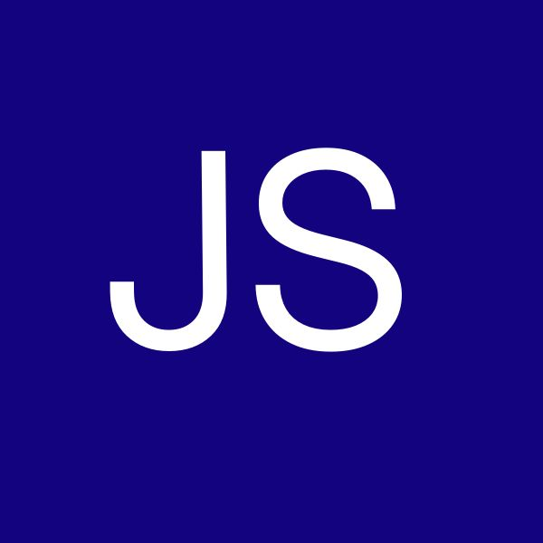
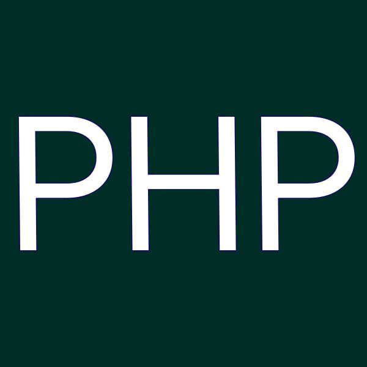
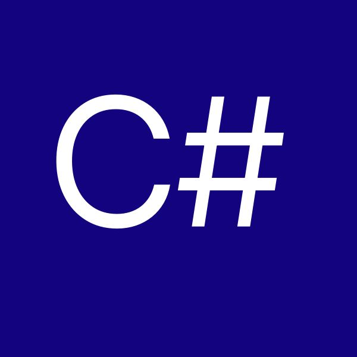
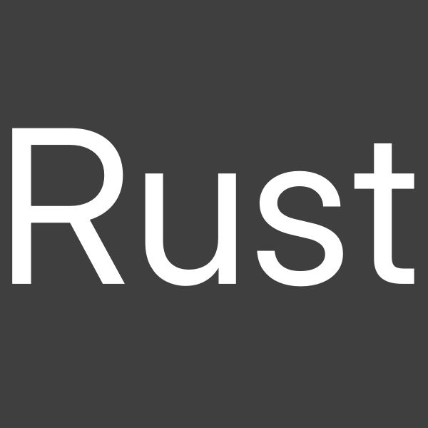
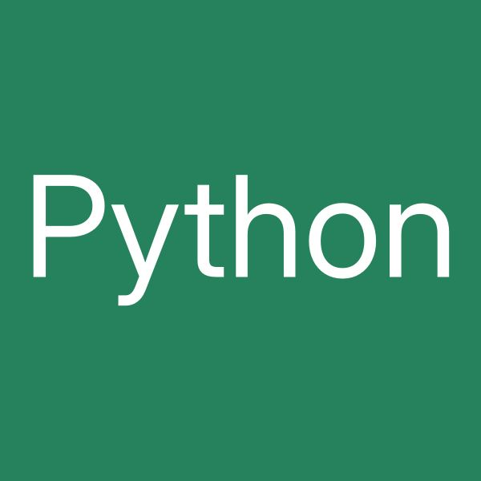
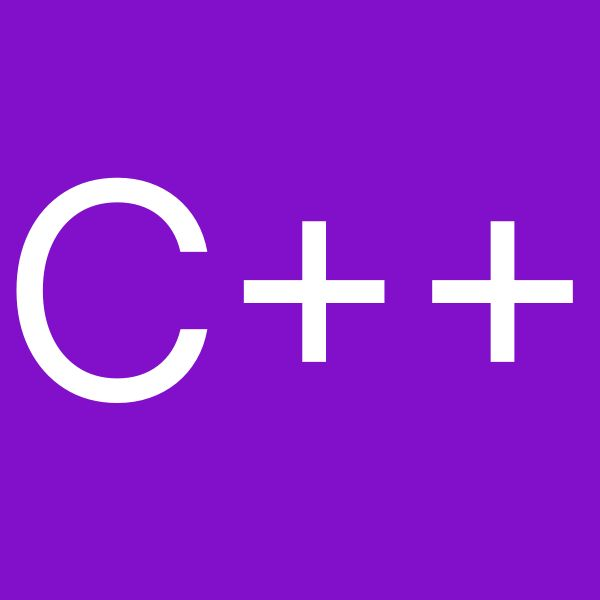

# Eine Syntax sie alle zu knechten

Ich arbeite mich aktuell und mal wieder in eine neue Programmiersprache ein. Das bleibt heutzutage leider nicht aus. Hat es früher gereicht, genau eine Sprache zu lernen, sich bei einer Versicherung anstellen zu lassen und dann in Ruhe zu verschimmeln, muss man heute flexibler sein, als ein Einfamilienhaus in den USA – zur Tornado-Saison. Kurz um, wer nicht mit der Zeit geht, muss mit der Zeit gehen. Und mit gehen meine ich eigentlich rennen. 

Jede Programmiersprache hat so ihre Eigenheiten. Und wenn ich mal wieder verzweifelt vor einer sinnlosen Fehlermeldung sitze, dann bekomme ich wirre Gedanken und heute habe ich mich gefragt:

> Was wären das eigentlich für Typen, wenn diese Programmiersprachen Arbeitskollegen wären? 

## JavaScript (JS) – Er ist der Einzige, der denkt, er wäre cool

JS ist ein leicht angegrauter Kollege, der sich völlig unpassend für sein Alter anzieht. Er hat Skater-Klamotten an und versucht krampfhaft auf jung zu machen. Trotzdem, oder vielleicht auch deswegen, versucht er immer hilfreich zu sein und schießt dabei sehr oft völlig übers Ziel hinaus. Die Worte *nichts* und *gar nichts* sind für ihn zwei fundamental unterschiedliche Begriffe. Denn wenn man ``null`` und ``undefined`` nicht unterscheiden kann, dann hat man das Konzept von "Nichts" einfach nicht verstanden. 

{: w="200" h="200" .right }

Und gerne lässt er sich bei schwachsinnigen Antworten ein wenig davontragen. ``"10" - 2`` ergibt *8*, ist doch völlig klar. Warum sollte man auch nicht eine Ganzzahl von einem String abziehen können? Sowas machen coole Leute eben, da fragt man nicht nach Sinn und Verstand. Aber nun möchtest du ``"10" + 2`` rechnen? Das ergibt *102*, ist doch logisch. Bei einer Addition wird der String halt, naja, die Zahl kommt hinten dran. Warum? *Weil ist so, verp... dich!*. 
Und der hört da noch lange nicht auf! `null == undefined` ist `true`, aber `null === undefined` ist konsequenterweise `false`. Er hat noch mehr solcher Storys auf Lager und ist mit den Leuten beim Drogentest inzwischen perdu. 

Möchtest du ein wenig Smalltalk mit ihm halten, wird er die Gelegenheit nutzen, dir zu erklären, warum man zwingen `if`, `do`, `while`, `for`, `for of`, `for in` und eigentlich noch sehr viel mehr Schleifen bräuchte. Schleifen sind das pure Leben.

Man nimmt so einen Kollegen halt hin, weil er in wirklich jeder Abteilung was zu tun hat und laufend neuen Kram einführt. *React*, *Angular*, *Vue.js* – man braucht sich nur kurz umdrehen, und er hat schon wieder was Neues fabriziert, um ja unersetzbar zu sein. Klar, ein npm-Paket, das überprüft, ob eine Zahl ungerade ist, hat er auch auf seinem Schreibtisch herumliegen.

## PHP – Der Soziopath der Programmiersprachen

PHP ist ein alter, grauer Kumpane, der mitten in den Büros herumsteht und in die Leere starrt. Es wurde schon so oft erzählt, das er wohl in Rente gegangen oder gestorben ist, nur um im nächsten Moment um die Ecke zu kommen. Dann erklärt er auch sofort, warum er unsterblich und unersetzbar ist, was zum Bedauern von ausnahmslos allen leider auch stimmt. Alle nennen ihn nur "den Typen, der was mit Webseiten macht" – ist der Ruf erst ruiniert ...

Mit PHP willst du eigentlich kein Gespräch beginnen. Er fängt dann nämlich gerne Mal an, Gruselgeschichten zu erzählen. `1 == true` ergibt `true`, `0 == false` ergibt `true`, aber `1 === true` ergibt `false`. Bruder was? Er denkt, er ist hilfreich aber man versucht instinktiv zu erschnüffeln, ob er wieder einen sitzen hat.

{: w="200" h="200" .left }

Und wenn er dann in Fahrt gekommen ist, dann geht es richtig rund. Dann erklärt er stolz und selbstsicher, das **Arrays** ja eigentlich **Listen** sind. Und **Maps**. Aber halt auch wieder **Arrays**. Und wenn dann eine der jungen Praktikantinnen unwissentlich fragt, was es denn für tolle Methoden gibt, dann beginnt er einen Sermon zu `str_replace`, `strpos` und `array_push` und warum diese sich so völlig wirr und unterschiedlich benehmen. Sollte die Praktikantinnen dann weinen, wird er sie versuchen zu trösten, mit einer echten Creep-Story über `$GLOBALS`, `$_GET`, `$_POST`  und `$_SESSION` und warum es total erregend ist, alles global verfügbar zu machen. Scope ist doch nur was für Ministranten und Sitzpinkler. PHP wird öfters mal ins HR zitiert und niemanden wundert das.

Auch traut sich keiner im Unternehmen, mit PHP zu sprechen, wenn er einen Fehler gemacht hat. Er kann in seinem Alter nicht mehr zwischen **Warnings**, **Notices** und **Fatal Errors** unterscheiden. Ist was schiefgelaufen, hat er sich vermutlich bereits eingenässt und sitzt weinend am Schreibtisch. 

## C# - Die Antwort auf die Frage, die niemand stellte

C# ist der Kollege, der auf "Guten Tag" oder "Willst du noch Kaffee" mit "Ich war mal ein hohes Tier bei Microsoft" antwortet. Er wird das immer und immer wieder erwähnen. Klar, inzwischen kommt er "super" mit Linux aus und ist auch total (quell)offen. Aber er ist halt ein Kind aus Redmond. 

Auch wenn sich C# modern gibt und viele moderne Trends mitmacht, ist er halt auch gerne mal verbohrt und stur wie ein Esel. Daher ist er auch ein echt unangenehmer Zeitgeist. Für ihn ist ausnahmslos alles ein **Object**. Du bittest ihn, dir aus der Küche einen Kaffee mitzubringen? Er wird dich dann im Gegenzug bitten, die *zu dieser Bitte gehörende Küche und Kaffeemaschine* zu bauen. Hast du es gerade geschafft, dich an diese Marotte zu gewöhnen, kommt er mit `structs` um die Ecke. Weil Werte kann man ja auch so kapseln. Aber ansonsten ist ausnahmslos alles ein **Object**!.

{: w="200" h="200" .right }

C# ist auch einer dieser Kollegen, der alle drei Wochen auf einem Fortbildungsseminar ist. Dann kommt er mit tollen neuen Skills und Buzzwords wie **Async/Await**, **LINQ**, **Generics**, **Delegates**, **Events** um die Ecke. Er hat dann auf wirklich alles eine Antwort, auch wenn sie gerade nicht zu der Frage passt. Sein Skillset liest sich wie ein Buch von Dostojewski. Ein höheres Gehalt bekommt er aber dennoch nicht. Er hängt dann gerne auch in anderen Abteilungen rum, wie z.B. Linux, aber auch Mobile oder Mac. Aber er passt da nicht wirklich rein und das ist für alle peinlich, nur nicht für ihn.

Hat man es geschafft, seine Bitte an ihn ordentlich zu formulieren, sodass er auch helfen kann, kommt er mit seinem Werkzeugkoffer in Form von **Visual Studio** vorbei. Das ist dann aber kein Koffer mehr, sondern ein Lkw mit Anhänger. Da drin sind dann mehr Werkzeuge, als jemals jemand brauchen wird. Aber er kommt von Microsoft, da muss so ein Auftritt eben sein.

Keiner im Unternehmen weiß, warum und wofür C# eigentlich eingestellt wurde. Aber niemand traut sich, das mal anzusprechen.

## Rust – Der 'Judge Dredd' im Unternehmen

Rust ist ein neuer Kollege, aber selbst die friedfertigsten Pazifisten im Unternehmen lernen ihn schnell und innig zu hassen. 

Den ersten Fehler begehst du, wenn du Rust nach einer kurzen Information fragst. Er wird dich zuerst darüber belehren, was du mit dieser Information machen darfst und wie du sie aufzuheben hast. Das läuft gerne einmal auf eine komplette Datenschutzschulung hinaus. Er ist halt ein "Borrow Checker", er kann da nicht aus seiner Haut. 

Er erwischt dich dabei, wie du den Kugelschreiber einfach auf den Tisch legst, anstatt ihn zurück in die ursprüngliche Verpackung zu stecken? Mach dich auf ein Epos über deinen Fehler gefasst. Er wird dir dann nicht nur minutiös erzählen, was du alles falsch gemacht hast, du bekommst ein Aufbau- und Fortgeschrittenenseminar zum Thema *Unfallverhütung im Umgang mit gerade benutzen Kugelschreibern* hinterher geschoben. Ob du willst, oder nicht. 

{: w="200" h="200" .left }

Stell dir vor, jemand hat alle Finanzbeamte und TÜV-Prüfer dieser Welt zusammen getan, komprimiert und konzentriert, das ist Rust. Du kannst ihn nicht einfach fragen, wie spät es ist. Er wird dir wegen so einer beleidigenden Frage direkt eine scheuern und dich eigenhändig zum HR zerren. Du musst ihn fragen, welche Werte die Uhr an seinem rechten Arm gerade anzeigt und in welcher Form du diese Daten zurück haben möchtest. Hast du bei deiner Frage nur den kleinsten Fehler gemacht, bekommst du einen epischen Vortrag, eine gescheuert, wirst ebenfalls zum HR gezerrt, praktisch jede Konversation endet so.

Er haut sporadisch seinen Lieblings-Oneliner raus, dass es mit ihm ja keine **Nullpointer Exeptions** gibt. Er denkt er ist witzig, aber wirklich niemand lacht. Mit Rust zu reden fühlt sich so an, als würde man einen politisch absolut nicht korrekten Witz, mitten im HR erzählen, während der CEO zuhört.

Die Unternehmensführung besteht darauf, dass Rust gekommen ist, um zu bleiben. Die Kollegen informieren einen im Team-Chat, ob er gerade in der Kaffeeküche ist, damit man ihm nicht über den Weg laufen muss.

## Python - Keiner weiß, wie der wohl nüchtern drauf ist

Python ist der coole Dude, mit dem man eigentlich gerne herumhängt. Er ist absolut tiefenentspannt und sieht sich selbst eher als Hippie. Das glaubt man ihm und riecht es auch. 

{: w="200" h="200" .right }

Er hat allerdings auch so seine Eigenheiten, mit denen man lernen muss, umzugehen. Sein Schreibtisch ist akkurat organisiert, denn er besteht auf eine exakte Anzahl von **Whitespaces** zwischen den verschiedenen Dingen. Legt man da zum Beispiel einen Aktenordner falsch ab, kann es passieren, das er anfängt zu weinen. Er wird dir dann aber nicht sagen, dass es am Ordner liegt, sondern, dass er auf einmal die Stifte nicht mehr erreichen kann. Viel Spaß, da durchzusteigen.

Und dann ist da noch der **Global Interpreter Lock (GIL)**. Python kann wirklich nur eine Sache zur selben Zeit erledigen. Hast du ihn morgens gegrüßt, kann es passieren, dass er am Nachmittag bei dir vorbeikommt, um dir ebenfalls einen guten Morgen zu wünschen, da er vorher noch was zu tun hatte. Fragst du ihn zum Beispiel, ob er nicht mehr als einen Zettel auf einmal aus dem Kopierer nehmen kann, starrt er dich völlig verwirrt an. Er kann wirklich **nur eine Sache zur selben Zeit** erledigen. Dafür sieht es lustig aus, wenn er mal einen längeren Text tippen muss.

Dennoch ist er ein Star im Unternehmen. Die Kollegen aus dem *Data Science* Department lieben ihn, weil er so umgänglich ist. Mal eben einen Machine Learning Algorithmus über einen Tensor laufen lassen? Python regelt das. Den ganzen Krempel mit **Seaborn** hübsch visualisieren? Python ist dein Freund und Helfer in der Not. Er ist da für jeden Spaß zu haben. Die Kollegen aus der *Backend* Abteilung haben mit ihm eine komplette REST-API auf das Parkett gezaubert. Jedes noch so beknackte und herbeigeredete Problem kann Python für dich lösen.

Dass er dabei so schnell ist wie eine Schildkröte, die sich durch Honig bewegt, stört eigentlich nur den Kollegen C#. Dieser würde Python gerne etwas über sein Seminar *Wie man mehrere CPU-Kerne und Threads erfolgreich zur selben Zeit nutzen kann* erzählen, aber immer, wenn er das versucht, trinkt er gerade einen Kaffee.

## C - Spricht wie er riecht: Komisch

C ist ein alter Veteran und kann dir Geschichten aus Zeiten erzählen, als Computer *so groß wie Kühlschränke* waren. Er wird dann aber skeptisch vom Kollegen Cobol angeschaut.

{: w="200" h="200" .left }

Wenn man mit ihm zu tun haben muss, wird es entweder nervig, lustig, oder richtig anstrengend. Häufig aber alles auf einmal. 

Bittest du C um eine Information, wird er dich fragen, wo denn diese genau abgelegt wurde. Hast du das vergessen, bekommst du die Information nicht. Gibst du ihm aber eine falsche Ortsangabe, fängt er an zu weinen und meldet sich erst mal krank. Kollege Rust lacht dann laut und dreckig und haut dann noch triumphierend seinen Oneliner raus.
Hast du die Information aber von C bekommen, teile ihm unbedingt mit, dass der entsprechende Speicherplatz nun wieder verwendet werden darf. Vergessen das zu viele Kollegen, kann es passieren, dass er vor leeren Regalen steht, aber keine weiteren Informationen ablegen kann, weil kein Platz mehr da ist. Er nässt sich häufig deswegen ein, weil ... **Memory Leak**.

Der Kollege neigt auch ab und zu dazu, völlig zu spinnen. Strings sind für ihn keine Zeichenketten, sondern Arrays voll mit Buchstaben. Da weiß man nicht, ob der noch alle Tassen im Schrank hat. 

Hat man im Umgang mit C dann doch versehentlich etwas falsch gemacht, wird er dir das nicht sagen. Er wird dir aber einen Text in einem seltenen, sumerischen Dialekt geben. Solltest du es geschafft haben, diesen zu übersetzen, wird der Inhalt nicht den geringsten Sinn ergeben. 

Man sagt, C war schon da, noch bevor das Unternehmen gegründet wurde. Ihm wurde bereits gekündigt, aber keiner traut sich, es ihm mitzuteilen.

## C++ - 'Ich bin Chaos'

Bei C++ fragen sich alle anderen Kollegen, ob die Eltern bei der Zeugung auf Pilzen unterwegs waren. 

Bittet man den Kollegen C++ um Hilfe, muss man ihm zuerst in einem Büro sagen, um was es geht. Anschließend muss man mit ihm das Zimmer wechseln, um ihm dann zu erzählen, wie er das Problem angehen soll. Sein **Header Dateien** Spleen ist völlig bescheuert, aber so tickt er nun mal. 

{: w="200" h="200" .right }

Wirklich lustig wird es dann, wenn du die **Operator Overloading** vom Kollegen C++ mal testen möchtest. Dann kannst du ihm sagen, dass er auf *Guten Morgen* mit einer wüsten Beschimpfung antworten soll. Es ergibt halt total Sinn, das Zeichen `+` umzudefinieren um völlig beknackten Code zu erzeugen. `operator++(int)` für `std::string` - einen Post-Inkrementor für einen String!?! 

Kollege C gibt auch gerne mit seinen **Template-Metaprogrammierung** Skills an. Code, der irgendwie neuen Code generiert? Hört sich nice an, oder? Es wird aber sehr wahrscheinlich sein, dass der Kollege C++ beim kompilieren dann plötzlich anfängt wirres Zeug zu reden, während er auf dem Boden liegt und weint.

Apropos Compiler: Kollege C++ lässt sich da gerne alle Zeit der Welt. Du hast nur eine Kleinigkeit geändert? Da wird sich erst mal in aller Ruhe alles angeschaut und die für ihn völlig neue Anfrage vollständig neu übersetzt. Precompiled Code ist sowieso was für Turnbeutelvergesser.

Und dann ist da noch das **Undefined Behavior**. Der Kollege C++ reagiert manchmal völlig unvorhersehbar. Fragst du ihn etwas, was er nicht weiß, kann es passieren, das er weint, die Blumen gießt oder kurzerhand alles niederbrennt. Man weiß es vorher nicht und sollte es immer fürchten.

Alle haben Angst vor dem Kollegen, und trotzdem hat er sich im Unternehmen festgesetzt wie Schimmel an der Wand.

## Fazit

Mit Programmiersprachen ist es wie mit Kollegen, man kann nicht ohne sie, weil es einfach nicht anders geht. Lernt man die verschiedenen Marotten und Eigenheiten einmal kennen, fragt man sich nicht selten, ob der Erfinder gerne mal einen Schuss Terpentin im Kaffee hatte, als er die Idee hatte. 

Aber wenn ich eines gelernt habe, dann, das Humor hilft. Ich glaube fest daran, dass das die Compiler dieser Welt auch wissen, denn nur so lassen sich einige Fehlermeldungen erklären, die man hingerotzt bekommt. 

Aber da ich nun Dampf abgelassen habe, kann ich mich wieder ans Werk machen. Denn jedes noch so verzweifelte `Internal Error: [CoreUtil/General]: Unexpected windows exception (0xe06d7363) at 752EC41F` und jedes `Error 1 Inconsistent accessibility: parameter type support.ACTInterface is less accessible than method support.clients.clients(support.ACTInterface)` unverständlicher Schrei Liebe.

## Ressourcen 

* [ProgramerHumor auf Reddit](https://www.reddit.com/r/ProgrammerHumor/)