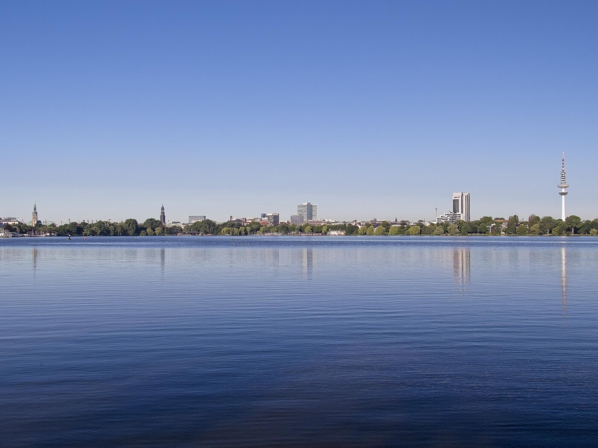
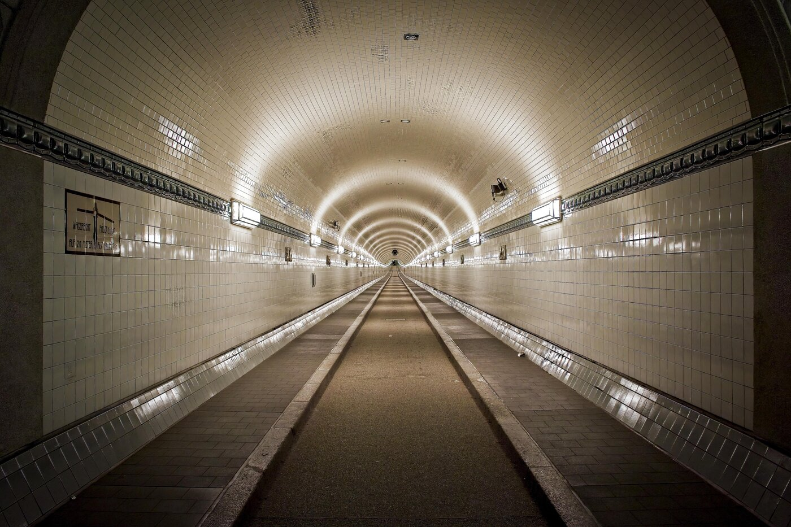
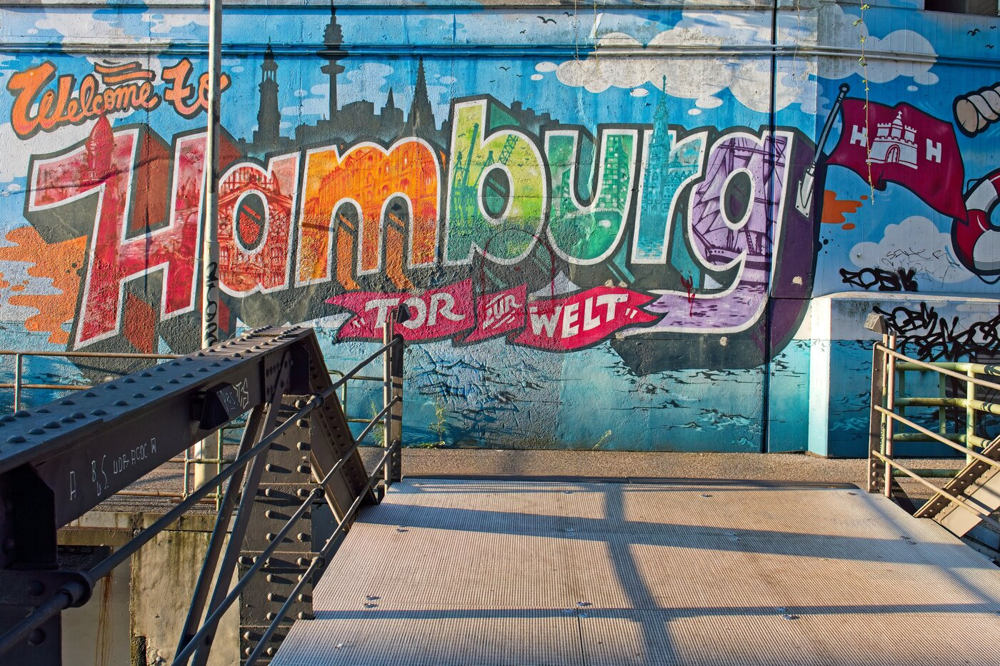
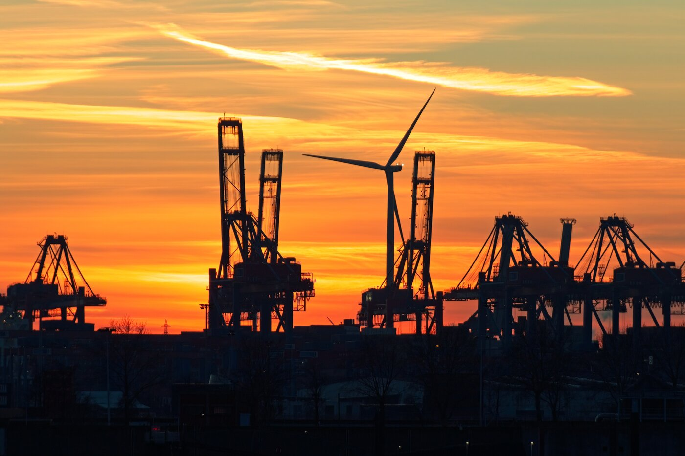
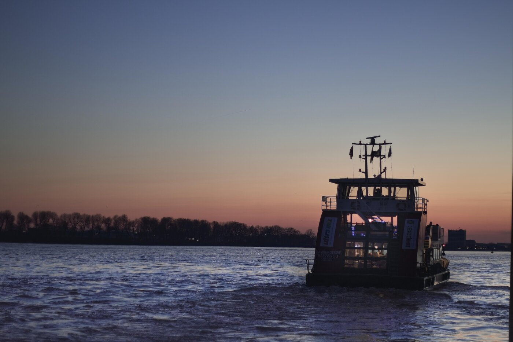

# Meine Lieblingsfotos - Dritter Teil
Im [zweiten Teil](http://127.0.0.1:4000/posts/liebingsfotos-part-deux/) meiner Lieblingsfotos drehte sich alles um den Hafengeburtstag, der auch dieses Jahr wieder stattfand. Im dritten Teil meiner Lieblingsfotos geht es nun aber wieder um Hamburg, ganz ohne Geburtstag. 

Ein Thema habe ich mir dieses Mal nicht ausgesucht. Mit dieser kleinen Fotoreise will ich es halten, wie ich es mit meinen Wandertouren auch immer mache: Einfach drauf los. Für mich ist das die Gelegenheit, die ein, oder andere Fototour noch einmal Revue passieren zu lassen. In Erinnerungen schwelgen mag zwar wenig produktiv sein, fühlt sich aber immer wieder toll an. 

Also, gehen wir los.

## Die Außenalster

_Die Außenalster mit Blick in Richtung Nord-West (2013 / Markus Daams / CC0)_

Als ich mit dem Fotografieren anfing, experimentierte ich munter darauf los. Da ist natürlich viel Ausschuss entstanden, denn ich hatte viel Lust, aber bemerkenswert wenig Ahnung. Ich kaufte auch allerhand Zubehör, darunter Polarisationsfilter. Einen davon fand ich sofort spannend, da er die Blautöne deutlich hervorhob. Also wartete ich geduldig ab, bis wir in Hamburg wieder Kaiserwetter hatten und zog sofort los.

Ich bummelte den Eilbekkanal in Richtung Kuhmühlenteich entlang und von da ging es dann an die Außenalster. Ich liebe die Aussicht dort, denn man sieht nicht nur viele Hamburger Originale wie den Fernsehturm, den Michel und das Rathaus. Dieser Abschnitt ist auch der beeindruckendste Teil des Flusses.

Ein Fluss? 

Ja, die Alster ist von Anfang bis Ende ein Fluss. Sie sieht hier nur aus wie ein See, mitten in der Stadt. Die Alster wurde einst aufgestaut, um eine Mühle anzutreiben. Die Binnenalster befand sich zu dieser Zeit innerhalb der Wallanlagen, also der Stadtmauer. Die Außenalster befand sich … na ja … außerhalb der Stadtmauer. Nachdem die Mühle verschwunden war, beließ man diesen Zustand so und darüber sind alle Hamburger sehr froh. 

**Warum ist das eines meiner Lieblingsfotos?** Dieses Foto mag ich aus zwei Gründen: Erstens konnte ich die Blautöne mit dem Polarisationsfilter herausstellen. Das Wetter war an diesem Tag wirklich fantastisch und ich hatte mir gewünscht, dass das Foto dies auch widerspiegelt. Zweitens war die Szene gerade 'leer'. Also kein Alsterdampfer, kein Segelboot, kein Tretboot usw. unterwegs. So habe ich den blauen Himmel, den blaue Alster und das weiß-grüne Band, das Hamburg zeigt.

## Der Alte Elbtunnel

_Der Alte Elbtunnel, mit Blick in Richtung Süden (2022 / Markus Daams / CC0)_

Der 'Alte Elbtunnel' hat eine beeindruckende Karriere hinter sich. 1907 wurde mit dem Bau begonnen, 1911 offiziell eröffnet und galt zu dieser Zeit als technische Meisterleistung. Seit diesem Tag diente er zunächst den vielen tausend Hafenarbeitern als trockene Passage von einem Elbufer zum anderen, in jüngerer Zeit dann vor allem Touristen. 

Er löste ein Problem, was es aber nach wie vor in Hamburg gibt. Denn unsere Stadt wird durch die Elbe in zwei Hälften geschnitten. Es ist eben jener Fluss, welcher der Stadt Wohlstand gebracht hat, aber auch viele Probleme mit sich bringt, die vor allem verkehrstechnischer Natur sind. In Hamburg gibt es neben den Elbbrücken nur noch die Elbtunnel, um den Fluss zu überqueren. Die Fähren eignen sich leider nur sehr bedingt dazu.

Ich nutze den Alten Elbtunnel sehr gerne, um auf die andere Seite zu gelangen. Er ist inzwischen für Autos gesperrt und wird daher vornehmlich von Touristen, Radfahrern und den verbliebenen Hafenarbeitern genutzt. Da ich fast immer sehr früh unterwegs bin, hatte ich schon öfters einmal die Möglichkeit, den Tunnel so zu fotografieren, wie man ihn auf dem Foto sieht: Leer und in seiner natürlichen Schönheit. 

Langsamfahrer im neuen Elbtunnel nennt man hier scherzhaft „Fliesenzähler“. Im Alten Elbtunnel lohnt es sich, diese zu zählen, denn einige zeigen Motive rund um das Thema ‘Leben in und an der Elbe’.

**Warum ist das eines meiner Lieblingsfotos?** Ich habe den Alten Elbtunnel öfters fotografiert. Aber keines der Fotos hatte mich überzeugten können. Bis auf dieses. Hier stimmt das Licht und der Ausschnitt. Das Foto zeigt den Tunnel so, wie ich ihn auch in meiner Erinnerung aufbewahre. Und wer diese architektonische Meisterleistung kennt, weiß, wie selten es ist, dass er mal leer ist.

_Ein Kunstwerk, mitten im Hafen. Hier ist es der Fähranleger Argentinienbrücke (2022 / Markus Daams / CC0)_

Meine Wandertouren wurden mit der Zeit immer ausgiebiger. Ich begann dann irgendwann das andere Elbufer zu erkunden. Auf dem südlichen Elbufer beginnt der eigentliche Hamburger Hafen. Hier finden sich also die Industrie und die sonstige Hafenwirtschaft. Verbunden ist das Gebiet vor allem durch Straßen und viele, viele Brücken.

Dazu kommt aber auch die Fähre. Die HADAG fährt nicht nur Touristen durch die Gegend, sondern hat für viele Menschen, die im Hafen beschäftigt sind, ebenfalls einen besonderen Stellenwert. Eine dieser wichtigen Linien ist die 73. Diese fährt von den Landungsbrücken in Richtung Ernst-August-Schleuse, also einmal rüber über die Elbe. Eine der angefahrenen Stationen ist die Argentinienbrücke. Dabei handelt es sich erst einmal um einen üblichen Schwimmponton mit HVV-Ausstattung, wie sie die HADAG viele hat. Bewegt man sich in Richtung Ufer, geht man direkt auf ein Kunstwerk zu, dass es in sich hat. „Hamburg – Tor zur Welt“. Das ist nicht nur das Motto der Stadt, es ist auch die Lebenseinstellung, die wir hier mit uns herumtragen. 

An den Wochenenden ist es relativ ruhig im Hafen. Dementsprechend gerne bin ich dann auch dort unterwegs. Das Fotomotiv habe ich eher zufällig entdeckt. Die Fähre 73 fährt am Wochenende nicht und daher gab es eigentlich keine Veranlassung, den Fähranleger zu betreten. Aber ich war auf der Suche nach neuen Perspektiven. Und neben einem tollen Blick auf den Hafen hatte ich dieses Meisterwerk entdeckt. 

**Warum ist das eines meiner Lieblingsfotos?** Mein Lebensgefühl, welches ich mit Hamburg verbinde, wurde in diesem Kunstwerk und meinem Foto davon perfekt eingefangen. Es ist herrlich bunt und strahlt eine besondere Art der Freude aus. Es leuchtet regelrecht. Alle Motive Hamburgs wie der Michel, der Hafen, der Fernsehturm usw. haben ihren perfekten Platz und wurden zu einer harmonischen Komposition zusammengefasst. Das klingt fürchterlich gestelzt, aber anders kann ich es nicht beschreiben. Alles daran ist einfach toll.

## Sonnenuntergang im Hafen

_Sonnenuntergang im Hafen von Hamburg (2014 / Markus Daams / CC0)_

Hamburgs Sonnenauf- und Untergänge können wirklich atemberaubend sein. Dieser Satz soll keine Schwärmerei sein, oder zumindest nur ein bisschen. Wer so etwas einmal erlebt, braucht sich dann nur umzuschauen. Dann zücken alle möglichen Menschen ihre Handys und Fotoapparate und versuchen den erlebten Moment irgendwie festzuhalten. Was man dann erlebt ist eine Symbiose aus Stadt und Licht. 

Der Hamburger Hafen ist sehr weitläufig und bietet durch die breiten Ströme der Nord- und Süderelbe teils sehr ausladende Sichtachsen. Malt die Natur dann ihre herzerwärmenden Kunstwerke in den Himmel, wirkt sich das auf das Panorama aus. Man sieht viel, von allem. 

Bevor die Sonne dann ganz hinter dem Horizont verschwindet, wird die Stadt und der Hafen in ein Meer aus gelben, orangen und roten Tönen getaucht. Dieser Moment dauert nur ein paar Minuten. Diese Schönheit dann einzufangen ist schwer, denn das Licht ist nicht mehr optimal und eigentlich will man nur da stehen und „Hach ist das schön“ seufzen. 

**Warum ist das eines meiner Lieblingsfotos?** Ich hatte zu dieser Zeit einen stressigen Job mit vielen Spätschichten. Um runter zukommen, habe ich mich bei gutem Wetter gerne mal aufgemacht, um durch den Hafen zu wandern. Hatte ich Glück und stand gerade eine Fähre bereit, bin ich von den Landungsbrücken zum Altonaer Fischereihafen gefahren. An diesem Tag war es wohlig warm, das Licht war perfekt und ich habe viele tolle Fotos geschossen. Dieses war eines davon. Die Containerbrücken heben sich von einem Himmel ab, der wie das Kunstwerk eines Hamburg-Schwärmers wirkte.

## Fährmann, hol' röver

_Die Fähre 62 legt von Neumühlen / Övelgönne ab (2015 / Markus Daams / CC0)_

Ist die Sonne in Hamburg einmal untergegangen, erobert ein dunkler Blauton noch einmal kurz den Himmel von der Farbe Orange zurück, bevor die schwärze der Nacht die Szene übernimmt. Das ist die letzte Phase der „blauen Stunde“, die ich ebenfalls sehr mag. 

Und genau zu dieser Zeit bin ich am Fähranleger Neumühlen / Övelgönne ausgestiegen. Meine Fähre fuhr ab und das wollte ich natürlich festhalten.

Auf dem Bild ist die Fähre der Linie 62 zu sehen. Diese ist in Hamburg berühmt und berüchtigt zugleich. Berühmt ist sie deswegen, weil sie die längste Tour abfährt, von den Landungsbrücken nach Finkenwerder und wieder zurück. Berüchtigt ist sie, weil sie in den letzten Jahren von Touristen gekapert wurde. Hunderte von Touristen wollen es sich nicht nehmen lassen, die günstigste Hafenrundfahrt in Hamburg zu machen, die es gibt. Denn die Hafenfähren fahren im HVV, dem Hamburger Tarifverbund. Also kann man mit der Tageskarte für Bus und Bahn auch Dampfer fahren. 

Das ist toll für die Touristen, aber weniger gut für die Berufspendler, die ebenfalls auf die Fähre angewiesen sind. Die 62 ist die bequemste und oft schnellste Art, von Finkenwerder zu den Landungsbrücken zu gelangen. Viel zu oft muss man bei gutem Wetter eine oder zwei Fähren aussetzen, wegen Überfüllung.

Dabei war das nicht immer so. Ende der 1990er waren die Fähren so schlecht ausgelastet, dass sogar der Betrieb infrage gestellt wurde. Die Fähren wurden aber modernisiert und eine Kampagne gestartet, mit dem Claim „Die günstigste Hafenrundfahrt in Hamburg“. Dass die Werbekampagne gezündet hat, steht heute völlig außer Frage.

**Warum ist das eines meiner Lieblingsfotos?** Dieses Foto hatte meine Stimmung zu dieser Zeit perfekt eingefangen. Tagsüber war es angenehm warm und als ich am Fähranleger Neumühlen ausstieg, war die Sonne gerade hinter dem Horizont verschwunden. Es wurde dann merklich kühler, was ganz normal an der Elbe ist. Meine Fähre fuhr davon und die Szene hatte eine Art von Fernweh in mir geweckt. Solche Szenen und Momente, wie auf diesem Foto, entstehen immer wieder im Hafen, die ich dann versuche, fest zuhalten. In diesem Fall ist es mir gelungen.  

## Zum Schluss

Damit schließe ich denn dritten Teil meiner Serie. Ich hatte mir eigentlich kein Thema für diesen Artikel ausgesucht. Wie es mir scheint, bin ich aber doch einem Motiv gefolgt: Farben. Hamburg sieht man oft in mindestens 50 Schattierungen von Grau. Aber wenn es die Stadt einmal bunt treibt, dann auf eindrucksvolle Art und Weise.

Noch ein Hinweis: Viele meiner Lieblingsfotos finden sich auch auf meinem Profil auf **Flickr** und auf **Pixabay**. Einige davon werde ich in diesem Blog zukünftig vorstellen.

* [Mein Profil auf Flickr](https://www.flickr.com/photos/uranwolle/)

* [Mein Profil auf Pixabay](https://pixabay.com/de/users/markusdhamburg-6311779/)

