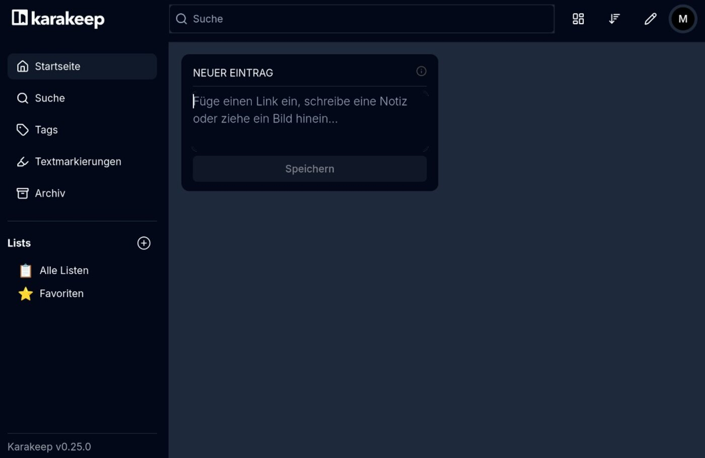
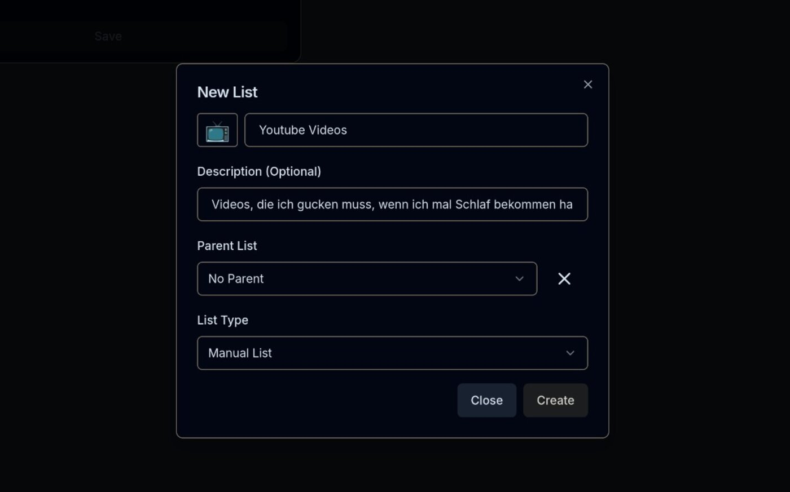
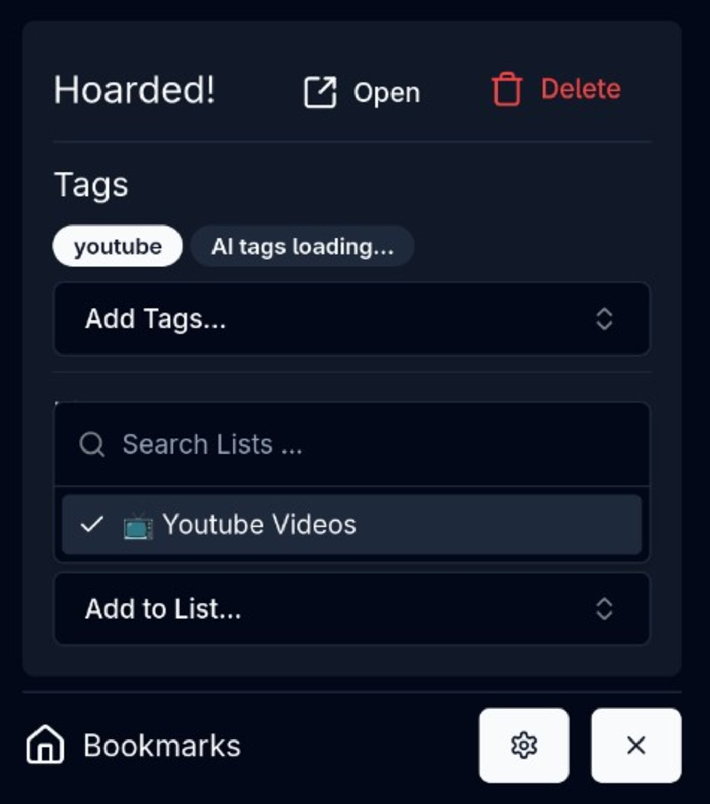
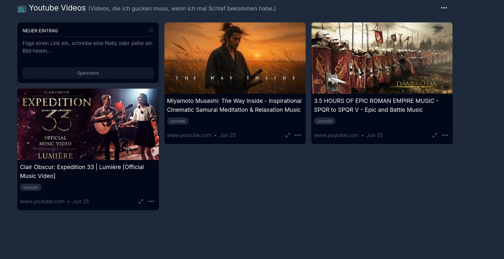
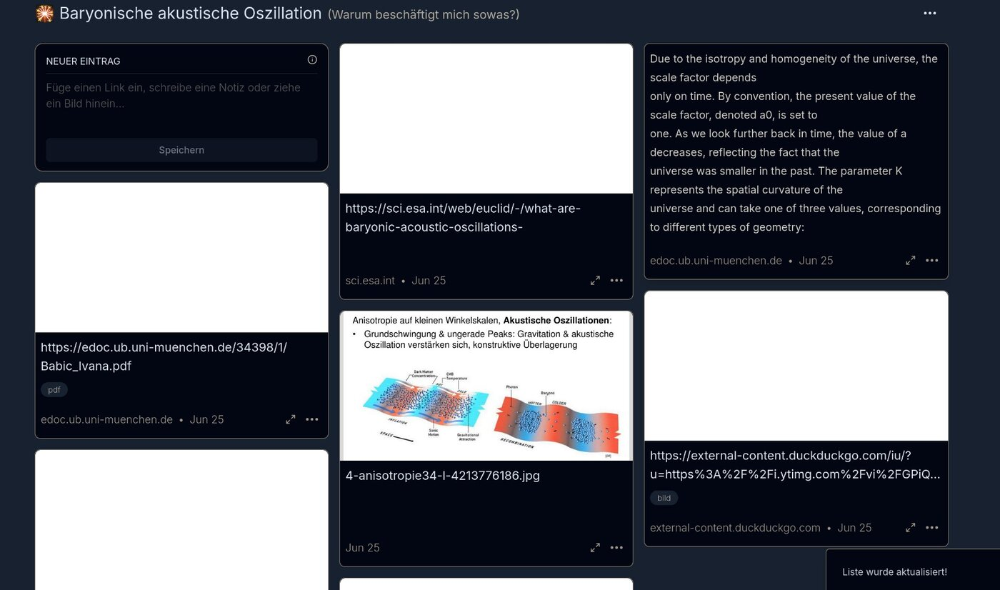

# Nicht ich bin chaotisch, das Leben ist es

Ich bin mir sicher, dass es vielen so geht wie mir. Man surft durchs Internet und möchte nur kurz einen Artikel zum Morgentee lesen und schwups, steckt man knietief in einer Recherche zum Thema „baryonischer akustischer Oszillation“ fest. Ich lasse mich schnell zu irgendwas verleiten und fange dann an, Tabs im Browser zu stapeln. Dasselbe Phänomen beobachte ich auch auf YouTube, wo eine Doku zum römischen Reich schnell in eine Bingewatch-Orgie zum Frühmittelalter ausartet.

„Das schaue ich mir später an“, heißt es dann bei mir. Ich bin dennoch sehr bemüht, meinen persönlichen Backlog schnell abzuarbeiten. Das Problem, welches ich dabei immer hatte, war und ist, all diese Zufallsfunde aus dem Web zu speichern und zu organisieren. Ich jage gerne mal mehr als einem Thema nach. Hier half mir einmal der Browser „Edge“ von Microsoft, in den gefühlt 15 Minuten, in denen er nützlich und sogar fast cool war. Er bot eine Seitenleiste, in der ich Links, Bilder, Screenshots, Videos und vieles mehr strukturiert aufbewahren konnte. Nur leider nicht plattformübergreifend. Bis jetzt.

## Auftritt Karakeep

Ich probiere immer wieder neue Tools aus, um mein Gedankenchaos zu organisieren. Also habe ich mir kurzerhand „Karakeep“ installiert. Die Installation ging, dank meiner [Runtipi-Instanz](https://markus-daams.com/posts/runtipi-selfhosting-einfach-gemacht/), ganz schnell und mit nur einem Mausklick. 

Die Liste der Features ist lang. Folgende Punkte haben mein Interesse geweckt:

* Kann vollumfänglich selbst gehostet werden (Haken dran bei der Plattformunabhängigkeit)
* Bookmark-Management
* PDFs, Links, Notizen, Screenshots usw. lassen sich organisiert speichern
* Tagging
* Add-ons für meine genutzten Browser stehen ebenfalls zur Verfügung
* Apps für iOS und Android gibt es ebenfalls
* Es gibt auch eine REST-API. Die schaue ich mir an, falls ich Karakeep behalte.

Und noch vieles, vieles mehr. Ich bin gespannt, welche Features ich am Ende wirklich nutzen werde und ob das Tool so hilfreich ist, wie ich es mir wünsche.

> Bisher hieß die App "Hoarder" und wurde erst kürzlich in "Karakeep" umbenannt. Daher findet man unter beiden Namen dasselbe Tool.
{: .prompt-info}

## Die ersten Schritte

Nach der Installation muss ich mich zunächst registrieren, denn Karakeep ist Multiuser-fähig. Nach dem Login finde ich ein leeres Dashboard wieder.

_Karakeep nach dem ersten Start. Viel ist hier noch nicht los._

Einen richtigen "erste Schritte Guide" habe ich auf Anhieb nicht finden können. Daher stürze ich mich selbst ins Abenteuer. Ich lege mir eine Liste für meine Youtube-ein-Video-geht-noch Obsession an. 

Die erste Liste ist schnell erstellt. Ich habe erst einmal „manuelle Liste“ ausgewählt, da ich noch nicht weiß, was genau die „Smart List“ macht. Das finde ich aber auch noch raus.

_Dass sich Listen mit einem Emote versehen lassen, finde ich praktisch._

Die Links lassen sich dann ganz einfach über die Weboberfläche in die neue Liste einfügen. Aber das geht sicherlich noch einfacher und schneller. Ich habe mir das gleichnamige Add-on für Firefox installiert. Um es zu nutzen, müssen die Subdomain und die Zugangsdaten eingegeben werden, was schnell erledigt ist. 

Danach kann ich Links direkt im Browser zur entsprechenden Liste hinzufügen und mit Tags versehen.

{: w="400"}
_Links lassen sich im Add-on direkt in die ausgewählte Liste eintragen._

Die erste Liste ist schnell mit Leben gefüllt. Dank dem Add-on im Browser geht das auch schnell und ohne mich aus dem Flow zu reißen.

_YouTube Links werden mit entsprechenden Vorschaubildern erstellt._

Alles läuft, wie erwartet. Ich bin aber neugierig geworden und möchte noch ein paar andere Features ausrpobieren. Da ich mich ja immer mal wieder von einem bestimmten Thema umtreiben lasse, lege ich mir eine neue Liste an und werde sie mit Leben füllen.

## Meine BAO-Liste

Meine neue Liste nenne ich "Baryonische akustische Oszillation". Ich mache mich auf die Suche im Internet und füge dann neue Elemente hinzu. 

_Alles da, aber die Vorschaubilder werden nicht generiert._

Neue Inhalte lassen sich sehr einfach über das Add-on hinzufügen. Allerdings werden auf meiner neuen Liste keine Vorschaubilder (Thumbnails) generiert. Den Grund dafür konnte ich nicht heraus finden. 

Was mir noch aufgefallen ist:

* Bilder lassen sich nicht aus der Zwischenablage einfügen, sondern müssen herunter geladen und dann in Karakeep eingefügt werden
* GIF-Dateien lassen sich gar nicht verwenden
* Die Elemente auf der Liste lassen sich nicht frei verschieben, aber sortieren (desc, asc)

Das sind alles Punkte, die nicht weiter stören, wenn man denn darum herum arbeiten möchte. Ich kann Links und markierten Text ganz einfach zur entsprechenden Liste hinzufügen, ohne dass es mich aus dem Lese-Flow reißt und darauf kommt es für mich an.

## Das hätte ich nicht tun sollen

Man kann viele verschiedene Datenstrukturen in Karakeep importieren. Neben JSON-Dateien aus anderen Tools, kann man auch Firefox-Pocket und sogar Browser-Tab Sessions importieren. Lesezeichen aus dem Browser können als HTML-Dateien verarbeitet werden, also habe ich das einmal flux gemacht. Die Lesezeichen werden automatisch in eine neue Liste importiert. Die Ordnerstruktur wird dabei aufrechterhalten, was erst einmal positiv ist. Allerdings sind alle Ordner anschließend Unterlisten, was die Verwaltung um einiges komplizierter macht.

Meine Bookmarks aus der Lesezeichenleiste befanden sich alle in einem separaten Unterordner. Da sich meine gut 60 Lesezeichen auf 11 Unterordner verteilten, hatte ich entsprechend viele davon. Drag & Drop ist aktuell leider nicht möglich. Auch konnte ich die Ordner nicht mittels Mehrfachauswahl bearbeiten. Ich wollte dieses Unterfangen erst einmal aufgeben und das HTML-File vor dem Import manuell bearbeiten. Bei dem Versuch, die neu erstellte Liste „Importierte Lesezeichen“ zu löschen, sind alle Unterordner eine Stufe hoch gerutscht. Die Liste war also weg und alle Lesezeichen nun in der Hauptübersicht. Ich habe diese dann manuell und einzeln löschen müssen. 

Ungünstig ist auch, dass alle Order im Firefox Add-on als separater Listeneintrag angezeigt wird. Hier spielte der übergeordnete Order dann keine Rolle mehr. Damit war dann auch die Übersicht dahin.

Meine Lesezeichen verwalte ich also lieber weiterhin im Browser. 

## Was mir so aufgefallen ist

Ich habe mich in Karakeep nun etwas ausgetobt und fasse mal ein paar Dinge zusammen, wie mir aufgefallen sind. 

* Der Typ der Ansicht lässt sich ändern, war schon einmal praktisch ist. So kann man die Kachelansicht also zum Beispiel auf eine Listenansicht umstellen. Leider ist die Einstellung immer global, gilt folglich für alle Listen. Die Ansicht kann nicht für jede Liste separat eingestellt werden.

* Die Suchfunktion reagiert schnell und funktioniert gut. Eine Suche nach „Musik“ brachte auch alle Ergebnisse mit dem Wort „Music“ hervor. Es werden immer alle Listen durchsucht.

* Im Add-on lassen sich neue Tags anlegen, aber keine neuen Listen. Hierfür muss ich das Board aufrufen. Das ist etwas umständlich, aber kein Beinbruch.

* Karakeep gibt es auch in Deutsch. Ich weiß, alle coolen Menschen reden nur Englisch, angemerkt sei es trotzdem.

## Mein persönliches Fazit

Vorweg muss ich einmal schreiben, dass Karakeep aktuell in der Version 0.25x unterwegs ist. Die App steckt also noch in ihren Kinderschuhen. Festzustellen ist aber auch, dass die Entwicklung aktiv voranschreitet, wenn man sich auf dem Github-Repo so umschaut. Die Idee hinter Karakeep ist sehr gut und wenn ich mir die Beschreibung des Repo-Erstellers anschaue, hat er dieselben Probleme wie ich, nur mit Reddit und mit nicht ganz so abgespaceten Themenfeldern. 

Die Geschichte mit den Bookmarks war unschön, aber nicht weiter schlimm. Es wäre natürlich praktisch für mich, ein Tool für absolut alles zu haben, aber für meine Lesezeichen bleibe ich erst einmal bei Firefox.

Für einige Dinge wie YouTube und Themen-Recherche funktioniert Karakeep bereits recht gut für mich. Daher werde ich es einem etwas längeren Test unterziehen. 

## Ressourcen

* [Karakeep - Github Repo](https://github.com/karakeep-app/karakeep)

* [Karakeep - Website (da gibt es auch eine Demo Page)](https://karakeep.app/)

* [Karakeep Dokumentation](https://docs.karakeep.app/)