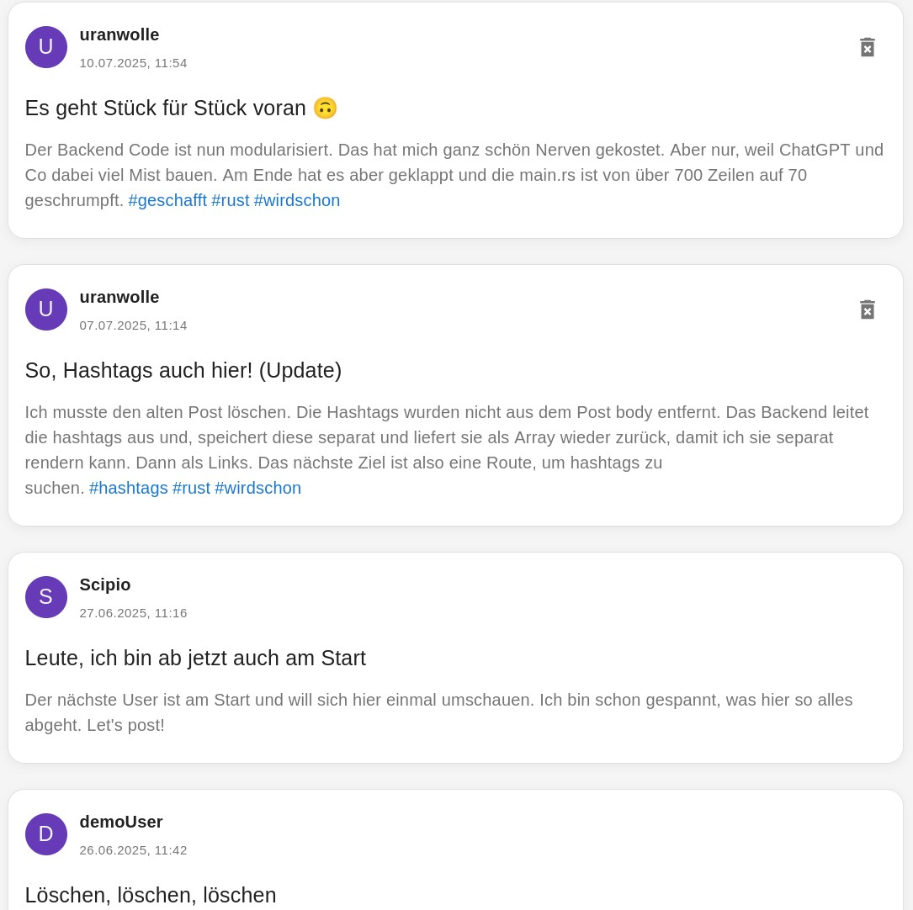
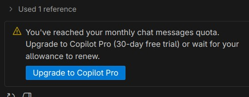
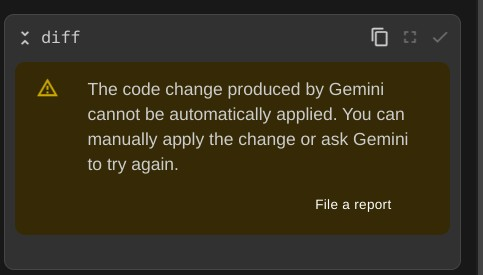
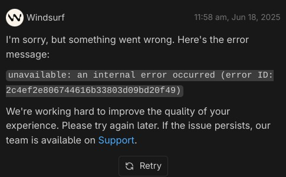

## Vibe Coding der Tragödie zweiter Teil

In meinem [ersten Erfahrungsbericht](https://markus-daams.com/posts/ich-habe-mal-vibe-coding-ausprobiert/) habe ich beschrieben, wie ich ein relativ spontanes Projekt durch Vibe Coding in neue Sphären bewegen wollte.

Ich bin aber auch auf Schwierigkeiten gestoßen, die mich hin und wieder aus dem „Flow“ gerissen haben. Mein Plan war es, auch davon zu berichten. Daher gibt es nun den zweiten Teil meiner „Vibe Coding“ Erfahrung. Natürlich habe ich mich auch weiterhin blöd angestellt. Wie bei jedem Coding Projekt, wachsen sich die Fehler der Anfänge nicht heraus, sondern mutieren zu mächtigen Fehler-Golems. Ich schweife ab. 

In Woche 4 hatte ich mein Projekt ein wenig umsortiert. Ich habe angefangen, mich mit einem Low-Key-Kanban-Board (Decky Add-on in Nextcloud) zu organisieren. Das alleine war sehr hilfreich, denn nun hatte ich nicht nur einen Ort, um neue Features zu sammeln und ordentlich auszuformulieren, auch Bugs ließen sich sammeln und beizeiten verjagen. 

In Woche 5 musste ich jedoch auf die Feature-Bremse treten, denn es war an der Zeit, ein anderes Problem zu lösen.

## Woche 5: Fast 800 Zeilen Code

Durch die vielen Vibes beim Coding ist meine ``main.rs``, welche den Code im Backend beinhaltet, auf 778 Zeilen Code angewachsen. Warum auch nicht, denn so impulsgesteuert, wie ich nun einmal bin, habe ich ein Feature nach dem anderen implementieren wollen. 

Es war also an der Zeit, den Code zu modularisieren, also in logische Komponenten aufzuteilen. Meine erste Intention war es, die Arbeit der AI zu überlassen. Also wendete ich mich an meinen **Copilot** und formulierte meine Wünsche. Der Code sollte modularisiert werden, die Funktionen sollten sich nicht ändern, bitte mit Docstrings würzen und gerne auch zeitgemäße Konventionen einhalten. Bei der Formulierung des Prompt habe ich versucht, so präzise wie möglich zu sein, um den Endzustand zu beschreiben. 

Der Copilot legte direkt los. Er hat die nötigen Files angelegt, diese mit Code gefüllt und mir anschließend noch ein paar Tipps gegeben, wie ich den Code noch verbessern könnte. Klasse! Nur das danach nichts mehr funktionierte. Was war passiert? Nun ja, der **Copilot** hat:

+ ….einige Handler-Funktionen verschwinden lassen
+ … viele Funktionen nicht öffentlich gemacht (``pub``)
+ … kleine Helper-Functions zur Middleware befördert
+ … keine Docstrings oder Kommentare eingefügt

Okay, das war ja auch nur der erste Versuch. Ich habe die Änderungen alle wieder Rückgängig gemacht. Anschließend habe ich **Gemini** befragt. **Gemini** hatte ähnliche Vorschläge wie der **Copilot**, konnte diese aber nicht umsetzen. Ich weiß allerdings nicht warum.

Nun denn, dann mache ich es fix selbst. Structs ausgelagert, Handler-Funktionen in sinnvolle Module gepackt, die ``main.rs`` angepasst und siehe da, nur noch 45 Zeilen. Anschließend habe ich den **Copilot** gebeten, Kommentare einzufügen, was dann geklappt hat. 

## Woche 6: #läuft

Das sich der Code im Backend nun übersichtlich präsentierte, war es an der Zeit, ein neues Feature zu implementieren. Posts sollten sich mit Hashtags ‚#‘ versehen lassen. Was einfach klingt, ich nicht ganz so einfach, denn …

+ Das Frontend würde die Hashtags mit dem ``body`` senden, also im Fließtext
+ Das Backend musste die Hashtags ausleiten, bereinigen und in einer separaten Tabelle speichern
+ Im Falle eines GET-Requests mussten Post und Hashtags wieder zusammen gelötet und als einheitlicher ``body`` mit Hashtag-Array ans Frontend gesendet werden.

Von **Gemini** ließ ich mich zunächst beraten, wie ich die Tabelle am besten strukturiere. Da es im Frontend möglich ist, verschiedene Arten von Posts (Tweet, Bild-Post und zukünftig auch mehr) anzulegen, musste all das sinnvoll miteinander verknüpft werden. **Gemini** hat mir verschiedene Optionen mit Vor- und Nachteilen erläutert und alles verständlich erklärt. Am Ende entschied ich mich für eine Hashtag-Tabelle und eine Verknüpfungstabelle, um zukunftsfest zu sein. 

Da **Gemini** mir auch gleich anbot, den Code für das Backend zu generieren, nahm ich das Angebot an. Und, was soll ich sagen, der Code funktionierte … Ja wirklich, er funktionierte einfach. Die vom Frontend gesendete Payload wurde genau so verarbeitet, wie ich mir das gewünscht habe. Natürlich wurde für Axium wieder veraltete Syntax verwendet, aber damit kann ich inzwischen um.

Den Code für das Frontend habe ich allerdings selbst angepasst. Ich musste nur die Hashtags aus dem ``body`` nehmen und als Link ``<a href...>`` mappen. Und weil es so gut lief, ließ ich **Gemini** auch den Code für die GET Route bauen. Wenn man auf einen Hashtag im Frontend klickt, sollten alle Posts angezeigt werden, die dieses Hashtag beinhalten. 

{: w="450"}
_Die Hashtag Funktion ließ sich geschmeidig vibe coden._

## Woche 7: Läuft doch nicht so gut

Nachdem mich die Modularisierung des Backend-Codes euphorisiert hat, wollte ich mir den nächsten Kick im Frontend holen. Es gab da ein paar Components, die sich hierfür anboten. Ich wollte diese so gestalten, dass die wiederverwendet werden konnte. Ob nun auf der Startseite, in einer Suchfunktion oder in persönlichen Profil. 

Als Erstes habe ich wieder meinen **Copilot** gefragt. Der hat mich dann aber darauf hingewiesen, dass er mich als Freeloader nicht mehr akzeptiert. 

{: w="450"}
_Für dich ist Schluss, Brudi!_

Ich wendete mich an **Deep Seek** und wurde ebenfalls enttäuscht. Mein Anliegen wurde genau verstanden und sogar gelobt. Aber der Code, den ich aus China bekommen habe, war unbrauchbar. Ich hätte manuell zu viel nacharbeiten müssen, daher habe ich ein paar Prompts später aufgegeben und ein neues Item auf meine Board angelegt. Ich mache das zu einem späteren Zeitpunkt selbst, manuell, wie früher, als man noch ohne Vibes gecodet hat.

Ein anderes Feature stand noch auf meiner Kanban-Wunschliste: Eine Suchfunktion. Ich wollte es den Usern ermöglichen, nach Hashtags, Usern und Text zu suchen. Eine einfache globale Suche. 

Ich wende mich als Erstes an **Gemini**, da mein **Copilot** ja im Urlaub war. Aber auch Googles helles Sternchen produzierte immer mehr Fehlermeldungen. Mein Anliegen wurde verstanden und es wurde auch angefangen eine Antwort zu generieren. Dieser Prozess brach aber etwas später ab und ich bekam eine Fehlermeldung.

{: w="450"}
_Gemini produzierte immer mehr Fehlermeldungen._

Was solls. Ich mache das fix selbst. Eine Suchfunktion lässt sich recht einfach in *Material UI* umsetzen. Ich habe mir aber von **Windsurf** unter die Arme greifen lassen, da die Dokumentation von *Material UI* recht gewöhnungsbedürftig (Edit Redaktion: Sie ist teils Mist, schreib es doch einfach) ist. 

Und im Backend? Mein „Ich mache das fix selbst“ Vibe war so stark, dass ich den Code auch hier weitestgehend selbst geschrieben habe. Nur mit der SQL-Query brauchte ich Hilfe, denn ich war dafür zu faul. UNION, JOIN, das Tippe ich doch nicht selbst! **Windsurf** to the front.

Aber auch **Windsurf** begann nun, Fehlermeldungen zu generieren. Eine alte Redensart sagt es so: *Hat man SchAIße am Schuh, hat man SchAIße am Schuh.*

{: w="450"}
_Windwurf ist zuverlässig, aber ab und zu auch nicht._

Hier ließ ich mir dann von **Le Chat** unter die Arme greifen. In der Zeit, in der ich die AI um Hilfe bat, hätte ich die passende Query selbst schreiben können.Aber so etwas weiß man natürlich nicht vorher.

## Ein Zwischenfazit

Fehler kommen vor, die meisten mache ich ja selbst. In den letzten Tagen habe ich vermehrt selbst Hand an den Code gelegt. Reines „Vibe Coding“ ist das natürlich nicht. Durch die Arbeit mit der AI habe ich aber festgestellt, dass meine Rust-Skills deutlich besser geworden sind. Vieles im Code möchte ich selbst machen, weil ich es kann und teilweise gefühlt schneller bin. **Gemini** macht bei mir mit Axum immer wieder dieselben Fehler. Statt sie zu korrigieren, schreibe ich den Code halt kurz selbst. Da ich gezwungen war, den Code selbst zu modularisieren, habe ich viel darüber gelernt, wie Rust mit Modulen umgeht. Ich könnte noch mehr Beispiele anführen. Da mich die AI öfters einmal hat hängen lassen, musste ich mir selbst helfen.

Da kommt nun aber noch ein **Aber**. Ich nutze von all den Angeboten nur die kostenlosen Versionen. Diese sind in Funktion und Umfang deutlich eingeschränkt. Ich kann also nicht erwarten, dass mir jeden Tag vollumfänglich geholfen wird. 

Ich habe meine ersten Learnings parat, die ich hier teilen will:

1. Vibe Coding starte ich ab jetzt immer mit einem Plan. Was für ein Projekt möchte ich umsetzen und wie genau ist der Endzustand definiert. Für Spontanität ist wenig Raum im Land der Vibes.

2. Das Projekt in kleine Teile zerlegen und ausformulieren. Ein Kanban-Board ist sehr gut geeignet dafür. In den einzelnen Items lassen sich Feature Requests und Bugs sammeln und tracken. Es lohnt sich, Prompts hier einzufügen, vorzuformulieren und zu verfeinern.

3. Es geht nicht ohne Programmier-Kenntnisse. Ich kenne Storys von Leuten, die völlig ohne Skills Software mit AI programmieren. Es mag sein, dass das stimmt. Meine bisherige Erfahrung hat mir aber gezeigt, dass ich früher oder später auf Probleme stoßen werden, je komplexer die Anforderungen sind.

4. Die neuen Möglichkeiten sind cool. Ich kann neue Features viel schneller Umsetzen. Hierbei wird auch die AI immer besser. Ich bekomme bei Antworten von **Gemini** immer öfters Tipps, wie ich meinen Code sicherer gestalten kann.

## To be continued

Dieser Artikel soll ein kleines Zwischenfazit darstellen. Ich bin in meinem Projekt nicht gut vorangekommen, da ich damit beschäftigt war, den Code auszuräumen. Das war mehr als nötig, denn ich hatte die Übersicht verloren. Bei der Modularisierung hat mir die AI nicht so gut geholfen, wie ich es mir erhofft hatte. Davon lasse ich mich aber nicht entmutigen. Der Plan ist, neue Features zu implementieren. Dieses Mal aber mit Struktur und der Macht eines Kanban-Boards.

Von meinen Fortschritten werde ich natürlich berichten.

## Ressourcen

* [Vibe Coding Artikel auf Wikipedia](https://de.wikipedia.org/wiki/Vibe_Coding)

* [Was ist Vibe Coding? Definition, Tools, Vor- und Nachteile (Blog-Artikel auf datacamp.org)](https://www.datacamp.com/de/blog/vibe-coding)

* [Vibe Coding Memes auf programmerhumor.io](https://programmerhumor.io/memes/vibe-coding)