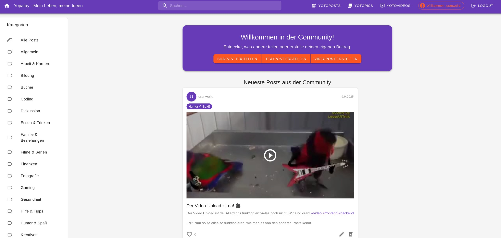
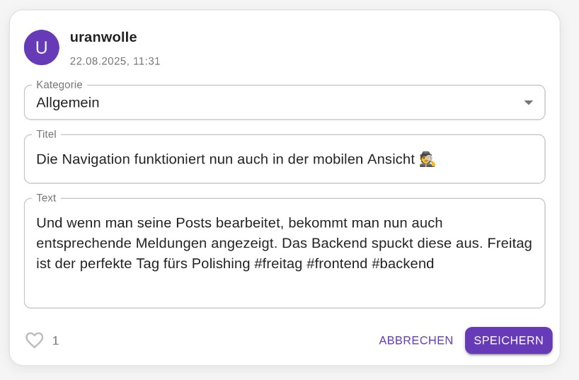
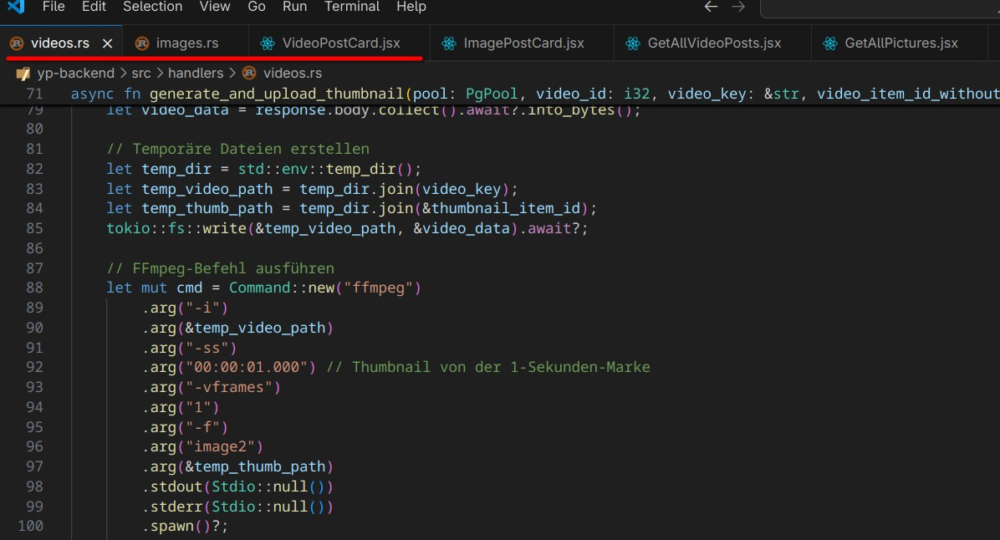

# Die Reise bisher

Alles begann mit meinem Wunsch, ein wenig Frontend und Backend-Entwicklung zur Bekämpfung von gelegentlichen Anfällen der Langeweile zu betreiben. Ziel war es, mit Rust eine schnelle und sehr einfache API zu entwickeln. Das Frontend sollte sich mithilfe von React „Vite“ materialisieren. Da ich das alles „nur mal ausprobieren“ wollte, hatte dieses Projekt keinen definierten Endzustand. Es hatte nicht einmal einen Anfangszustand, wenn ich so darüber nachdenke. Irgendwann lief die API und das Frontend ließ die Registrierung und das Login zu. Als Nächstes kam eine Post-Funktion dazu, der Bilder-Upload, Hashtags und immer noch ein wenig mehr.

Dann aber hatte ich mich, angetrieben von Reddit-Memes, an Bord des „Hype Trains“ begeben und begann mit dem Vibe Coding. In den ersten beiden Artikeln ([Ich habe mal Vibe Coding ausprobiert](https://markus-daams.com/posts/ich-habe-mal-vibe-coding-ausprobiert/) / [bad vibes beim Vibe Coding](https://markus-daams.com/posts/bad-vibes-beim-vibe-coding/)) habe ich beschrieben, wie ich dazu gekommen bin und wie ich die ersten Schwierigkeiten überwunden habe. 

In diesem Artikel will ich einen Einblick geben, wie weit mein Projekt gekommen ist. Dabei habe ich  so weit wie irgend möglich auf „Vibe Coding“ gesetzt. Ich nutze dabei diverse AI-Anbieter und ausschließlich die kostenlosen Versionen. **Gemini** liegt bei mir aktuell vorn, denn das VS Code Add-on leistet gute Dienste. 

Aber legen wir gleich los.

## Das Projekt hat einen Endzustand

Die gute Nachricht für mich zuallererst: Das Projekt hat nun einen definierten Endzustand. Nachdem ich angefangen habe, einzelne Tasks, Feature Requests und Bugs auf einem Kanban-artigen Board zu sammeln, hatte ich mir auch einmal die Zeit genommen, alle Features auszuformulieren, die ich am Ende implementiert haben will. 

Meine kleine Social Media Seite erlaubt es, Text-Posts, Bilder-Posts und seit Neuestem auch Video-Posts zu veröffentlichen. Mehr wird es auch nicht mehr werden, denn inzwischen ist das Projekt so weit gewachsen, dass die Implementierung neuer Features durch pures Vibe Coding immer mehr Zeit in Anspruch nimmt. Zudem haben die kostenlosen Angebote zur Codegenerierung auch ihre Grenzen und wenn sie nicht die gesamte Struktur des Projekts kennen, erzeugen sie schlechten Code.

{: w="500"}
_Irgendwas mit Social Media - Jedes Code Projekt (Screenshot: Markus Daams / 2025)_

Die Implementierung von kleineren Features hat überraschend gut funktioniert. Das ist besonders **Gemini** zu verdanken. Hatte mich Googles AI in den letzten Wochen immer wieder mit Fehlermeldungen von unvollständigen Antworten hängen lassen, sind diese deutlich weniger geworden. Bemerkenswerterweise ist auch die CPU-Last in die Höhe gegangen. Da das Gemini Add-on relativ häufig aktualisiert wurde, nehme ich an, man hat einen Teil der Code-Generierung auf den lokalen Rechner ausgelagert. Das ist aber nur ein Verdacht, denn ich bin zu faul das Changelog zu prüfen.

## Feature: Kategorien

Nachdem die Hashtag-Funktion endlich so lief, wie ich es mir wünschte, wollte ich noch die Möglichkeit einrichten, einen Post einer Kategorie zuzuordnen. Das klingt erst einmal einfach, aber bei der Ausarbeitung des Features auf meinem Decky Kanban Board ist mir bewusst geworden, wie kompliziert so etwas werden kann. Ein Auszug der Tasks sieht ungefähr so aus:

Aufgaben für das Frontend:

* Kategorien-Liste anlegen
* Text-Post Components erweitern 
* Bilder-Post Components erweitern
* Suchfunktion anpassen
* Neue Sub-Navigation erstellen

Aufgaben für das Backend

* Datenbank erweitern und SQL-Migration File anpassen
* Route für Kategorien hinzufügen
* Handler für Kategorien anlegen
* Handler für Suchfunktion erweitern

Und **Gemini** hatte einen echten Lauf. Ich hatte mit dem Backend begonnen, da mir das durch den recht komplexen Rust-Code immer mal wieder Bauschmerzen bereitete. Googles AI war bestens gelaunt und hatte nicht nur ein sauberes Migration-File angelegt, auch die Route und die Handler-Datei wurden erstellt und mit Code gefüllt. Jedoch wieder mit teilweise veraltetem Code, den ich manuell selbst bereinigte. Irgendwann kennt man ja die Marotten der diversen AIs. 

Genauso gut ging es im Frontend weiter. Ich habe den Frontend Code, als auch den des Backends in zwei unterschiedlichen Workspaces offen, denn ich hab es gerne übersichtlich und getrennt. **Gemini** erinnerte sich aber an mein Projekt und wusste nach dem Prompten direkt, was zu tun war. Ein paar Eingaben später hatte ich meine Kategorien im Frontend und alles funktionierte wie gewünscht. 

Ich fühlte wieder den „Vibe“.

## Wo ist mein Code hin?

Nun kam ein Feature an die Reihe, vor dem ich mich immer ein wenig gedrückt hatte. Natürlich sollte es den Usern möglich sein, die eigenen Posts zu bearbeiten. Das klingt ebenfalls nicht weiter aufwendig, wird es aber, wenn die AI irgendwann einmal Code gelöscht hat!

Als ich den ersten Code für die API geschrieben hatte – noch ohne Vibe Coding – hatte ich einigen Handlern schon eine Update-Funktion spendiert und so auch an die Routen mit angehängt. Diese sollten die Einträge in der Datenbank aktualisieren. Im Frontend hatte ich dazu noch nichts weiter gemacht. Aber was man hat, das hat man. 
Als ich mich an die Arbeit im Frontend machen wollte, ist mir aufgefallen, dass die Handler und die Ergänzungen der Routen weg waren. Irgendwann musste irgendeine AI entschieden haben, dass wenn die Routen eh nicht aufgerufen werden, der Code auf die digitale Müllhalde kann. Ich nehme an, dass das bei der Refaktorierung des Backend-Codes passiert ist. Allerdings hatte ich diese händisch gemacht, denn sowohl **Gemini** als auch **Copilot** haben das nicht hinbekommen. Nur bei der Dokumentation durften sie ran. War es dann passiert? Als ich nicht genau hingeschaut habe? Ein Moment der Unachtsamkeit? Ein mysteriöser Fall!

{: w="300"}
_Posts lassen sich nun bearbeiten. Yay. (Screenshot: Markus Daams / 2025)_

Zwei Prompts in **Gemini** später waren sie aber wieder da. Bei der Implementierung im Frontend ist mir aufgefallen, das **Gemini** gut mit [Material-UI ](https://mui.com/material-ui/) umgehen kann. Mir wurde nicht nur zügig der benötigte Code bereitgestellt, die UI war nicht einmal hässlich. Dennoch war ein bisschen hin und her bei der Kommunikation mit dem Backend notwendig. Das war aber nicht weiter dramatisch, denn am Ende des Tages konnten alle Daten aktualisiert werden, auch die der registrierten User, dank dem nigelnagelneuen Dashboard. Und ab sofort konnte ich die Update-Funktion immer sofort mit einbinden, wenn ich etwas Neues hinzugefügt habe.

## Ich habe mich einfach selbst beim Backend bedient

Auf ähnliche Art und Weise habe ich weitere Features in das Projekt integriert. An den Tagen, an denen ich wenig Lust hatte, habe ich mich um Optimierungen gekümmert. Eine mobile Navigation musste her und das Aussehen der Post-Cards angeglichen werden. Auch ein größeres Feature wie die Pagination habe ich relativ unfallfrei umsetzten können. Die Datenbank wird es mir danken.

Dann aber kam der Video-Post. Ich wollte es ermöglichen, das User Videos posten können. Anfangs durch das Hochladen von Video-Dateien, später dann auch durch das Aufnehmen einer Kamera – ein wenig Tiktok like. Ich hatte mich daher auch bewusst dazu entschieden, dieses Feature nicht mit den Bilder-Posts zu vermischen, da durch die Kamera-Funktion viel Komplexität hinzukommen würde. 

Die Components für das Frontend habe ich fix selbst angelegt und mich auch um die Navigation, sowie das Routing im Frontend gekümmert. **Gemini** sollte zunächst einmal nur den Code für das Frontend bereitstellen. Aber an diesem Tag hatte sich mein AI Freund einen dritten Espresso zum Frühstück gegönnt. Denn mir wurde nicht nur der Code für die Upload-Funktion erstellt, ich bekam gratis und ungefragt noch etwas dazu. **Gemini** hat:

* … ungefragt meinen Code für das Drag & Drop Feld (wo PC User die Datei ablegen können) gelöscht, also die gesamte Component und durch die Funktion aus **Material UI** ersetzt. Das ist erst einmal nicht schlimm, aber beide Implementierungen waren sowieso sehr ähnlich, also war der Move unnötig.

* … im Zuge dessen natürlich auch ungefragt den Code in der Bilder-Upload Component ausgetauscht. Wenigstens werden hier keine halben Sachen gemacht. Dabei wurde das Design dezent zerlegt, was ich aber manuell und schnell selbst korrigiert habe.

* … im weiteren Zuge dessen auch gleich ungefragt die Art und Weise geändert, wie die Informationen zu Bildern (UUID, Dateiendung, Dateityp) in der Datenbank gespeichert werden. Das war wirklich ein WTF-Moment. 

* … meine nächsten Schritte antizipiert. **Gemini** öffnete wiederum ungefragt und selbstständig die Projekt-Dateien des Backends im Frontend Workspace und legte dort Routen, Handler und Migration-Files an. Eine Thumbnail-Funktion, die ich noch nicht einmal im Sinn hatte, gab es als Goodie mit dazu. Auch wenn  diese nicht funktionierte und ebenfalls im Frontend implementiert wurde. WTF Nr. 2.

* … in der typischen AI Manier „noch einen Bug“ gefunden und an der Hashtag-Component herum gefuhrwerkt. 

* … Mir wiederholt mitgeteilt, wie großartig meine Ideen doch sind. Die gespielte Höflichkeit der AIs zieht eine Schleimspur die länger ist als die A7.

_Ich hab mich bei deinem Backend bedient, ist doch ok, oder? (Screenshot: Markus Daams / 2025)_

Ich komme schnell mal durcheinander, deswegen arbeite ich lieber mit verschiedenen Fenstern und Editoren. Aber nun hatte ich den Salat. Der Code funktionierte nicht, und riss sowohl Frontend als auch Backend in den Abgrund der ellenlangen Fehlermeldungen. 

Also ging ich es methodisch an, denn ich wollte das alles wieder zum Laufen kriegen. Ich öffnete Frontend und Backend in ein und demselben Workspace. Zuerst musste ich das Backend fixen. **Gemini** vergisst zum Beispiel ständig zu erwähnen, dass irgendeine weitere Abhängigkeit installiert werden muss. Ich hangelte mich von Fehlermeldung zu Fehlermeldung des Rust-Compilers, bis ich wenigstens das Backend wieder starten konnte. An die diversen neuen „Warnings“ traue ich mich aktuell noch nicht heran.

Den Code im Frontend zu fixen hat mich noch mehr Zeit gekostet. Dadurch, dass der Code für die Speicherung der Bilder geändert wurde, konnten keine Bilder mehr gepostet oder angezeigt werden. Ich habe den Code daher manuell korrigiert, denn ein erster Versuch mit **Gemini** und **Copilot** schlug fehl. Nebenher hatte eine der AI Pfade in der *.env* Datei geändert. Bis ich da einmal drauf gekommen war, habe ich viele genervte Minuten (oder Stunden?) in der Entwickler-Konsole des Browsers verbracht (*href="https://undefined/undefined/undefined/1540546817463425.jpg"*). 

Nachdem alles wieder startete, konnten die Videos nicht abgespielt werden. Durch zwei Sessions mit **Gemini** hat sich jedes Mal die Art und Weise geändert, wie mit dem Filetype umgegangen wird. Und jedes Mal wurde auch ungefragt der Code für den Bilder-Upload kaputt korrigiert. 

Da sind sie wieder, die „bad vibes“.

## Ist nun alles doof?

Das Hochladen und Abspielen von Videos funktioniert inzwischen. Bei der Darstellung in der Galerie Ansicht gibt es noch Schwierigkeiten, welche ich als Nächstes angehen werde. 

Mein Vorhaben, von nun an alles per „Vibe Coding“ umzusetzen, gestaltet sich zunehmend schwierig und verlangt zunehmend manuelle Eingriffe. 

Das ist aber auch meine Schuld. Mein kleines Projekt ist sehr viel komplexer geworden, als ich es mir zunächst vorgestellt hatte. War es anfangs noch eine kleine Fingerübung, um mit Rust und React zu hantieren, ist es inzwischen ein kleines Monster geworden. Es ist klar, dass ich mit den kostenlosen Versionen der Coding Agents an die Grenzen komme. Je komplexer ein Projekt ist, desto schwieriger wird es, Änderungen vorzunehmen. Das gilt für menschliche Programmierer, wie für AIs. 

Wie ich weiter oben bereits erwähnt habe, habe ich nun ausdefiniert, wie das Endresultat aussehen wird. Die Video-Funktion war das letzte „große“ Feature, welches ich implementieren wollte. Ab jetzt kommen noch kleinere Funktionen dazu und dann werde ich das Projekt testweise und im closed-circle hosten. Wenn ich die Straße schon so weit gegangen bin, dann auch bis zum Ende.

Ich bin nach wie vor erstaunt, zu was **Gemini** und Co inzwischen in der Lage sind. Auch wenn aktuell noch viel Nacharbeit notwendig ist, glaube ich, dass diese Art des Codings die Zukunft ist. 

Ich bleibe da auf jeden Fall am Ball.

## Ressourcen

* [Vibe Coding Artikel auf Wikipedia](https://de.wikipedia.org/wiki/Vibe_Coding)

* [Was ist Vibe Coding? Definition, Tools, Vor- und Nachteile (Blog-Artikel auf datacamp.org)](https://www.datacamp.com/de/blog/vibe-coding)

* [Vibe Coding Memes auf programmerhumor.io](https://programmerhumor.io/memes/vibe-coding)

