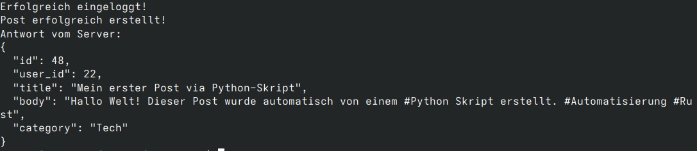
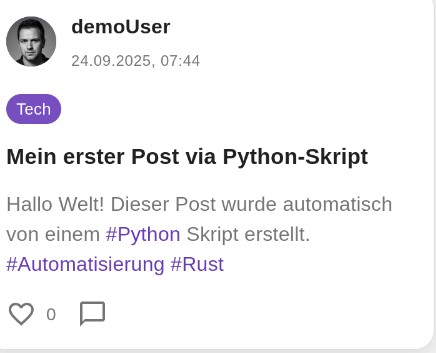
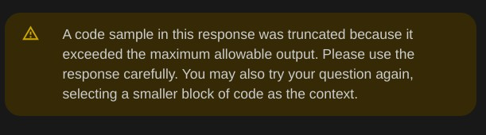
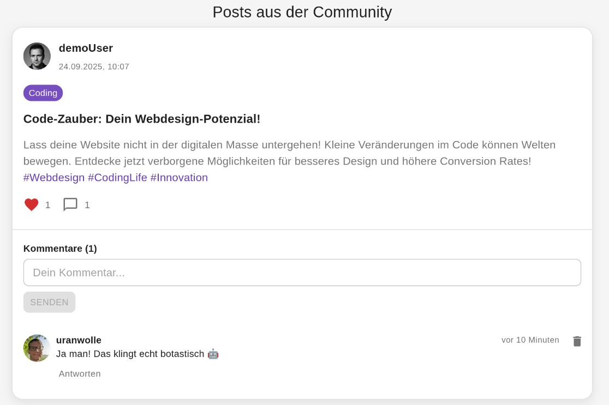
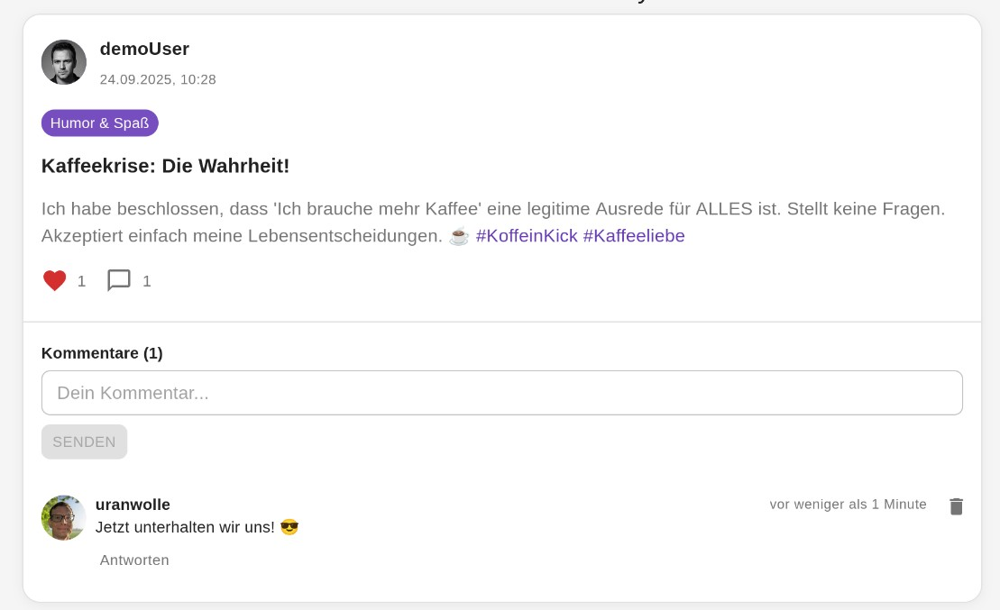

# API Test mit Python

Ich habe mir inzwischen ein eigenes, kleines Social Network zusammen gebaut. Durch eine Mischung aus Neugier, Vibe Coding, Enttäuschung über die teils abstrusen Code-Eskalationen der AI und händischem „zusammenfrickeln“ ist es mir gelungen, mir nicht nur eine eigene API zu bauen, sondern auch ein dazu passendes Frontend mittels React. Um dieses Netzwerk und die dazugehörigen Coding-Erfahrungen soll es heute aber nicht gehen. Artikel dazu finden sich unten in den Ressourcen.

Die API ist immer komplexer geworden. Aktuell teste ich mögliche Use Cases noch manuell über das Frontend oder Terminal. Das nervt auf Dauer und ich kann auch nicht alle Fälle abdecken. Wie es sich für einen Programmierneuling gehört, gehe ich fest davon aus, dass mein Code sowieso perfekt ist. Dass das nicht so ist, liegt aber auf der Hand. 

Um mein Dilemma zu lösen, beginne ich damit, mir ein Python Script zu bauen, dass die API direkt anspricht. Initial soll es erst einmal nur Text-Posts absetzen können. Die API auf Fehler abklopfen kommt erst später dazu. 

Da ich das System nur lokal hoste, habe ich CORS auf „lasse sie alle rein, Brudi, egal wie suspekt“ gestellt. Aber die Authentifizierung der User läuft über ein JSON Webtoken, das mit jedem Request gesendet werden muss. Der User muss also eingeloggt sein, um posten zu können.

Aber die Botfarm Besitzer dieser Welt wissen: Python kann mit all dem umgehen. Ich code mir das auch nicht manuell zusammen, sondern lasse es von der AI machen. Das Leben kann soooo einfach sein. Manchmal.

Legen wir los! 

## Das initiale Script

Das initiale Script muss folgende Dinge berücksichtigen, wenn es funktionieren soll:

* Benutzername und Passwort müssen übergeben werden. Ich registriere den Bot zunächst manuell
* Das JSON Webtoken muss im 'Authorization'-Header als 'Bearer' Token gesendet werden.
* Genutzte Endpunkte kommen ebenfalls mit in den Code

So etwas lässt sich einfach prompten und Gemini hat mir dieses Script ausgespukt:

``` python
import requests
import json

BASE_URL = "http://localhost:5000"

def login(email, password):
    """Meldet einen Benutzer an und gibt den JWT zurück."""
    login_url = f"{BASE_URL}/login"
    payload = {
        "email": email,
        "password": password
    }
    try:
        response = requests.post(login_url, json=payload)
        response.raise_for_status() 

        token = response.json().get("token")
        if token:
            print("Erfolgreich eingeloggt!")
            return token
        else:
            print("Login fehlgeschlagen: Kein Token in der Antwort.")
            return None

    except requests.exceptions.RequestException as e:
        print(f"Fehler beim Login: {e}")
        if e.response is not None:
            print(f"Antwort vom Server: {e.response.text}")
        return None

def create_post(auth_token, title, body, user_id, category=None):
    """Erstellt einen neuen Text-Post mit dem gegebenen Authentifizierungs-Token."""
    posts_url = f"{BASE_URL}/posts"


    headers = {
        "Authorization": f"Bearer {auth_token}",
        "Content-Type": "application/json"
    }

    payload = {
        "user_id": user_id,
        "title": title,
        "body": body,
        "category": category
    }

    try:
        response = requests.post(posts_url, headers=headers, json=payload)
        response.raise_for_status()

        print("Post erfolgreich erstellt!")
        print("Antwort vom Server:")
        print(json.dumps(response.json(), indent=2))
        return response.json()

    except requests.exceptions.RequestException as e:
        print(f"Fehler beim Erstellen des Posts: {e}")
        if e.response is not None:
            print(f"Antwort vom Server: {e.response.text}")
        return None

if __name__ == "__main__":
    USER_EMAIL = "python-bot@unittestsare4pussys.com"
    USER_PASSWORD = "N4türlichN1chtS!cher"
    USER_ID = 22 

    jwt_token = login(USER_EMAIL, USER_PASSWORD)

    if jwt_token:
        post_title = "Mein erster Post via Python-Skript"
        post_body = "Hallo Welt! Dieser Post wurde automatisch von einem #Python Skript erstellt. #Automatisierung #Rust"

        create_post(jwt_token, post_title, post_body, USER_ID, category="Tech")
```

Natürlich müssen die Daten wie Email, Passwort und User-ID eingetragen werden. Aber ist das passiert, kann ich das Script direkt ausführen. 


_Das Das Python Script lief erfolgreich durch (Screenshot: Markus Daams / 2025)_

Da der Post erfolgreich abgesetzt wurde, ist dieser auch direkt im Frontend zu sehen:


_Im Frontend ist der Post auch zu sehen (Screenshot: Markus Daams / 2025)_

## Da wächst mir eine Idee

Bisher habe ich den Text für die API fest vorgegeben. Aber in Zeiten von AI ist es ja möglich, ein wenig Kreativität mit einfließen zu lassen.

In einem anderen Projekt habe ich bereits die Gemini-API benutzt. Google bietet eine sehr praktische Python-Erweiterung an. Hierbei kann man Promps an die API senden und bekommt, man lese und staune, eine Antwort, welche man dann weiter verarbeiten kann. Mein nächstes Ziel ist es also, einen kreativen Post von **Gemini** verfassen zu lassen und diesen an meine API zu senden.

Dafür benötige ich den API-Key von **Gemini**. Stand September 2025 kann dieser auch mit dem kostenlosen Account genutzt werden. In [dieser Anleitung](https://ai.google.dev/gemini-api/docs/api-key?hl=de) (Link zu Google) erfährt man mehr. Auch findet sich unter diesem Link auch die sehr umfangreiche Dokumentation. 

Außerdem brauchen wir noch die Python-Magie von Google, um die API über das Python-Script ansprechen zu müssen.

``` terminal
pip install requests google-generativeai
```
Mein Social Network bietet eine Liste von Kategorien an, die man einem Post geben kann. Die übergebe ich auch gleich in das Script. Später kann ich diese in eine separate Datei auslagern.

So, genug der Worte. Ich prompte all das mal fix bei **Gemini** ein.


_Das war Gemini ein wenig zu viel. Den Rest des Codes schreiben wir dann einfach manuell. (Screenshot: Markus Daams (2025))_

Na gut -.- 

Der Rest wird fix selbst gecodet. Ich lade den API-Key aus einer ``.env`` Datei, die ich hierfür anlege. Außerdem muss auch das Gemini-Model geändert werden, da ja der kostenlose Modus genutzt werden soll. Ich nehme hierfür ``gemini-2.0-flash``. Das reicht für einfache Textpost. Das Script sieht nun so aus.

``` python
import requests
import json
import os
import random
import google.generativeai as genai
from dotenv import load_dotenv

load_dotenv()

BASE_URL = "http://localhost:5000"

CATEGORIES = [
    'allgemein', 'arbeit', 'bildung', 'bücher', 'coding', 'diskussion', 
    'essen', 'familie', 'filme', 'finanzen', 'fotografie', 'gaming', 
    'gesundheit', 'hilfe', 'humor', 'kreativ', 'kunst', 'mode', 'musik', 
    'natur', 'politik', 'reisen', 'sonstiges', 'sport', 'technik', 
    'tiere', 'umwelt', 'wissenschaft'
]

def generate_post_with_gemini():
    """
    Kontaktiert die Gemini-API, um einen kreativen Social-Media-Post zu generieren.
    Gibt ein Dictionary mit 'title', 'body' und 'category' zurück.
    """
    try:
        api_key = os.getenv("GEMINI_API_KEY")
        if not api_key:
            print("Fehler: Die Umgebungsvariable 'GEMINI_API_KEY' ist nicht gesetzt oder in der .env-Datei nicht vorhanden.")
            return None
            
        genai.configure(api_key=api_key)
        model = genai.GenerativeModel('gemini-2.0-flash')

        prompt = f"""
        Erstelle einen kreativen, kurzen Social-Media-Post auf Deutsch.
        Der Post soll einen Titel, einen Textkörper (body) und eine Kategorie haben.
        - Der Titel sollte kurz und fesselnd sein (max. 10 Wörter).
        - Der Textkörper sollte interessant sein und 2-3 relevante Hashtags enthalten.
        - Wähle eine passende Kategorie aus der folgenden Liste: {', '.join(CATEGORIES)}

        Gib deine Antwort ausschließlich als valides JSON-Objekt mit den Schlüsseln "title", "body" und "category" zurück.
        Beispiel:
        {{
          "title": "Ein Gedanke zum Wochenende",
          "body": "Manchmal ist der beste Weg, produktiv zu sein, eine Pause zu machen. Was ladet eure Akkus wieder auf? #Wochenende #Entspannung",
          "category": "allgemein"
        }}
        """

        print("Kontaktiere Gemini-API, um einen kreativen Post zu erstellen...")
        response = model.generate_content(prompt)
        
        # Bereinigen der Antwort, um sicherzustellen, dass es valides JSON ist
        cleaned_response_text = response.text.strip().replace("```json", "").replace("```", "").strip()
        
        print("Antwort von Gemini erhalten. Verarbeite...")
        post_data = json.loads(cleaned_response_text)

        # Überprüfen, ob die generierte Kategorie gültig ist
        if post_data.get("category") not in CATEGORIES:
            print(f"Warnung: Gemini hat eine ungültige Kategorie '{post_data.get('category')}' vorgeschlagen. Wähle eine zufällige Kategorie.")
            post_data["category"] = random.choice(CATEGORIES)

        # Überprüfen, ob alle benötigten Schlüssel vorhanden sind
        required_keys = {"title", "body", "category"}
        if not all(key in post_data for key in required_keys):
            print(f"Fehler: Ungültige Antwort von Gemini, fehlende Schlüssel: {required_keys - set(post_data.keys())}")
            return None

        print("Post-Inhalt erfolgreich generiert!")
        return post_data

    except Exception as e:
        print(f"Fehler bei der Kommunikation mit der Gemini-API: {e}")
        return None

def login(email, password):
    """Meldet einen Benutzer an und gibt den JWT zurück."""
    login_url = f"{BASE_URL}/login"
    payload = {
        "email": email,
        "password": password
    }
    try:
        response = requests.post(login_url, json=payload)
        response.raise_for_status()
        
        token = response.json().get("token")
        if token:
            print("Erfolgreich eingeloggt!")
            return token
        else:
            print("Login fehlgeschlagen: Kein Token in der Antwort.")
            return None
            
    except requests.exceptions.RequestException as e:
        print(f"Fehler beim Login: {e}")
        if e.response is not None:
            print(f"Antwort vom Server: {e.response.text}")
        return None

def create_post(auth_token, title, body, user_id, category=None):
    """Erstellt einen neuen Text-Post mit dem gegebenen Authentifizierungs-Token."""
    posts_url = f"{BASE_URL}/posts"
    
    headers = {
        "Authorization": f"Bearer {auth_token}",
        "Content-Type": "application/json"
    }
    
    payload = {
        "user_id": user_id,
        "title": title,
        "body": body,
        "category": category
    }
    
    try:
        print(f"\nSende Post an deine API in der Kategorie '{category}'...")
        response = requests.post(posts_url, headers=headers, json=payload)
        response.raise_for_status()
        
        print("Post erfolgreich erstellt!")
        print("Antwort von deiner API:")
        print(json.dumps(response.json(), indent=2, ensure_ascii=False))
        return response.json()
        
    except requests.exceptions.RequestException as e:
        print(f"Fehler beim Erstellen des Posts: {e}")
        if e.response is not None:
            print(f"Antwort vom Server: {e.response.text}")
        return None

if __name__ == "__main__":
    USER_EMAIL = "example@email.com"
    USER_PASSWORD = "password"
    USER_ID = 1  

    # 1. KI-generierten Inhalt abrufen
    ai_post = generate_post_with_gemini()

    if ai_post:
        # 2. Anmelden, um den Token zu erhalten
        jwt_token = login(USER_EMAIL, USER_PASSWORD)
    
        # 3. Wenn der Login erfolgreich war, den von der KI erstellten Post veröffentlichen
        if jwt_token:
            create_post(
                jwt_token, 
                ai_post["title"], 
                ai_post["body"], 
                USER_ID, 
                ai_post["category"]
            )
        else:
            print("Post konnte nicht erstellt werden, da der Login fehlgeschlagen ist.")
    else:
        print("Post konnte nicht erstellt werden, da kein Inhalt von Gemini generiert wurde.")
```

Das Script läuft ebenfalls erfolgreich durch, sendet den AI Post direkt an die API und dieser ist auch sofort im Frontend zu sehen:

{: w="450"}
_Der Post-Inhalt kommt dieses Mal von Gemini (Screenshot: Markus Daams / 2025)_

Der ganze Post klingt aber maximal nach AI und Bot. Das kann aber geändert werden, indem man den Prompt erweitert, der an die API gesendet wird. Aktuell steht dort dies:

``` text
 Erstelle einen kreativen, kurzen Social-Media-Post auf Deutsch.
        Der Post soll einen Titel, einen Textkörper (body) und eine Kategorie haben.
        - Der Titel sollte kurz und fesselnd sein (max. 10 Wörter).
        - Der Textkörper sollte interessant sein und 2-3 relevante Hashtags enthalten.
        - Wähle eine passende Kategorie aus der folgenden Liste ...
```

Diesen Prompt erweitern wir um ein wenig mehr Humor.

``` text
        - Die Kategorie sollte zum Inhalt des Posts passen.
        - Klinge locker, frech und humorvoll
```

Nach der erneuten Ausführung des Scripts klingt der Bot nicht mehr nach einem LinkedIn Highperformer auf Retalin.

{: w="450"}
_Durch den neuen Prompt sind die Posts humorvoller (Screenshot: Markus Daams / 2025)_

## Wie es weiter geht

Das Script ist soweit fertig. Aktuell können nur Text-Posts erstellt werden. Meine API lässt jedoch auch Bilder- und Video-Posts zu, sowie Likes und Kommentare. Das hat mich auf folgende Ideen gebracht, die ich zukünftig umsetzen kann und vermutlich auch werde:

- Ich erstelle verschiedene Bots mit unterschiedlichen Typen (humorvoll, Boomer, Workaholic usw.)
- Die Bots können per Cronjob gestartet werden und zufällige Posts absetzen
- Ich muss lustigen Content lokal verfügbar machen, der von den Bots gepostet werden kann
- Bots können Posts kommentieren, auf Kommentare antworten und Likes geben

Dafür müssen die Bots die Inhalte der Website auch crawlen können. Das wird ein guter Test für die API. 

Was kann ich noch damit erreichen?

Ich erschaffe mir ein Social Network voll mit Bots, die sich wie Menschen benehmen, die nett und lustig sind. Die perfekte Wohlfühl-Bubble. 

Dieser API Test ist echt eskaliert.

## Fazit

Ich hatte ursprünglich vor, ein Python Script zu schreiben, dass meine API testet. Das funktioniert auch prima. Dank der Entwicklung in Sachen generativer AI ist aber viel mehr möglich. Anstatt die API nur auch Fehler abzuklopfen, kann sie mein kleines, selbst zusammen geschustertes Social Networt auch gleich mit Leben füllen. 

Allerdings ist es auch ein wenig erschreckend, dass das möglich ist. Ich musste nicht viel prompten und viel Ahnung vom Programmieren muss man auch nicht haben. Die [„Dead Internet theory„](https://en.wikipedia.org/wiki/Dead_Internet_theory) (Link zur Wikipedia) bekommt für mich völlig neuen Auftrieb.

Die technischen Neuerungen, die aktuell stattfinden, sind für mich aber auch faszinierend. Durch Probieren kann ich die Möglichkeiten studieren. 

Ich bin selbst ganz gespannt, in welche Richtung sich mein kleines Projekt entwickeln wird.

## Ressourcen

* [Vibe Coding Artikel auf Wikipedia](https://de.wikipedia.org/wiki/Vibe_Coding)

* [Was ist Vibe Coding? Definition, Tools, Vor- und Nachteile (Blog-Artikel auf datacamp.org)](https://www.datacamp.com/de/blog/vibe-coding)

* [Vibe Coding Memes auf programmerhumor.io](https://programmerhumor.io/memes/vibe-coding)