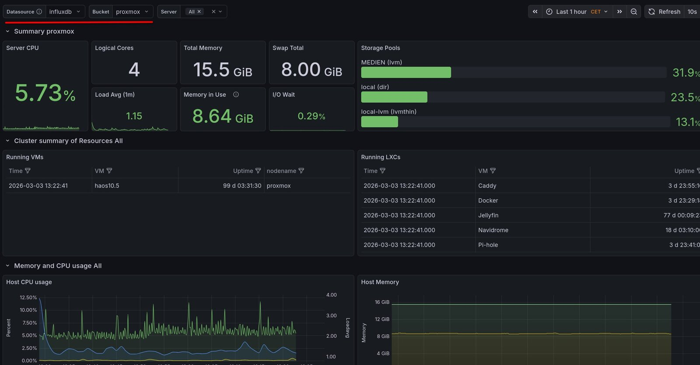

# Daten! Man gebe mir Daten.

Ich hatte einmal ein richtig doofes, selbstverursachtes Problem. Hierfür habe ich eine mit *extFAT* formatierte SSD an meinen Proxmox Host angeschlossen, an meinen Jellyfin Server weiter gereicht und gehofft, alles wird gut. Das wurde es nicht. Da ich die Berechtigungen nicht richtig gesetzt hatte, konnte Jellyfin nicht auf die SSD schreiben, probierte es aber munter weiter, immer weiter. Leider bekam ich das viel zu spät mit, was dazu führte, das völlig sinnlose I/O Requests durch die Leitungen gejagt wurden.

Für mich war klar, dass ich meinen Proxmox Server ein wenig mehr überwachen musste. Mich interessierten mehrere Dinge: I/O Requests aller LXC und VM, CPU Last, RAM Verbrauch und der Netzwerkverkehr.

Proxmox stellt diese Daten bereit. Um sie aufzubereiten und zu visualisieren ist man aber auf sich selbst gestellt. Das geht aber einfacher, als man denkt und darum soll es in diesem Artikel gehen.

Los geht’s.

## Voraussetzungen

Für das hier vorgestellte Setup werden zwei Komponenten benötigt:

1. **InfluxDB V2**
2. **Grafana**

Bei **InfluxDB** in der Version 2 handelt es sich um eine Zeitreihendatenbank. Diese Datenbank ist ideal für kontinuierlich auflaufende Daten, wie sie von einem Metrikserver gesendet werden. Es gibt eine kostenlose und quelloffene Version, welche ich in diesem Setup auch nutzen werde.
Die zweite Komponente hört auf den Namen **Grafana**. Hierbei handelt es sich ebenfalls um eine quelloffene Software zur visuellen Aufbereitung von genau solchen Daten.

Das heißt, die Daten laufen in der **InfluxDB** auf und werden von **Grafana** schickt gemacht.
Beides lässt sich sowohl auf dem Proxmox Host selbst, als auch in einem LXC installieren und nutzen. Ich nutze hierfür aber im Folgenden einen **Raspberry Pi**. Zum einen habe ich auf dem erst kürzlich [**umbrelOS**](https://markus-daams.com/posts/tsch-ss-casaos-hallo-umbrelos-und-co/) installiert und kann die benötigen Apps bequem installieren. Zum anderen will ich nicht, dass für das Monitoring die Metriken des Monitorings im Dashboard auflaufen.

Um dieser Anleitung weiter zu folgen, empfehle ich also erst einmal, sowohl **InfluxDB V2**, als auch **Grafana** dort zu installieren, wo man es gerne hätte.

## InfluxDB konfigurieren

Die Konfiguration von **InfluxDB v2** ist recht einfach. Nach der Installation steht direkt eine Weboberfläche bereit. Zunächst registriert man sich und muss eine Organisation und ein erstes Bucket erstellen. Das ist aber auch nachträglich möglich, indem man im linken Menü auf den Usernamen und dann auf *Create Organization* klickt. In meinem Fall habe ich es einfach gehalten:

* Organization: **proxmox**
* Bucket: **proxmox-bucket**

Beides ist frei wählbar. In dem angelegten Bucket laufen später die Daten auf und werden von **Grafana** abgegriffen. Damit das klappt, wird aber noch ein *Access Token* benötigt, um das Lesen und Schreiben zu autorisieren. Um an dieses Token zu gelangen, klicken wir im linken Menü auf **Load Data** → **API Token** → rechts auf **+Generate API Tokens** → **All Access API Token** , vergeben eine beliebige Beschreibung wie (*Proxmox, Grafana Zugriff*) und notieren uns das angezeigte Token. Dieses kann man sich später nicht mehr anzeigen lassen, also am besten im Editor zwischenspeichern.

{: w="550"}
_Organisation und Bucket in InfluxDB anlegen (Screenshot: Markus Daams / 2026)_

Stehen alle drei Daten, bestehend aus Organisation, Bucket und Token bereit, geht es weiter in **Proxmox**

## Proxmox Metrik Server anlegen

Damit die Daten in die soeben konfigurierte Datenbank landen, muss diese in Proxmox hinterlegt werden. Dazu klicken wir im linken Menü ganz oben auf **Rechenzentrum** und im linken Sekundärmenü etwas weiter unten auf **Metrikserver**. Weiter geht es mit einem Klick auf **Hinzufügen** → **InfluxDB**. Die Daten wie folgt ausfüllen:

* **Name**: Frei wählbar
* **Server**: IP-Adresse oder URL des **InfluxDB** Servers
* **Port**: Port des **InfluxDB** Servers
* **Protokoll**: HTTP
* **Organisation**: Muss die Organisation des **InfluxDB** Servers sein
* **Bucket**: Names des Buckets, welches wir im **InfluxDB** Server angelegt haben.
* **Token**: Das Token, dass wir uns notiert haben

{: w="550"}
_Die Daten der InfluxDB in diese Maske eintragen (Screenshot: Markus Daams / 2026)_

Nach dem Speichern sendet Proxmox die Daten an den Server. Ob das klappt, oder nicht, ist hier leider nicht erkennbar, es findet kein Test statt. Man kann dies aber in der Weboberfläche von **InfluxDB** sehen, zum Beispiel unter **Load Data** → **Bucket**.  Hier laufen die Daten aber einfach nur auf. Wir wolle diese ja schick anzeigen, also geht es weiter in **Grafana**

## Grafana konfigurieren

Weiter geht es auf der Weboberfläche von Grafana. Hier müssen zwei Schritte durchgegangen werden. Als Erstes muss die **InfluxDB** als Datenquelle hinzugefügt werden und anschließend ein Dashboard erstellt werden. Beides ist nicht weiter wild, also rocken wir los.

Die Datenquelle wird im linken Menü unter **Verbindungen** (Connections) → **Datenquelle** (Data Sources) hinzugefügt. Im sich öffnenden Menü rechts oben auf **+ Neue Datenquelle hinzufügen** (Add Data Source) klicken. In die Suchleiste nun *Influx* eintippen und **InfluxDB** sollte als Suchtreffer angezeigt werden. Dies anklicken und es öffnet sich ein neues Menü. Von oben nach unten muss dies nun so ausgefüllt werden:

* **Name**: Frei wählbar
* **Query Language**: Flux
* **URL**: IP-Adresse und Port der **InfluxDB** Datenbank (kann auch localhost sein)
* **Basisauthentifizierung**: Deaktivieren, es öffnet sich unten ein neues Menüfeld
* **Organisation**: Wieder der Name von unserer Organisation in der **InfluxDB** 
* **Token**: Das notierte Token aus der **InfluxDB**
* **Default Bucket**: Name des Buckets, das wir in der **InfluxDB** angelegt haben

{: w="550"}
_Wichtige Einträge sind rot markiert (Screenshot: Markus Daams / 2026)_

Nach einem Klick auf **Speicher und testen** versucht **Grafana**, die Verbindung zur **InfluxDB** herzustellen. Klappt dies nicht, wird dies auch sofort angezeigt. In diesem Fall alle eingegebenen Daten sorgfälltig überprüfen. Hat der Test geklappt, schließt sich das Menü und die neue Datenquelle wird sofort angezeigt. Hier brauchen wir aber nichts weiter zu tun, denn nun legen wir ein schickes Dashboard an.

## Schickes Dashboard anlegen.

Das Tolle an **Grafana** ist, dass es eine große Community gibt, die hier bereits vorkonfigurierte und informative Dashboards erstellt und geteilt hat. Für diese Anleitung werde ich im Folgenden das Dashboard mit der ID **15356** nutzen. Wer sich aber selbst auf die Suche machen will, kann das auf der Website [grafana.com/grafana/dashboards](https://grafana.com/grafana/dashboards) tun. Im linken Menü unter *Filters:* als **Data Source** dann **InfluxDB** auswählen. In den Beschreibungen der von der Community erstellten Dashboards findet man dann weiter Informationen, wie es genutzt wird und was beachtet werden muss. 

Für **15356** ist das aber nicht nötig. Im linken Menü von **Grafana** auf **Dashboard** → **Neu** (New) → **importieren** (import) und im sich öffnenden Menü im mittleren Feld die ID
**15356** eingeben.

{: w="550"}
_In diese Maske nur die ID 15356 eintragen und laden (Screenshot: Markus Daams / 2026)_

Nach einem Klick auf **Laden** (Load) öffnet sich eine neue Maske.

* **Name**: Frei wählbar
* **Select a InfluxDB data source**: Hier die erstellte Datenquelle auswählen. Alle anderen Einträge können so bleiben und mit **Importieren** (Import) wird der Vorgang abgeschlossen. 

Im linken Menü von **Grafana** auf **Dashboard**  und dann auf das soeben importierte und konfigurierte Dashboard klicken. Falls hier nun überall *No Data* angezeigt wird, in der oberen Leiste sicher gehen, das bei **Data Source** die angelegte Datenquelle und bei **Bucket** das richtige Bucket ausgewählt sind. Ist das erledigt, sollten alle Datenfelder nun etwas anzeigen.

{: w="550"}
_Datenquelle und Bucket auswählen (rot markiert). (Screenshot: Markus Daams / 2026)_

Ist alles konfiguriert, erwacht das Dashboard zum Leben. Es kann etwas dauern, bis genügend aussagekräftige Daten aufgelaufen sind. Zu sehen sind dann allgemeine Informationen zum Proxmox Note und Metriken zur CPU-Last, RAM-Verbrauch, Netzwerkverkehr und I/O Operationen der einzelnen LXC und VM. Ganz genau so, wie ich es gerne hätte.

## Fazit

Sinn der ganzen Aktion war für mich einen Überblick darüber zu bekommen, wie sich die Ressourcen meines Proxmox Servers verteilen. Die sinnlosen Schreibaktionen Jellyfin Servers hätte ich wohl viel früher bemerkt, wenn ich meinen Mors schon eher hochbekommen hätte.

Proxmox stellt hierfür Metriken über eine API bereit:

``https://<PROXMOX-HOST>:8006/api2/json/nodes/<NODE-NAME>/metrics``

Wer JSON als Muttersprache spricht, freut sich darüber. Einfacher ist es, diese Daten in einer Datenbank zu speichern und zu visualisieren. Das bedeutet aber auch, die oben beschriebene Anleitung ist nur ein Weg von sehr vielen, dieses Ziel zu erreichen.  Sowohl für die Datenbank, als auch für die Visualisierung gibt es einige Alternativen. Für meine Zwecke langt es. Für den professionellen Einsatz vermutlich nicht.

Ich freue mich jedenfalls über schicke Daten und werde sinnlosen Schreiboperationen von rastlosen LXC schneller auf die Schliche kommen, als es bisher der Fall war.

## Ressourcen 

* [Proxmox VE API Dokumentation (Englisch)](https://pve.proxmox.com/wiki/Proxmox_VE_API)

* [Influx Dokumentation "Manage Organizations" (Englisch)](https://docs.influxdata.com/influxdb/v2/admin/organizations/)

* [Grafana Dokumentation "Import Dashboard" (Englisch)](https://grafana.com/docs/grafana/latest/visualizations/dashboards/build-dashboards/import-dashboards/)