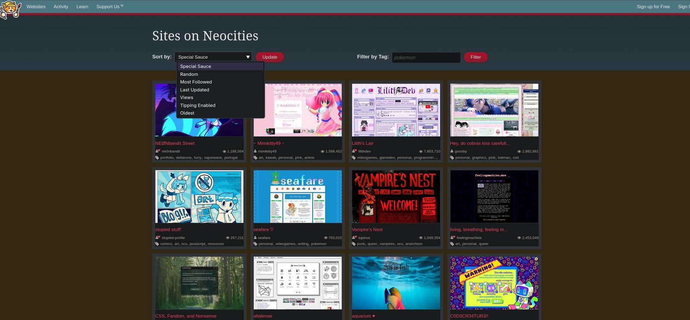

# Sag mir, wo die Websites sind

Das Wetter wird langsam wieder besser und es gibt endlich ein paar Gründe mehr, sich draußen herumzutreiben. Denn auf eine Sache habe ich eigentlich keine Lust mehr – mich im Internet aufzuhalten. Ich surfe leider nur noch dieselben Websites ab, konsumiere die wichtigsten Artikel und bin froh, wenn ich mich etwas Produktiverem zuwenden kann. Wenn ich ehrlich bin, macht mir das Internet schon seit langer Zeit keinen echten Spaß mehr. Ich lese immer dieselben deprimierenden Nachrichten, dieselben SEO optimierten Artikel und lese immer dieselben Diskussionen in den Kommentarspalten, wenn es denn noch welche gibt, die nicht geschlossen sind. Dazu kommen immer mehr Bots, die irgendeiner politischen Agenda folgen und seit Neuestem der lawinenartige Schwall von AI-Slop.

Mir hat das Internet aber früher einmal Spaß gemacht. Man konnte an jeder Ecke etwas Neues entdecken. Messenger wie ICQ waren die Social Networks der Zeit und Winamp lief die garantiert nicht AI generierte Musik. Ob das alles so viel besser war, bleibt natürlich offen. Immerhin wurde ja immer wieder die steile These geäußert, dass das Internet die Welt besser machen würde. Viele Menschen würden Zugang zu fast unbegrenztem Wissen erhalten, könnten sich miteinander verbinden und auf diesem Wege die interkulturelle Interaktion auf ein neues Level heben.

Man, lagen wir falsch!

Aber das soll nicht „so ein Text“ werden. Ich habe mich gefragt, ob ich das „alte Internet“ noch irgendwo finden kann. Ich habe es gefunden und spontan beschlossen, einen kleinen Artikel darüber zu schreiben.

## Was ist denn "das alte Internet"?

Um es gleich vorwegzunehmen, ich teile die Entwicklung des Internets in drei Zeitalter ein. Diese Einteilung ist rein subjektiv, nicht wissenschaftlich und basiert auf meiner ureigenen, emotionalen Evidenz. Ich versuche das ganze dennoch mit etwas Logik aufzuwerten.

**Erstes Zeitalter**

Das ist das sehr frühe Internet. Der Zugriff war teuer, erfolgte über monströse Akustikkoppler und eigentlich konnten es sich nur Universitäten und Regierungseinrichtungen leisten. Daher gab es nicht viele Dienste und ich bin sicher, zu dieser Zeit liefen noch irgendwo Dinos, Dodos und andere Fabelwesen durch die Welt.

**Zweites Zeitalter**

Das goldene Zeitalter. Der Zugriff erfolgte über Analogmodems und den ersten DSL-Anschlüssen. Immer mehr Menschen konnten selbst Websites erstellen, es gab Diskussionsforen, Messenger und Torrent war der digitale Sport des armen Mannes. Für die Politik war dieses Internet neuestes Neuland. Ich bin mit diesem Internet aufgewachsen. Es war wild und manchmal beängstigend. Es war cool!

**Drittes Zeitalter**

Da sind wir jetzt. Zugriff hat man überall, ob man will oder nicht. Die beliebtesten Websites stammen von riesigen Corpos, Inhalte sind häufig generiert und generisch bis zum Gehtnichtmehr. Die Politik versucht Zugang und Inhalte bis herunter auf die Quantenebene zu kontrollieren. Man müsste die Silbe „Inter“ ehrlicherweise streichen. Stammen die Inhalte nicht von Bots, dann vermutlich von einer KI. Der wichtigste Inhalt ist Werbung.

Das sind meine drei Zeitalter. Ich habe mich dazu entschlossen, mich auf die Suche nach Artefakten des 2. Zeitalters zu machen. 

## Websites, mit Ecken und Kanten

Die ersten Websites, die nicht von irgendeiner Organisation und Behörde stammten, sondern von einfachen Menschen, waren vor allem eins: Bemerkenswert hässlich. HTML und CSS hatten sich eben erst als Standard durchgesetzt und dementsprechend konnten es noch nicht so viele Menschen. Das hat aber eben jene nicht davon abgehalten, ihr Wissen und ihre Ideen zu verbreiten. Die ersten Websites waren also sehr einfach gehalten. Wortgeschöpfe wie UI- / UX-Design, SEO-Optimierung und User Experience waren noch nicht erfunden. Allein auf den Inhalt kam es an.

Jeder, der ein Hobby hatte, ein Wissensgebiet oder eine eigene Theorie zu irgendwas, konnte sich eine Website zusammenbasteln und ins Internet stellen. Befeuert wurde das ganze durch Tools wie [Microsoft FrontPage](https://de.wikipedia.org/wiki/Microsoft_FrontPage). Dank dieses Editors konnte man Websites erstellen, ohne HTML / CSS zu beherrschen. Der Quellcode kam direkt aus der Hölle und selbst der Internet Explorer bettelte um Gnade, wenn er das Endprodukt rendern musste. Dennoch verhalf er jeder noch so unausgegorenen Idee auf die Bühne des Internets.

Man selbst konnte sich dann auf die Suche machen. Entweder wurde die Website in irgendeinem Katalog gelistet, oder sie war auf einer anderen Seite verlinkt. Diese „Link Ringe“ waren total angesagt. Verlinkst du mich, verlinke ich dich – die Kernidee des Internets. Es war damals nicht unüblich, mehrere Websites mit demselben Themengebiet zu verlinken. Konkurrenzgedanken waren längst nicht so dominant wie es heute der Fall ist. Wer also Lust hatte, konnte sich immer wieder durch das Internet klicken, immer weiter und immer tiefer in die Untiefen menschlicher Schaffenskraft.

Aber genug der Worte. Wo findet man denn noch solche Websites?

## Wer suchet, der findet (noch)

**Wiby.me**: Diese Seite ist mir immer einmal wieder untergekommen. Für Nostalgiker ist sie inzwischen eine Institution. Die Seite ist absolut minimalistisch aufgebaut. Es gibt eine Suchleiste, in der man per Freitext suchen kann und es gibt den „Surprise me“ Button. Dieser Button leitet auf eine zufällige Website weiter. Es werden nur Websites aufgenommen, die zu diesem „alten Internet“ gehören. Also einfache HTML / CSS Websites, auf denen ein animiertes GIF den Gipfel des Entertainments darstellen. Mehr über die Suchmaschine findet sich auf der [About Seite](https://wiby.me/about/guide.html). Übrigens, die Search Engine ist Open Source und kann heruntergeladen werden.

=> [wiby.me](https://wiby.me/)

{: width="550"}
_Solche Websites meine ich. Nicht hübsch, aber mit Liebe gemacht (Screenshot: Markus Daams / 2026)_

**marginalia-search.com** schlägt in dieselbe Kerbe. Auch hier werden nicht kommerzielle Websites gesucht und gelistet. Die Suche hier lässt sich auf Wunsch granularer gestalten. So kann man zum Beispiel gezielt nach Blogs oder „Vintage“ Seiten suchen. Abgerundet wird das Angebot mit einer zufälligen Auswahl von Websites unter dem „Explore“ Tab. Hier halte ich mich öfters auf, denn man findet die ausgefallensten Perlen.

=> [marginalia-search.com](https://marginalia-search.com/)

{: width="550"}
_Bei marginalia-search handelt es sich ebenfalls um eine Suchmaschine (Screenshot: Markus Daams / 2026)_

## Websitebaukästen … aus der Hölle

Im alten Internet haben sich relativ schnell die ersten Website-Baukästen breitgemacht. Nun brauchte man gar keine Kenntnisse mehr, denn man konnte seine Inhalte direkt in einen Editor donnern und sofort online stellen. Die Domain gab es gratis dazu und finanziert wurde der Spaß durch die aufkommende Werbung. Der berühmteste und sicherlich auch berüchtigtste Dienst unter diesen Free Hostern war **GeoCities**. Da es keine Einstiegshürden mehr gab und es auch noch kostenlos war, sammelte sich hier alles an, was anderswo nicht unterkam. Es gab viele, echt gute Websites und eine ganze Menge von Seiten, welche die tiefsten Abgründe des Menschen widerspiegelten. Kurz um, es war unterhaltsam, sich durch die Websites zu klicken,auch wenn man manchmal ins digitale Plumpsklo gefallen war. 

GeoCities gibt es nicht mehr. Hier kommt aber nun **neocities.org** ins Spiel. Die Erschaffer hinter diesem Projekt versuchen den „guten“ Geist des alten Portals wieder aufleben zu lassen. Hier finden sich Websites voll blinkender GIFs, sinnloser Animationen und garantiert nicht SEO konformer Content. Die Suche kann angepasst werden und für die Websites sind Tags hinterlegt, nach denen man ebenfalls suchen kann. Die Krönung des Ganzen ist ein Oldschool HTML-Editor, für all jene, die selbst eine NeoCities Website erstellen wollen. Und davon scheint es ein Glück eine ganze Menge zu geben, denn die Community ist sehr aktiv.

*Kommet, ihr trashigen und liebevollen Websites!* 

=> [neocities.org](https://neocities.org/)

{: width="550"}
_NeoCities lässt den Geist von GeoCities wieder aufleben (Screenshot: Markus Daams / 2026)_

## Und dann kamen die Blogs

Irgendwann wurde es aber zu mühselig, für jeden Gedanken gleich eine ganze Website zu erstellen. Hierfür gab es dann Blogs. Die Website selbst war bereits erstellt und man musste sich nur noch um die Texte kümmern. Viele Menschen nutzen Blogs als ihr digitales Tagebuch. Auf diesem Wege konnte man anderen dabei zuschauen, wie ihre Ideen und Projekte langsam Wirklichkeit wurden. Im Prinzip waren Blogs Twitter mit längerem und häufig auch viel besserem Inhalt.

Auch für Blogs gab es Link Ringe, man verlinkte sich also gegenseitig und profitierte davon. Wie bei den Websites waren längst nicht alle Blogs auch nur halbwegs sinnvoll. Dennoch fanden sich hier und da echte Perlen. Um solche alten Blogs zu finden, lohnt der Besuch auf **ooh.directory**. Hierbei handelt es sich um eine von Hand gepflegte Liste von Blogs. Man kann sich sowohl durch die Kategorien klicken, als auch eine Freitextsuche starten. 

{: width="550"}
_Eine handverlesene Liste von Blogs auf ooh.directory (Screenshot: Markus Daams / 2026)_

=> [ooh.directory](https://ooh.directory/)

## Einen habe ich noch

Mein letzter Tipp ist ein Zugeständnis an den Zeitgeist. Heute surfen die meisten von uns auf dem Smartphone durchs Internet. Das Problem ist, dass die meisten der alten Websites dafür gar nicht optimiert sind, denn es gab zu dieser Zeit entweder gar keine Mobiltelefone, oder sie waren so groß wie Schuhkartons. Ich möchte aber auch auf dem kleinen Bildschirm meiner Nostalgie frönen und hier kommt **Kagi Small Web** ins Spiel. Hier finden sich ebenfalls „alte Internetseiten“, wie auch bei den oben genannten Tipps. Für Kagi gibt es aber auch eine App, die ich im Android App Store gefunden habe. Beim Start wirft sie mich direkt auf eine zufällige Website. Der Vorteil ist der App ist, dass die Seite für den kleinen Bildschirm optimiert wird. Zudem kann ich mich per Swipe auf die nächste zufällige Website werfen lassen.

Das ist wie Tinder für alte Internetseiten – ich liebe es. Kagi lässt sich aber auch im Desktop Browser bedienen, ganz wie damals.

=> [kagi.com/smallweb/](https://kagi.com/smallweb/)

{: width="550"}
_Für Smartphones gibt es Kagi Small Web auch als App (Screenshot: Markus Daams / 2026)_

## Fazit und Gedanken

Als ich meine ersten Schritte in das Internet unternommen hatte, was es vor allem eins – aufregend. An jeder Ecke gab es etwas Neues zu entdecken. Oder etwas absolut Furchtbares, es war ein digitales Überraschungsei. Vor allem war es aber aufregend, denn man konnte nur erahnen, was in Zukunft alles möglich sein würde.

Allerdings konnte es ein Versprechen nicht einlösen, nämlich die Welt zu einem besseren Ort zu machen. Den Menschen Zugang zu fast unbegrenztem Wissen zu geben, scheint nach aktueller Lage absolut nichts zu bringen. Eher ist es wohl so, dass wir Wissen als Waffe für die eigenen Zwecke einsetzen. Das Internet gerät zunehmen unter Druck. Konzerne, Regierungen und politische Interessensgruppen haben sich dem Web angenommen und beherrschen es nun zu einem großen Teil. Das ist schade, denn das war nicht immer so.

Ganz tot ist das alte Internet aber auch nicht, wie man den oben vorgestellten Links entnehmen kann. Es wurde nur an den Rand gedrängt, auf Seite 1.005.207 der Suchergebnisse von einer beliebigen Suchmaschine. Hier findet man dann alles, was das Herz begehrt. Websites über jedes noch so ausgefallene Hobby, diverseste Kuriositäten und so manche Perle. Wem die Nostalgie packt, ist hier am richtigen Ort. Auch meine kleine Website hier soll ein Beitrag dazu sein. Sicher, sie ist nicht Plain HTML / CSS. Aber sie ist werbefrei und ich schreibe, wonach mir die Nase steht. 

Meine Auswahl ist bei Weitem nicht vollständig. Wer gezielt danach sucht, wird noch mehr Projekte dieser Art finden. Ganz wie damals, als man sich von Link zu Link klickte.

## Ressourcen

Noch einmal alle Links im Überblick:

* [wiby.me](https://wiby.me/)

* [marginalia-search.com](https://marginalia-search.com/)

* [neocities.org](https://neocities.org/)

* [ooh.directory](https://ooh.directory/)

* [kagi.com/smallweb/](https://kagi.com/smallweb/)

