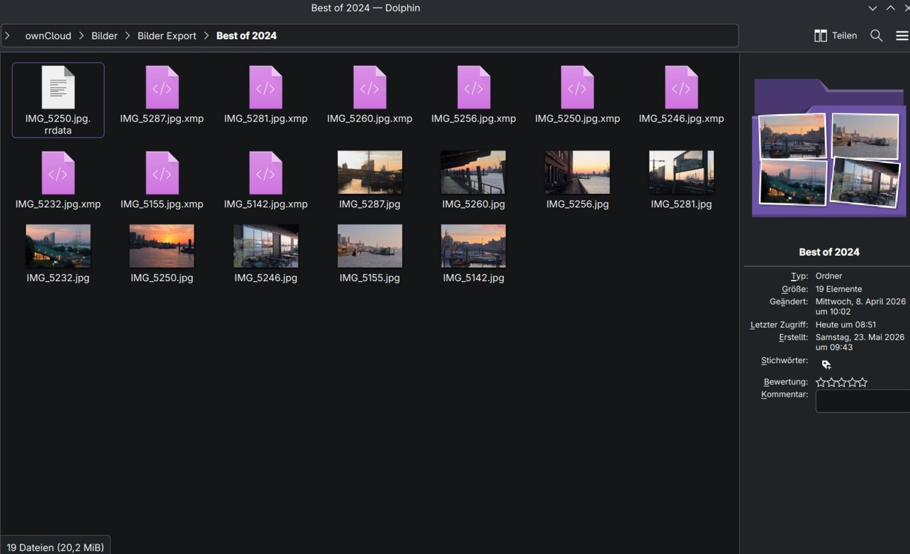

# Und noch eine Cloud App

Eine Wolke besitzen? Das wäre doch was. Aber mal im Ernst, ich war schon länger auf der Suche nach einem Ersatz für **Nextcloud**. In meinem Artikel [„Auf der Suche nach einer Nextcloud Alternative“](https://markus-daams.com/posts/die-suche-nach-einer-nextcloud-alternative/) testete ich zuletzt „Filebrowser Quantum“. Ich wurde nicht glücklich damit und habe den Wechsel erst einmal wieder verschoben.

Dann aber poppte erneut eine Meldung auf, die meine Motivation neu erweckte. Wer Nextcloud kennt, kennt sicherlich auch die Übersicht aller Meldungen (Fehler und Warnungen) in der Administrationsoberfläche. Diese Liste musste ich von Zeit zu Zeit abarbeiten, was mir viel Zeit und Mühe abverlangte. Der größte Brocken war aber immer das PHP Update. Ist die Version zu alt, bekommt man deutliche Hinweise darauf, das zukünftige Versionen diese nicht mehr unterstützen werden. Das Update von PHP ist aber alles andere als trivial. Dank der großartigen Community rund um Nextcloud habe ich es aber fast immer hinbekommen – per Update Script. Dank Backups habe ich auch fehlerhafte Runs des Scripts korrigieren können.

Mein Ziel war es, diesen zeitraubenden Administrationsaufwand zu minimieren. Ich kam zu dem Schluss, dass Nextcloud dafür leider wegmusste. So habe ich das hinbekommen.

## Keine Lösung? Ändere das Problem!

Ich habe Nextcloud für drei Dinge verwendet:

1. Geräteübergreifende Datei-Synchronisation (Brot und Butter Geschäft der Cloud)
2. Verwaltung meiner Notizen (auch hier über alle Geräte hinweg)
3. Bilder-Verwaltung (Wie Google Fotos nur in datenschutzfreundlich)

In dieser Kombination bekommt das aktuell nur Nextcloud so gut hin, wie ich es mag. Da es keine Alternative dafür gibt, habe ich die drei Punkte zerlegt und einzelne Lösungen gefunden.

Für die Verwaltung meiner Bilder und Videos habe ich mich für [Immich](https://markus-daams.com/posts/immich-fotos-und-videos-selbst-hosten/) entschieden. Dank [Runtipi](https://markus-daams.com/posts/runtipi-selfhosting-einfach-gemacht/) hält sich der Administrationsaufwand in Grenzen und wer Immich kennt, liebt es. Wer nicht, sollte sich schnell verlieben.

Die Verwaltung meiner Notizen habe ich vollständig auf [Obsidian](https://markus-daams.com/posts/wissen-und-notizen-verwalten-mit-obsidian/) migriert. Dieses Tool will ich auf keinen Fall mehr missen.

Nun habe ich noch ein Problem übrig, die geräteübergreifende Datei-Synchronisation. Hier hakte es in der Vergangenheit, denn ich hatte ebenfalls drei Anforderungen:

1. Eine mindestens halbwegs moderne Weboberfläche
2. Eine halbwegs moderne App für Android
3. Eine gute Integration in die Linux Desktops KDE Plasma und Gnome

Den ersten Punkt bekommen alle Alternativen, die ich getestet habe, prima hin. Jeder kann inzwischen React, das ist super. Bei den beiden letzten Punkten hakte es aber immer wieder. Bis jetzt.

## oCIS / ownCloud

Bei meiner Suche nach einer Alternative bin ich natürlich auch über **ownCloud** gestolpert. Dieses Open-Source-Projekt bietet alles das, was ich gesucht habe. Wer aber die [Geschichte von ownCloud](https://de.wikipedia.org/wiki/OwnCloud) kennt, weiß, dass Nextcloud ein Fork davon ist. Der technische Unterbau hat bei beiden Projekten also dieselbe Basis. Bei einem Wechsel hätte ich nichts gewonnen. Die Entwicklung von ownCloud, openCloud und Nextcloud ist wild, ich empfehle den verlinkten Wikipedia Artikel.

Mit **oCIS** (ownCloud Infinite Scale) wurde ownCloud auf eine neue technische Basis gestellt. Man hat PHP über Bord geschmissen und das Backend in [„Go“](https://go.dev/) neu geschrieben. Im Vordergrund standen bei der Entwicklung vor allem Performance und Skalierung. Die Skalierung ist eher für kommerzielle Anbieter interessant. Die Performance nehme ich gerne mit.

**oCIS** löst alle meine drei Probleme auf einmal. Denn die Datei-Synchronisation ist der Kernauftrag des Tools und funktioniert demnach prima. Dazu kommt, dass sich die bereits sehr guten ownCloud Apps mit **oCIS** nutzen lassen.

Also alles gut und ich kann wechseln?

## Und schon gewechselt

Auf die Installation gehe ich in diesem Artikel nicht groß ein. Ich habe es per Docker gemacht. Bei Interesse empfehle ich den [„run oCIS Artikel“](https://owncloud.dev/ocis/getting-started/#run-ocis) in der offiziellen Dokumentation. Wer will, kann die Binaries installieren, oder es eben per Docker erledigen. Die Installation mittels Docker ist nicht ganz so trivial, daher empfehle ich ggf. die Unterstützung der A.I. der Wahl (ChatGPT und Co) zur Unterstützung. Ich habe mir eine sinnvolle YAML zusammen gebastelt und per [„Dockge“](https://github.com/louislam/dockge) deployt, denn aktuell teste ich Docker GUIs wie wild.

Mittels [„Caddy“](https://markus-daams.com/posts/caddy-helfer-im-heimnetz/) habe ich das Domain- und Zertifikat-Gelöt direkt aus dem Weg geräumt und **oCIS** lief. Installation und Konfiguration haben mich ca. eine Stunde gekostet, nebst Dokumentation in Obsidian. Ich will ja später nachvollziehen können, was ich da zusammen gekocht habe. 

## Wie es läuft und aussieht

Nach der Installation und Konfiguration war die Weboberfläche sofort erreichbar. Diese sieht modern aus, ist auf das Nötigste beschränkt und reagiert angenehm schnell.

{: width="600"}
_Die Weboberfläche ist schick und schnell, das gefällt schon einmal (Screenshot: Markus Daams / 2026)_

Dies sind einige Dinge, die mir sofort positiv aufgefallen sind:

- Die Ansicht der Elemente ist flexibel. Von Listen bis Raster, es ist alles Wichtige dabei
- Thumbnails für Bilder werden zügig erstellt
- Für Bilder gibt es eine Karussell-Ansicht 
- Sinnvolle Meta-Informationen zu den Dateien werden in der rechten Spalte angezeigt
- Für alle Dateien lassen sich Tags hinterlegen
- Verschiedene Sortieroptionen (Datum, Namen, Dateigröße) sorgen schnell für Übersicht
 
Klar, vieles davon ist inzwischen selbstverständlich. Mir gefällt, dass die Weboberfläche auf das Nötigste beschränkt ist, ohne zu viel Komfort zu opfern. Wer *OneDrive* oder *Google Drive* kennt, wird sich in der Weboberfläche von **oCIS** schnell zurechtfinden.

## Und die Apps?

Bei den Apps hakte es bei den von mir getesteten Alternativen bisher. Entweder gab es keine, oder ich musste Umwege über zum Beispiel WebDAV nehmen. **oCIS** unterstützt ebenfalls das WebDAV Format. Allerdings stehen auch native Apps zur Verfügung, auch für Linux. Hierfür greift man einfach auf die bestehenden ownCloud Apps zurück, denn diese verbinden sich anstandslos.

Ich weiß nicht, wie es bei anderen Distributionen aussieht, aber unter Fedora hatte ich eine kleine Klippe zu umschiffen. Der offizielle ownCloud-Client findet sich weder bei den Flatpaks, noch in den existierenden Repos. Es wird aber vom Projekt ein eigenes Repository angeboten und gepflegt. Dieses musste ich einbinden, um den Client per `dnf` installieren zu können.

Wie das genau funktioniert, wird in der Dokumentation des Projektes erläutert. Unter [diesem Link](https://attic.owncloud.com/desktop/ownCloud/stable/latest/linux/download/) finden sich die Installationsanleitungen für Fedora, Debian, openSUSE und Ubuntu.
{: width="600"}
_Der Client bindet ownCloud in die Distribution ein (Screenshot: Markus Daams / 2026)_

Nach der Installation des Clients verbinde ich mich mit meinem Server und das war es. Die Datei-Synchronisation startet sofort. Per Klick kann ich meine Dateifreigabe direkt in Dolphin (KDE) und Nautilus (Gnome) einbinden. Ich kann meine Cloud Dateien bequem lokal anschauen, bearbeiten usw.

{: width="600"}
_Freigaben aus der Cloud lassen sich in den Datei Explorer einbinden (Screenshot: Markus Daams / 2026)_

Die Installation unter Android verlief einfacher, denn die offizielle App findet sich im [Android App-Store](https://play.google.com/store/apps/details?id=com.owncloud.android&hl=de) und kann einfach installiert werden. Diese bedient sich genauso bequem wie andere Cloud Apps.

Es kam weder unter Plasma KDE, Gnome noch Android zu irgendwelchen Überraschungen oder Schwierigkeiten. Es ist nur schade, dass nicht zum Beispiel ein Flatpak bereitsteht, um die Installation noch ein klein wenig flauschiger zu machen.

## Nachbetrachtungen

Ich habe den Wechsel zu oCIS / ownCloud nach einer kurzen Testphase abgeschlossen und alle Clients umgestellt. Das ging einfacher, als zunächst erwartet. Dank Caddy hatte ich bezüglich der Domain und des Zertifikats kein Problem. Dank der offiziellen ownCloud Clients musste ich keine Bastel-Lösung finden. Zudem hat mich die Performance überrascht. Dem Container steht ein CPU-Kern und 512 MB RAM zur Verfügung und alles rennt.

Schaue ich auf die eingangs erwähnten drei Probleme zurück, die sich bei einem Wechsel der Cloud-Lösung ergaben, kann ich feststellen, das alles im Lack ist. Wie bereits erwähnt, habe ich die Verwaltung der Fotos und Notizen in die Hände andere Apps gelegt. Diese erledigen ihre Aufgaben mehr als zufriedenstellend. 

Bei den Notizen stieß ich auf ein Problem, für das oCIS jedoch nichts kann. Die Vault von Obsidian, also der Basis-Ordner aller Notizen, liegt in meinen Cloud-Dateien. Dies ermöglicht mir, Obsidian geräteübergreifend zu nutzen und auf diesem Wege alle Notizen, Add-ons und Einstellungen zu synchronisieren. Die Obsidian-App unter Android kann auf diesen Ordner jedoch nicht zugreifen. Grund hierfür ist das rigide agierende Rechtemanagement unter Android. Ich habe auf die App *Foldersync* zurückgegriffen, denn diese hat eine ownCloud Integration. So kann ich den Ordner auf dem Smartphone synchronisieren und hier ebenfalls Obsidian nutzen.
Bis auf die Umwege bei der Client-Installation unter Fedora und der Obsidian-Vault-Synchronisation hatte ich aber keinerlei Probleme.

Und das war es. Ich habe Nextcloud nach einer kurzen Übergangsphase gelöscht. Ein zukünftiges PHP-Upgrade bleibt mir genauso erspart wie das manuelle Anstoßen der Neuindizierung von Dateien per Terminal. Ja, statt ein Tool muss ich nun drei pflegen. Aber unterm Strich hat sich der Administrationsaufwand für mich deutlich reduziert und genau darum ging es mir.

Nextcloud ist nach wie vor ein tolles Projekt, nur nicht mehr für mich. 

## Ressourcen 

* [Offizielles GitHub Repository von oCIS](https://github.com/owncloud/ocis)

* [Dokumentation von oCIS (Englisch)](https://doc.owncloud.com/)

