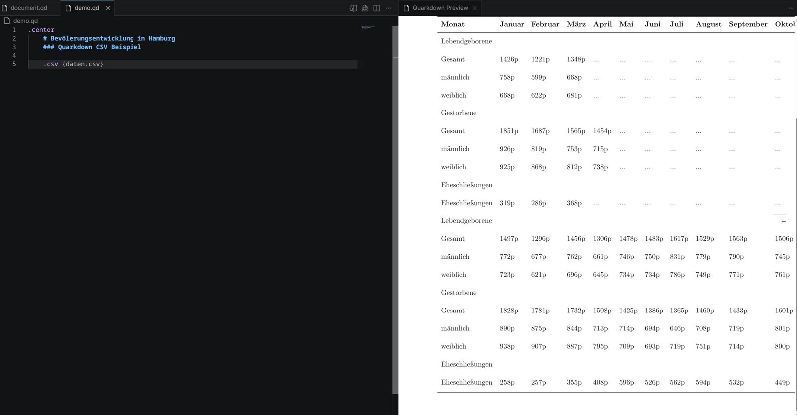

# Yet another Markup Language

Nein, in diesem Text geht es nicht um YAML. Ich bin kürzlich über **Quarkdown** gestolpert und da kürzlich die Version 2.4 erschienen ist, habe ich es mir ein wenig genauer angeschaut.

Ich nutze Markdown schon seit vielen Jahren (wirklich vielen :O). Sehr viele Tools wie Zendesk, das von mir vorgestellte [Obsidian](https://markus-daams.com/posts/wissen-und-notizen-verwalten-mit-obsidian/), GitHub und fast alle Notiz-Tools unterstützen es. Es hilft mir, Dokumente sauber zu strukturieren und übersichtlich zu gestalten. Man muss nicht viel Syntax lernen um es sinnvoll einsetzen zu können.

Das ist allerdings auch der Grund, warum man sehr schnell an die Grenzen des klassischen Markdown stößt. Denn sobald man etwas höhere Ansprüche an die Formatierung stellt oder komplexere Inhalte darstellen will, gelingt dies mit Markdown oft nicht mehr. Viele Tools helfen sich dann zum Beispiel mit [GitHub Flavoured Markdown](https://markus-daams.com/posts/formatierung-in-obsidian/) oder HTML weiter. Das ist jedoch nicht für alle geeignet und gerade HTML stellt größere Hürden auf, wenn es um die Formatierung von Dokumenten geht. Nein, das geht besser.

Das dachten sich wohl auch die Macher hinter Quarkdown. Dieses Projekt möchte das klassische Markdown um Optionen und Funktionen erweitern, um selbst die komplexesten Dokumente erstellen zu können, ohne auf eine zweite Sprache wie HTML zurückgreifen zu müssen. Man macht sich einmal mit der Syntax vertraut und kann dann los legen. Klingt echt cool und ist es auch.

## Was kann Quarkdown?

Die Featureliste von Quarkdown ist sehr lang. Während das klassische Markdown ausschließlich Formatierungsoptionen anbietet, geht man in diesem Projekt sämtliche Extrameilen. Diese Features sind mir ins Auge gefallen:

- Klassisches Markdown wird vollständig unterstützt
- Alle Formatierungsoptionen können mit eigenen Styles überschrieben werden
- Exportformate: Text, HTML, PDF
- Formatierungsoptionen wie automatische Seitenzahl, Fußnoten, Buchcover, Spalten-Layout und sehr viele mehr
- Programmierfunktion (Ja, wirklich)
- Automatischer Datenimport aus CSV-Dateien nebst Visualisierungsmöglichkeiten
- Themes
- Slideansicht für Präsentationen
- Integration in [GitHub Actions](https://markus-daams.com/posts/container-bauen-mit-github-actions/)

Diese Auflistung ist nur ein Auszug aus der langen Liste. Klingt kompliziert, oder? Nun ja, wer mehr Optionen fürs Layout braucht, kommt nicht umhin, ein wenig in die Materie abtauchen zu müssen. Quarkdown macht dies aber sehr einfach.

## Installation

Die Installation von Obsidian erfolgt über ein Script, das auf der [GitHub Seite](https://github.com/iamgio/quarkdown) des Projekts angeboten wird. Da bin ich aktuell echt kein Fan von, da „Script Poisining“ zum Trendsport verkommen ist. Wer nicht höllisch aufpasst, lädt sich ungebetene digitale Gäste auf den Rechner. Aus Ermangelung eines Flatpaks, eines Pakets im offiziellen Fedora Repo oder eines Tools, das Quarkdown nativ unterstützt, bleibt mir jedoch nichts anderes übrig. Dennoch lasse ich meine übliche Warnung hier erscheinen:

> Scripte aus dem Internet überprüfen und gegenlesen. Es lohnt sich auch die Links in den Scripten zu checken. Wer will, lässt eine AI drüberschauen. Das gilt ganz besonders für Scripte, die Root-Rechte (su) benötigen.
{: .prompt-warning}

Für Linux wird das Script mittels `curl` geladen.

``` shell
curl -fsSL https://raw.githubusercontent.com/quarkdown-labs/get-quarkdown/refs/heads/main/install.sh | sudo env "PATH=$PATH" bash
```

Deinstalliert wird es durch das Löschen der Ordner `/opt/quarkdown` und `/usr/local/bin/quarkdown`.

Ist das aus dem Weg, empfehle ich noch das offizielle Quarkdown Add-on für VS Code. Es bietet Syntax-Highlighting, eine Preview- und Export-Funktion sowie das übliche andere Gelöt. Das Add-on findet sich auf dem [Marketplace](https://marketplace.visualstudio.com/items?itemName=quarkdown.quarkdown-vscode).

Ist beides installiert, kann man direkt loslegen. Dazu legt man eine Datei mit der Endung `.qd` an und kann anfangen zu schreiben.

## Eine Syntax sie alle zu formatieren

Müsste ich die Syntax von Quarkdown in einem Satz definieren, würde ich das schreiben: Alle Keywords starten mit einem `.` (Punkt) und Optionen / Parameter kommen in geschweifte Klammern `{}`. So wird das Theme so geändern: `.theme {paperwhite}`. Mit diesem Wissen im Hintergrund kann man sich an die Arbeit machen.

Syntax Beispiel:

``` text
.docauthor {Max Mustermann}
.theme {galactic}


.pagemargin {topright}
    .docauthor 

.center
    # Überschrift
    ### Klassisches Markdown funktioniert

.paragraphstyle lineheight:{1.5}
    Hier steht ein recht langer Text.

```

Die Preview lässt sich dann in VS Code anzeigen (STRG / CTRL + Shift + V oder Icon anklicken). 


_Die Preview wird beim Speichern aktualisiert (Screenshot: Markus Daams / 2026)_

Wie man bereits in dem Screenshot sehen kann, lassen sich die meisten Elemente frei konfigurieren. So habe ich für einen Absatz eine Zeilenhöhe von `1.5` festgelegt. Den Block aus Überschriften, Blocktext und Zitat habe ich zentriert. Das kann alles pixelgenau festgelegt werden. Es gibt zahlreiche Optionen für Meta-Daten. So reicht es beispielsweise, den `.docauthor` einmalig festzulegen um ihn anschließend im ganzen Dokument aufzurufen. 

## Man kann hier echt programmieren?

Als ich mir bei einer heißen Tasse Tee die Dokumentation zu Gemüte geführt habe, ist mir die Unterstützung von Funktionen ins Auge gesprungen. Das lässt sich prima mit der Unterstützung von Variablen kombinieren. Fast alles lässt sich bei Quarkdown in eine Variable packen. Das ist zum Beispiel für Namen, Datum und Werte wie Zeilenabstand interessant.

Wie bei anderen Programmiersprachen üblich, bekommen Funktionen Namen und lassen sich anschließend aufrufen. Das Ergebnis wird auch direkt im Preview-Modus ausgeworfen. Die Syntax orientiert sich hierbei an anderen Programmiersprachen.

Mit dem Keyword `var` deklariere ich eine Variable, im ersten geschweiften Klammerpaar hinterlege ich den Namen der Variable und im zweiten Paar den Wert. `.sum` ist vordefiniert und liefert mir die Summe zurück. 

``` text

.function {MathematischeOperationen}
    .var {zahl1} {5}
    .var {zahl2} {10}
    Die Summe von .zahl1 und .zahl2 ist: .sum {.zahl1} {.zahl2}

.MathematischeOperationen

````

Die Ausgabe hiervon wird dann so kompiliert:

`Die Summe von 5 und 10 ist: 15`


_Wer will, kann in Quarkdown Funktionen schreiben (Screenshot: Markus Daams / 2026)_

## Tabellen

Tabellen lassen sich in Form von CSV Dateien laden. Aktuell ist die Implementierung noch nicht sehr flexibel. Leere Spalten haben bei mir zu einer Fehlermeldung geführt. Die erste Zeile wird als Spaltenüberschrift verwendet. Wenn man aber ein entsprechend formatiertes Dokument hat, kann das ganz einfach per `.csv {/pfad/zur/datei.csv}` geladen werden. Für die Formatierung stehen dann weitere Optionen zur Verfügung.


_CSV Dateien lassen sich laden und direkt rendern (Screenshot: Markus Daams / 2026)_

Mittels `.xychart` steht zudem eine umfangreiche Visualisierungslösung bereit. Das habe ich aber noch nicht ausprobiert. 

## Mein erster Eindruck

Ich bin von Quarkdown beeindruckt. Es löst einige Probleme, die ich in der Vergangenheit mit Markdown hinsichtlich der Formatierung hatte. Quarkdown unterstützt eine so breite Palette an Formatierungsmöglichkeiten, dass ich HTML-Umwege wohl nicht mehr gehen müsste. Die Syntax ist logisch und verzichtet auf zu viel Komplexität. Das ist eine Eigenschaft, die unbedingt beibehalten werden sollte. Denn der eigentliche Charm von Markdown ist ja das Motto: *Easy to learn and easy to master*.

Mir ist natürlich klar, dass es mit **LaTeX**, **Typst** und **MDX** weitere Möglichkeiten gibt, die jeweils eigene Stärken haben. Alle Ökosysteme haben ihre Anhängerschaft, wobei man im Falle von LaTeX wohl von quasireligiösem Eifer sprechen kann – kleiner Scherz. Es kommt ganz auf das Problem an, das man lösen muss. Mit Quarkdown kann ich Präsentationen erstellen, PDF Dateien erzeugen und wenn ich will, ein E-Book schreiben. Für alle diese Aufgaben gibt es aber auch bequemere Tools.

Was ich vermisse ist eine bessere Installationsmethode. „Irgendein Script“ ist mir in der aktuellen, sehr AI verseuchten Welt der IT zuerst einmal suspekt. Ich wünsche mir Binaries, die man in die offiziellen Repos packt, oder gerne auch ein Flatpak. Zudem wären Tools interessant, welche die Syntax und den Compiler unterstützen, sodass ich das nicht alles unbedingt in VS Code machen muss, denn – kleiner Spoiler für einen zukünftigen Artikel – der Editor von Microsoft fängt an zu nerven. Fordern lässt sich in der Open Source Community immer viel, daher will ich meine Schnute nicht zu weit aufreißen. Ich bin dankbar und froh, dass es coole Menschen gibt, die so etwas wie Quarkdown auf die Beine stellen.

Ich werde Quarkdown auf dem Radar behalten und bin gespannt, was sich bei diesem Projekt noch alles tun wird. 

Ich wünsche viel Spaß beim Ausprobieren und Experimentieren :)

## Ressourcen

* [Offizielles GitHub Repository von Quarkdown](https://github.com/iamgio/quarkdown)

* [Die offizielle Website von Quarkdown](https://quarkdown.com/)

* [Wiki und Doku von Quarkdown](https://quarkdown.com/wiki/quickstart/)


